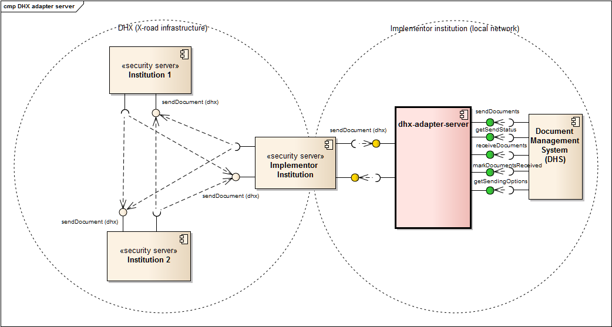
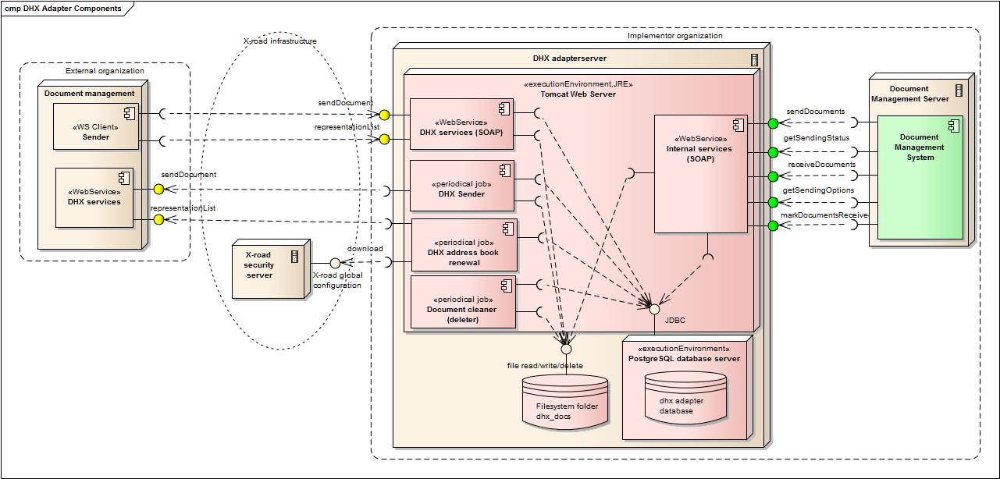

# DHX adapterserveri kasutusjuhend

  

Sisukord
=================

  * [DHX adapterserveri kasutusjuhend](#dhx-adapterserveri-kasutusjuhend)
    * [1\. Sissejuhatus](#1-sissejuhatus)
    * [2\. WSDL asukohad](#2-wsdl-asukohad)
    * [3\. SoapUI testimine](#3-soapui-testimine)
    * [4\. Sisemine liides](#4-sisemine-liides)
      * [4\.1\. getSendingOptions (sisemine liides)](#41-getsendingoptions-sisemine-liides)
      * [4\.2\. sendDocuments (sisemine liides)](#42-senddocuments-sisemine-liides)
      * [4\.3\. getSendStatus (sisemine liides)](#43-getsendstatus-sisemine-liides)
      * [4\.4\. receiveDocuments (sisemine liides)](#44-receivedocuments-sisemine-liides)
      * [4\.5\. markDocumentsReceived (sisemine liides)](#45-markdocumentsreceived-sisemine-liides)
    * [5\. Vahendajana saatmine/vastuvõtmine](#5-vahendajana-saatminevastuv%C3%B5tmine)
      * [5\.1\. Vahendatavate lisamine](#51-vahendatavate-lisamine)
      * [5\.2\. Kontrollida kas vahendatav tagastatakse representationList väljundist\.](#52-kontrollida-kas-vahendatav-tagastatakse-representationlist-v%C3%A4ljundist)
      * [5\.3\. Vahendatava poolt dokumendi välja saatmine (sisemine liides)](#53-vahendatava-poolt-dokumendi-v%C3%A4lja-saatmine-sisemine-liides)
      * [5\.3\. Vahendatava poolt dokumendi vastuvõtmine (sisemine liides)](#53-vahendatava-poolt-dokumendi-vastuv%C3%B5tmine-sisemine-liides)
    * [6\. Kokkuvõtte erinevustest (DVK liidesega võrreldes)](#6-kokkuv%C3%B5tte-erinevustest-dvk-liidesega-v%C3%B5rreldes)
    * [7\. DHX adapterserveri detailne sisemine arhitektuur](#7-dhx-adapterserveri-detailne-sisemine-arhitektuur)


## 1. Sissejuhatus
DHX adapterserver on tarkvara, mis hõlbustab [DHX](https://e-gov.github.io/DHX/) dokumendivahetuse protokolli kasutusele võtmist.

DHX adapterserveri kasutusjuhend on vajalik eelkõige tarkvara arendajale, kes teostab Dokumendihaldus süsteemi (DHS) ja DHX adapterserveri liidestamist. 

DHX adapterserveri paigaldamine on kirjeldatud [DHX adapterserveri paigaldusjuhendis](adapter-server-paigaldusjuhend.md).

DHX adapterserveri haldamine on kirjeldatud [DHX adapterserveri haldusjuhendis](adapter-server-haldusjuhend.md).



DHX adapterserver pakub kahte erinevat [SOAP](https://www.w3.org/TR/2000/NOTE-SOAP-20000508/) veebiteenuste liidest:
* Väline DHX liides (pildil kollane). DHX liides on suunatud väljapoole (teiste asutustega suhtlemiseks). DHX liides implementeerib DHX operatsiooni [sendDocument](https://github.com/e-gov/DHX/blob/master/files/sendDocument.md). Vahendaja korral ka operatsiooni [representationList](https://github.com/e-gov/DHX/blob/master/files/representationList.md) (ei ole lihtsustamise eesmärgil pildil näidatud).
* Sisemine liides (pildil roheline). See liides on suunatud sissepoole (asutuse lokaalvõrku). Seda liidest kasutab asutuse dokumendihaldussüsteem (DHS) dokumentide saatmiseks ja vastuvõtmiseks. See liides implementeerib operatsioonid sendDocuments, receiveDocuments, markDocumentsReceived, getSendStatus ja getSendingOptions. Sisemise liidese sünonüümina kasutatakse muudes dokumentides mõistet "DVK protokolli" liides.

DHX adapterserver käitub puhver serverina, võttes mõlema liidese kaudu vastu dokumente, salvestades kõigepealt need enda lokaalses andmebaasis ja failisüsteemis, selleks et need hiljem adressaadile edastada.

Välise DHX liidese toimimise loogikast arusaamine ei ole DHX adapterserveri kasutajale hädavajalik.

## 2. WSDL asukohad

Välise DHX liidese [WSDL](../dhx-adapter-ws/src/main/resources/dhx.wsdl) asub DHX adapterserveris aadressil `http://<HOST>:<PORT>/dhx-adapter-server/ws/dhx.wsdl`.

Välise DHX liidese SOAP päringud tuleb teha vastu aadressi `http://<HOST>:<PORT>/dhx-adapter-server/ws`.


Sisemisel liidese WSDL failid on esitatud versioonide kaupa.
 
[v1](../dhx-adapter-server/src/main/resources/dhl_new.wsdl) asub DHX adapterserveris aadressil `http://<HOST>:<PORT>/dhx-adapter-server/wsServer/dhlv1.wsdl`.

[v2](../dhx-adapter-server/src/main/resources/dhl_new_v2.wsdl) asub DHX adapterserveris aadressil `http://<HOST>:<PORT>/dhx-adapter-server/wsServer/dhlv2.wsdl`.

[v3](../dhx-adapter-server/src/main/resources/dhl_new_v3.wsdl) asub DHX adapterserveris aadressil `http://<HOST>:<PORT>/dhx-adapter-server/wsServer/dhlv3.wsdl`.

[v4](../dhx-adapter-server/src/main/resources/dhl_new_v4.wsdl) asub DHX adapterserveris aadressil `http://<HOST>:<PORT>/dhx-adapter-server/wsServer/dhlv4.wsdl`. 

Sisemise liidese SOAP päringud tuleb teha vastu aadressi `http://<HOST>:<PORT>/dhx-adapter-server/wsServer`.
  
## 3. SoapUI testimine

Sisemist liidest saab soovi korral testida [SoapUI](https://www.soapui.org/) programmiga.

**1)** Avada SoapUI ja lisada uus projekt, sisestades WSDL aadressiks `http://<HOST>:<PORT>/dhx-adapter-server/wsServer/dhlv1.wsdl`, `http://<HOST>:<PORT>/dhx-adapter-server/wsServer/dhlv2.wsdl`,`http://<HOST>:<PORT>/dhx-adapter-server/wsServer/dhlv3.wsdl` või `http://<HOST>:<PORT>/dhx-adapter-server/wsServer/dhlv4.wsdl` (muuta vajadusel host ja port).

**2)** Genereeritud projekti all avada näiteks `dhlSoapBinding`->`getSendingOptions`->`Request 1`.  

**3)** Üleval ripploendis kuvatakse teenuse aadress. Valida seal "Edit current" ja sisestada aadressiks `http://localhost:8080/dhx-adapter-server/wsServer` (muuta vajadusel host ja port).

**4)** Sisestada Request XML väljale SOAP päring, muutes endale sobivaks elementide `<xRoadInstance>`, `<memberClass>` ja `<memberCode>` (asutuse registrikood) väärtused (näiteks `ee-dev`, `GOV` ja `40000001`) 

**5)** Lisada vajadusel manus (Attachment) failist. NB! SoapUI arvestab manuse faili lugemisel laiendit, Kui laiend on näiteks .txt, siis SoapUI püüab seda ise kodeerida ja lisab content-type: text/plain. Selleks et SoapUI seda ise ei teeks, peaks manuse faili laiend olema näiteks `.base64`. 

**6)** Käivitada SoapUI päring.

Märkus:
> Osade päringute ja vastuste manused on [gzip](https://en.wikipedia.org/wiki/Gzip) pakitud ja seejärel [BASE64](https://en.wikipedia.org/wiki/Base64) kodeeritud.
> 
> Need saab Linux/unix all kokku pakkida salvestades manuse XML sisu faili `manus.xml` (fail peab olema salvestatud UTF-8 kodeeringus) ja käivitades seejärel:
> ``` 
>  cat manus.xml | gzip | base64 --wrap=0 > manus.base64 
> ```
> Manused peavad olema [basic](https://docs.oracle.com/javase/8/docs/api/java/util/Base64.html#basic) base64 kodeeritud ehk terviklikult ühe reana. Base64 [MIME](https://docs.oracle.com/javase/8/docs/api/java/util/Base64.html#mime) kodeeritud manustest (mitu rida, iga rida 76 märki) DHX adapterserver aru ei saa ja annab vea.
>
> Manused saab Linux/unix alla lahti kodeerida salvestades manuse faili `manus.base64` ja käivitades seejärel:
> ``` 
>  cat manus.base64 | base64 -d | gunzip > manus.xml
> ```

SoapUI-ga testimise kohta loe eraldi dokumentatsioonist [SoapUI testide käivitamise juhend](adapter-server-soapui-test-juhend.md) ja [Testlood](adapter-server-testilood.md). 

## 4. Sisemine liides

Sisemist liidest kasutab asutuse DHS tarkvara dokumentide saatmiseks ja vastuvõtmiseks.

Sisemise liidese kasutamisel käitub DHS tarkvara SOAP kliendina (DHS tarkvara ei pea ise ühtegi veebiteenust pakkuma).

Sisemise liidese operatsioonid on järgmised: 
* **getSendingOptions** - väljastab nimekirja asutustest, kellele üle DHX protokolli saab dokumente saata.
* **sendDocuments** - teenus dokumendi välja saatmiseks
* **getSendStatus** - teenus välja saadetud dokumendi staatuse kontrollimiseks
* **receiveDocuments** - asutusele saabunud (sissetulevate) dokumentide küsimiseks
* **markDocumentsReceived** - teenusega saab märkida asutusele saabunud dokumendi vastu võetuks 


Märkused: 
> Sisemist liidese operatsioonid on projekteeritud väga sarnaselt vanale [DVK liidesele](https://github.com/e-gov/DVK/blob/master/doc/DVKspek.md). 
> Sisemise liidese SOAP teenuste XML nimeruumid ja realiseeritud operatsioonide struktuur on täpselt samad nagu vanas DVK liideses.
> 
> Enamasti peaks saama vanalt DVK X-tee liideselt üle minna uuele DHX protokollile, hakates kasutama uut DHX adapterserver tarkvara, muutes DHS sees ümber DVK veebiteenuse võrguaadressi (endpoint URI aadressi).
> Kui varem pakkus seda teenust X-tee turvaserver, siis selle asemel pakub seda adapterserveri sisemine liides.
> 
> Sisemises liideses on realiseeritud ainult hädavajalikud DVK liidese operatsioonide versioonid.
>
> Lisaks tuleb silmas pidada, et esineb mõningaid erinevusi võrreldes DVK liidesega. Need on eraldi välja toodud dokumendi lõpus. 

Sisemisele liidese päringutes tuleb kaasa anda X-tee v6 standardsed päised (`<service>` ja `<client>`), kuigi Sisemine liides X-tee turvaserverit kasuta.

Päringus `<service>` päises ette antud alamelemente `<xRoadInstance>`, `<memberClass>`, `memberCode` ja `<subsystemCode>` ignoreeritakse. 
Seega need võivad olla samad nagu saadeti vana DVK X-tee teenuse korral (`GOV`, `70006317` - Riigi Infosüsteemi Amet ja `dhl`).
```xml 
      <xro:service>
         <iden:xRoadInstance>ee</iden:xRoadInstance>
         <iden:memberClass>GOV</iden:memberClass>
         <iden:memberCode>70006317</iden:memberCode>
         <iden:subsystemCode>dhl</iden:subsystemCode>
         <iden:serviceCode>getSendingOptions</iden:serviceCode>
         <iden:serviceVersion>v1</iden:serviceVersion>
      </xro:service>
```

Päringu `<client>` päises ette antud alamelementidest kasutatakse ainult `<memberCode>` (saatja asutuse registrikood) elementi.  
Ülejäänuid `<client>` päise elemente ignoreeritakse. Seega need võivad olla samad nagu vana DVK X-tee teenuse korral saadeti.
```xml  
      <xro:client>
         <iden:xRoadInstance>ee</iden:xRoadInstance>
         <iden:memberClass>COM</iden:memberClass>
         <iden:memberCode>30000001</iden:memberCode>
         <iden:subsystemCode>DHX</iden:subsystemCode>
      </xro:client>
```

Järgnevalt kirjeldatakse kuidas toimub DHX adapterserveri sisemise liidese kasutamine dokumentide saatmiseks ja vastuvõtmiseks. 

### 4.1. getSendingOptions (sisemine liides)

Seda operatsiooni kasutatakse [DHX aadressiraamatu](https://e-gov.github.io/DHX/#74-lokaalne-aadressiraamat) küsimiseks.

See tagastab kõik asutused (adressaadid) kellele võib üle DHX protokolli dokumente saata. 

Lisaks kirjeldust vana DVK spetsifikatsioonis [getSendingOptions.v1](https://github.com/e-gov/DVK/blob/master/doc/DVKspek.md#getsendingoptionsv1),
[getSendingOptions.v2](https://github.com/e-gov/DVK/blob/master/doc/DVKspek.md#getsendingoptionsv2) ja [getSendingOptions.v3](https://github.com/e-gov/DVK/blob/master/doc/DVKspek.md#getsendingoptionsv3)

> **NB!** DVK spetsifikatsiooni näidetes kasutatakse vanu X-tee versioon 4.0 päiseid (`<xtee:asutus>`, `<xtee:andmekogu>` jt). 
> DHX adapterserveri sisemise liidesega suhtlemisel tuleb kasutada  X-tee versioon 6.0 päiseid. Nagi allpool toodud näites.

Märkused vana DVK X-tee liidese kasutajale:
> DHX adapterserveris on realiseeritud kõik getSendStatus operatsiooni versioonid [getSendingOptions.v1](https://github.com/e-gov/DVK/blob/master/doc/DVKspek.md#getsendingoptionsv1), [getSendingOptions.v2](https://github.com/e-gov/DVK/blob/master/doc/DVKspek.md#getsendingoptionsv2) ja [getSendingOptions.v3](https://github.com/e-gov/DVK/blob/master/doc/DVKspek.md#getsendingoptionsv3).

Päringu `getSendingOptions.v1` näide:
```xml
<soapenv:Envelope xmlns:soapenv="http://schemas.xmlsoap.org/soap/envelope/" 
 xmlns:xro="http://x-road.eu/xsd/xroad.xsd" 
 xmlns:iden="http://x-road.eu/xsd/identifiers" 
 xmlns:dhl="http://producers.dhl.xrd.riik.ee/producer/dhl">
   <soapenv:Header>
      <xro:protocolVersion>4.0</xro:protocolVersion>
      <xro:id>64a3ddbd-1620-42c4-b2fe-60b854c2f32f</xro:id>
      <xro:service>
         <iden:xRoadInstance>ee</iden:xRoadInstance>
         <iden:memberClass>GOV</iden:memberClass>
         <iden:memberCode>70006317</iden:memberCode>
         <iden:subsystemCode>dhl</iden:subsystemCode>
         <iden:serviceCode>getSendingOptions</iden:serviceCode>
         <iden:serviceVersion>v1</iden:serviceVersion>
      </xro:service>
      <xro:client>
         <iden:xRoadInstance>ee</iden:xRoadInstance>
         <iden:memberClass>COM</iden:memberClass>
         <iden:memberCode>10560025</iden:memberCode>
         <iden:subsystemCode>DHX</iden:subsystemCode>
      </xro:client>
   </soapenv:Header>
   <soapenv:Body>
      <dhl:getSendingOptions>
         <keha></keha>
      </dhl:getSendingOptions>
   </soapenv:Body>
</soapenv:Envelope>
```

Vastuse näide:
```xml
<SOAP-ENV:Envelope xmlns:SOAP-ENV="http://schemas.xmlsoap.org/soap/envelope/">
   <SOAP-ENV:Header>
      <xro:protocolVersion xmlns:xro="http://x-road.eu/xsd/xroad.xsd">4.0</xro:protocolVersion>
      <xro:id xmlns:xro="http://x-road.eu/xsd/xroad.xsd">64a3ddbd-1620-42c4-b2fe-60b854c2f32f</xro:id>
      <xro:service xmlns:xro="http://x-road.eu/xsd/xroad.xsd">
         <iden:xRoadInstance xmlns:iden="http://x-road.eu/xsd/identifiers">ee</iden:xRoadInstance>
         <iden:memberClass xmlns:iden="http://x-road.eu/xsd/identifiers">COV</iden:memberClass>
         <iden:memberCode xmlns:iden="http://x-road.eu/xsd/identifiers">70006317</iden:memberCode>
         <iden:subsystemCode xmlns:iden="http://x-road.eu/xsd/identifiers">dhl</iden:subsystemCode>
         <iden:serviceCode xmlns:iden="http://x-road.eu/xsd/identifiers">getSendingOptions</iden:serviceCode>
         <iden:serviceVersion xmlns:iden="http://x-road.eu/xsd/identifiers">v1</iden:serviceVersion>
      </xro:service>
      <xro:client xmlns:xro="http://x-road.eu/xsd/xroad.xsd">
         <iden:xRoadInstance xmlns:iden="http://x-road.eu/xsd/identifiers">ee</iden:xRoadInstance>
         <iden:memberClass xmlns:iden="http://x-road.eu/xsd/identifiers">COM</iden:memberClass>
         <iden:memberCode xmlns:iden="http://x-road.eu/xsd/identifiers">10560025</iden:memberCode>
         <iden:subsystemCode xmlns:iden="http://x-road.eu/xsd/identifiers">DHX</iden:subsystemCode>
      </xro:client>
   </SOAP-ENV:Header>
   <SOAP-ENV:Body>
      <ns2:getSendingOptionsResponse  xmlns:ns2="http://www.riik.ee/schemas/dhl"  xmlns:ns4="http://www.sk.ee/DigiDoc/v1.3.0#" xmlns:ns5="http://www.w3.org/2000/09/xmldsig#">
         <keha xmlns:ns10="http://x-road.eu/xsd/xroad.xsd" xmlns:ns2="http://www.riik.ee/schemas/deccontainer/vers_2_1/"  xmlns:ns3="http://producers.dhl.xrd.riik.ee/producer/dhl" xmlns:ns4="http://www.riik.ee/schemas/dhl"  xmlns:ns5="http://www.sk.ee/DigiDoc/v1.3.0#" xmlns:ns6="http://www.w3.org/2000/09/xmldsig#"  xmlns:ns7="http://dhx.x-road.eu/producer" xmlns:ns8="http://x-road.eu/xsd/identifiers" xmlns:ns9="http://x-road.eu/xsd/representation.xsd">
            <asutus>
               <regnr>dvk.70006317</regnr>
               <nimi>Riigi Infosüsteemi Amet(DHX.dvk)</nimi>
               <saatmine>
                  <saatmisviis>dhl</saatmisviis>
               </saatmine>
            </asutus>
            <asutus>
               <regnr>10560025</regnr>
               <nimi>BPW Consulting</nimi>
               <saatmine>
                  <saatmisviis>dhl</saatmisviis>
               </saatmine>
            </asutus>
            <asutus>
               <regnr>30000001</regnr>
               <nimi>Hõbekuuli OÜ</nimi>
               <saatmine>
                  <saatmisviis>dhl</saatmisviis>
               </saatmine>
            </asutus>
      </ns2:getSendingOptionsResponse>
   </SOAP-ENV:Body>
</SOAP-ENV:Envelope>
```

See sisaldab asutuse kohta kolme välja:
* `<regnr>` - asutuse registrikood või alamsüsteemi kood. Üldjuhul tagastatakse siin asutuse registrikood. Juhul kui asutus pakub teenust DHX alamsüsteemi kaudu (näiteks subsystemCode=`DHX.subsystem1`), siis  DHX adapterserveri getSendingOptions väljundis tagastatakse see kujul `<regnr>subsystem1.40000001</regnr>`, kus 40000001 on asutuse registrikood. Teatud spetsiifilised asutused on häälestatud tagastama ainult süsteemi koodi (näiteks `<regnr>adit</regnr>`). See on määratud `dhx.server.special-orgnisations=adit,kovtp,rt,eelnoud` parameetriga. Vaata [DHX adapterserveri paigaldusjuhendist](adapter-server-paigaldusjuhend.md#6-häälestus-fail-dhx-applicationproperties). 
* `<nimi>` - Asutuse või alamsüsteemi nimi. Asutuse nimi leitakse X-tee globaalse konfiguratsiooni ja vahendajate [representationList]((https://github.com/e-gov/DHX/blob/master/files/representationList.md)) teenuse väljundite põhjal. 
* `<saatmisviis>` - alati konstant `dhl`.

Märkus:
> Asutusel kellel on kasutusel mitu [DHX alamsüsteemi](https://e-gov.github.io/DHX/#55-reserveeritud-nimi-dhx), näiteks alamsüsteem `DHX.viru`, väljastatakse nimi kujul: `Asutuse nimi (DHX.viru)`.
> 
> DHS kasutajale arusaadavama alamsüsteemi nime võib määrata, määrates DHX adapterserveri andmebaasis (vaata [andmebaasi mudelit](adapter-server-haldusjuhend.md#41-andmebaasi-mudel)) välja `ASUTUS.reaalne_nimi` väärtuseks õige nime, näiteks `Viru Ringkonnaprokuratuur`.

Ülejäänud DVK poolt tagastatavaid välju (`<ks_asutuse_regnr/>`, `<allyksused>`, `<ametikohad>`) DHX adapterserver kunagi ei tagasta.
Kui asutuse DHS süsteem neid vana DVK korral kasutas, siis DHX protokollile üle kolimisel peaks ta need kusagilt mujalt küsima.
Samuti ei ole neid mõtet `getSendingOptions.v3` päringu sisendis ette anda, sest neid ignoreeritakse. 
Samuti ignoreeritakse sisendis välju `<vahetatud_dokumente_vahemalt>`, `<vahetatud_dokumente_kuni>` ja `<vastuvotmata_dokumente_ootel>`.

### 4.2. sendDocuments (sisemine liides)

SOAP operatsiooni `sendDocuments.v4` kasutatakse dokumentide saatmiseks teisel asutusele.
Dokumendid peavad olema [Kapsli 2.1 versioonis](https://riha.eesti.ee/riha/main/xml/elektroonilise_andmevahetuse_metaandmete_loend/1). Vanemad Kapsli versioonid ei ole toetatud.

DHX adapterserver võtab dokumendi vastu, salvestab enda andmebaasi ja vastab SOAP päringule koheselt. 
Dokumendi edasine DHX addresaadile saatmine teostatakse asünkroonselt (taustatöö poolt).
Dokumendi saatmise staatuse küsimiseks tuleb kasutada operatsiooni [getSendStatus](#43-getsendstatus-sisemine-liides).

Vaata täpsemat kirjeldust vana DVK spetsifikatsioonis [sendDocuments.v4](https://github.com/e-gov/DVK/blob/master/doc/DVKspek.md#senddocumentsv4).
> **NB!** DVK spetsifikatsiooni näidetes kasutatakse vanu X-tee versioon 4.0 päiseid (`<xtee:asutus>`, `<xtee:andmekogu>` jt). 
> DHX adapterserveri sisemise liidesega suhtlemisel tuleb kasutada  X-tee versioon 6.0 päiseid. Nagu need on allpool näites.

Päringu sisu näide:
```xml
<soapenv:Envelope xmlns:soapenv="http://schemas.xmlsoap.org/soap/envelope/" xmlns:xtee="http://x-tee.riik.ee/xsd/xtee.xsd" xmlns:dhl="http://producers.dhl.xrd.riik.ee/producer/dhl">
    <soapenv:Header>
       <ns4:protocolVersion xmlns:ns2="http://dhx.x-road.eu/producer" xmlns:ns3="http://x-road.eu/xsd/identifiers" xmlns:ns4="http://x-road.eu/xsd/xroad.xsd" xmlns:ns5="http://www.riik.ee/schemas/deccontainer/vers_2_1/">4.0</ns4:protocolVersion>
    <ns4:id xmlns:ns2="http://dhx.x-road.eu/producer" xmlns:ns3="http://x-road.eu/xsd/identifiers" xmlns:ns4="http://x-road.eu/xsd/xroad.xsd" xmlns:ns5="http://www.riik.ee/schemas/deccontainer/vers_2_1/">64a3ddbd-1620-42c4-b2fe-60b854c2f32f
    </ns4:id>
    <ns4:client xmlns:ns2="http://dhx.x-road.eu/producer" xmlns:ns3="http://x-road.eu/xsd/identifiers" xmlns:ns4="http://x-road.eu/xsd/xroad.xsd" xmlns:ns5="http://www.riik.ee/schemas/deccontainer/vers_2_1/">
      <ns3:xRoadInstance>ee-</ns3:xRoadInstance>
      <ns3:memberClass>GOV</ns3:memberClass>
      <ns3:memberCode>30000001</ns3:memberCode>
      <ns3:subsystemCode>DHX</ns3:subsystemCode>
    </ns4:client>
    <ns4:service ns3:objectType="SERVICE" xmlns:ns2="http://dhx.x-road.eu/producer" xmlns:ns3="http://x-road.eu/xsd/identifiers" xmlns:ns4="http://x-road.eu/xsd/xroad.xsd" xmlns:ns5="http://www.riik.ee/schemas/deccontainer/vers_2_1/">
      <ns3:xRoadInstance>ee</ns3:xRoadInstance>
      <ns3:memberClass>GOV</ns3:memberClass>
      <ns3:memberCode>70006317</ns3:memberCode>
      <ns3:subsystemCode>dhl</ns3:subsystemCode>
      <ns3:serviceCode>sendDocuments</ns3:serviceCode>
      <ns3:serviceVersion>v4</ns3:serviceVersion>
    </ns4:service>
   </soapenv:Header>
   <soapenv:Body>
      <dhl:sendDocuments>
         <keha>
            <dokumendid href="cid:sendDoc.base64">
            </dokumendid>
            <kaust>/</kaust>
         </keha>
      </dhl:sendDocuments>
   </soapenv:Body>
</soapenv:Envelope>
```

Manus XML failina:
```xml
<DecContainer xmlns="http://www.riik.ee/schemas/deccontainer/vers_2_1/">
  <Transport>
    <DecSender>
        <OrganisationCode>30000001</OrganisationCode>
        <PersonalIdCode>EE38806190294</PersonalIdCode>
    </DecSender>
    <DecRecipient>
        <OrganisationCode>40000001</OrganisationCode>
    </DecRecipient>
  </Transport>
  <RecordCreator>
    <Person>
      <Name>Lauri Tammemäe</Name>
      <GivenName>Lauri</GivenName>
      <Surname>Tammemäe</Surname>
      <PersonalIdCode>EE38806190294</PersonalIdCode>
      <Residency>EE</Residency>
    </Person>
    <ContactData>
      <Adit>true</Adit>
      <Phone>3726630276</Phone>
      <Email>lauri.tammemae@ria.ee</Email>
      <WebPage>www.hot.ee/lauri</WebPage>
      <MessagingAddress>skype: lauri.tammemae</MessagingAddress>
      <PostalAddress>
        <Country>Eesti</Country>
        <County>Harju maakond</County>
        <LocalGovernment>Tallinna linn</LocalGovernment>
        <AdministrativeUnit>Mustamäe linnaosa</AdministrativeUnit>
        <SmallPlace>Pääsukese KÜ</SmallPlace>
        <LandUnit></LandUnit>
        <Street>Mustamäe tee</Street>
        <HouseNumber>248</HouseNumber>
        <BuildingPartNumber>62</BuildingPartNumber>
        <PostalCode>11212</PostalCode>
      </PostalAddress>
    </ContactData>
  </RecordCreator>
  <RecordSenderToDec>
    <Person>
      <Name>Lauri Tammemäe</Name>
      <GivenName>Lauri</GivenName>
      <Surname>Tammemäe</Surname>
      <PersonalIdCode>EE38806190294</PersonalIdCode>
      <Residency>EE</Residency>
    </Person>
    <ContactData>
      <Adit>false</Adit>
      <Phone>3726630276</Phone>
      <Email>lauri.tammemae@ria.ee</Email>
      <WebPage>www.hot.ee/lauri</WebPage>
      <MessagingAddress>skype: lauri.tammemae</MessagingAddress>
      <PostalAddress>
        <Country>Eesti</Country>
        <County>Harju maakond</County>
        <LocalGovernment>Tallinna linn</LocalGovernment>
        <AdministrativeUnit>Mustamäe linnaosa</AdministrativeUnit>
        <SmallPlace>Pääsukese KÜ</SmallPlace>
        <LandUnit></LandUnit>
        <Street>Mustamäe tee</Street>
        <HouseNumber>248</HouseNumber>
        <BuildingPartNumber>62</BuildingPartNumber>
        <PostalCode>11212</PostalCode>
      </PostalAddress>
    </ContactData>
  </RecordSenderToDec>
  <Recipient>
    <Organisation>
      <Name>Riigi Infosüsteemi Amet</Name>
      <OrganisationCode>70006317</OrganisationCode>
      <Residency>EE</Residency>
    </Organisation>
  </Recipient>
  <RecordMetadata>
    <RecordGuid>25892e17-80f6-415f-9c65-7395632f0234</RecordGuid>
    <RecordType>Kiri</RecordType>
    <RecordOriginalIdentifier>213465</RecordOriginalIdentifier>
    <RecordDateRegistered>2012-11-11T19:18:03</RecordDateRegistered>
    <RecordTitle>Ettepanek</RecordTitle>
    <RecordLanguage>EE</RecordLanguage>
  </RecordMetadata>
  <Access>
    <AccessConditionsCode>Avalik</AccessConditionsCode>
  </Access>
  <File>
    <FileGuid>25892e17-80f6-415f-9c65-7395632f0001</FileGuid>
    <RecordMainComponent>0</RecordMainComponent>
    <FileName>Ettepanek.doc</FileName>
    <MimeType>application/msword</MimeType>
    <FileSize>211543</FileSize>
    <ZipBase64Content>H4sIACvlpU0AAwspqszMS1coyVcoTs1LUUjJT+YCALD0cp8TAAAA</ZipBase64Content>
  </File>
  <RecordTypeSpecificMetadata  />
</DecContainer>
```

Sama manus gzip ja base64 kodeeritult:
```
H4sIACJmhFgAA+1X3W7bNhS+z1MIvR0SSrIt2wEnTHWyJGvcGrGzYbspWOnYYSORGknZS59ll3mM3uXFekRZP1ayddjdsBqGQZ7z8fx+h6DpGcQzKQzjApTzR5YK/f2rO2PyU0J2u92J4vz+BIDo+A4ypkkCcVzDyRaUfu+/98ir8Mhx6EoxoXOpTLnDPZpegkhAVXsre6c2THDNDJdiJhMIB679eJQ8U7WnFuhICpZeJVZxfj6YTNzAm7r+dEhJT1s5Jz3vZTQ3EPOcgzB/F9DwKwFZyweWKDnInKJSqmSmgBlZe69irP3StyyD8JoVijsrlmWQPT0CJVZaQy74FkSLo6QV1JBloUS575ioRUf/unI2Ac0TEPED4ilpd/v8u7lQS57YnDHDmvNRwk1oVIHx2GUTzJ0U2PGxHwQD1x8HaMpKav15xngapmW6J8bmxOAHxRkSkJJKWUN/gQ8LtoGw5OidNCVF06pMtaZGzkFrtuFiEyWJwnWo7x9yOHUO3VDyDNdELbVhaU9qMy+EUVgj0Ab91tse4CG8ZOpj4WSM3UuR7HFd2LWMWXohcZhEVjJqxdKUC8Gc8peSvro9GCUZR34ahQzdwq3ASs8LjLVkgj3MpGZlC57BWhvLDL0tUhZDuHh6fHrUxT1ocN48/YlcanWdaJlIrA2MrF52zBkF0A3DlK3bS1vYpSw0vC2yDzid/nBCSVfQwl4XPE2wIwumzF4Z+JS8IO5cFbZbls6e53sI70jqlpIXelp25oDKJfN7g7wf7epeWUm8CP63471mqf4239/m+78/371ppr1XwsEL4XDCbzjfcOdKrKV++qyxFBl3ogxMb9SfvSPG+L4IBt74r988X5vRfkw2l86LpMpsDoYlzeTuhRcFT0J/NJn64I2PJ+46OB56o/XxNA5Gx+PBdBQM/LXrD4Z1feyBroUVzlf4hpfD2BF0Ee8UFsZePBgQX/OSBt5gGIzqEy8AuuexRXADGyQ1KMBoXc8/9jz8rrzpqTc5dQe1oR7yIExuUrwSjYGcCbhvgrXiLhB5vinKK6Uq9YGow5NuNWkUxy2zqg3SCy9DbIi2nYy2LOXo9UWlNdvaoD/yJqZy+c96ZB+pDbyb0Rzf5zOZ5Xj5IiHcJoMDcevOsrUp1Eki48puy2I65xnYNrM8T3lsiUcyvUOreLXWytbkkn8C7Lk3Gg4qW1ZQ6X/j+WumIRiWA1lGcjnUV9Fsm+a3bhTtdP67/jRferF8+DmWK+1d395+/Gn13a+z6PrMjfPJKsIPJc/M2KLWlexwdZnjbKx5XDfQcUh4ZJ/xzT+f8As/TQdcCA0AAA==
```

Nõuded päringu sisendile:
* Päringu sisendi X-tee päises ette antud saatja `<client><memberCode>30000001</ns3:memberCode>` peab ühtima Kapslis toodud saatjaga `<Transport><DecSender><OrganisationCode>30000001</OrganisationCode>`.
* Kui soovitakse saata asutuse alamsüsteemile (`getSendOptions` tagastas `<asutus><regnr>subsystem1.40000001</regnr>`), siis tuleb Kapslis ette anda adressaat kujul `<Transport><DecRecipient><OrganisationCode>subsystem1.40000001</OrganisationCode>`.
* Samamoodi tuleb saata neile spetsiifilistele asutustele, mille korral getSendingOptions tagastas mnemoonilise koodi (`<asutus><regnr>adit</regnr>`) ilma registrikoodita. Neile tuleb saata Kapsli sees näiteks `<Transport><DecRecipient><OrganisationCode>adit</OrganisationCode>`. Need asutused on määratud `dhx.server.special-orgnisations=adit,kovtp,rt,eelnoud` parameetriga. Vaata [DHX adapterserveri paigaldusjuhendist](adapter-server-paigaldusjuhend.md#6-häälestus-fail-dhx-applicationproperties). 
* Kapsel peab olema [SWAREF](http://www.ws-i.org/profiles/attachmentsprofile-1.0-2004-08-24.html) manusena. Manuse algne xml fail peab olema UTF-8 kodeeringus, lisatud manusesse gzip pakitud ja seejärel base64 kodeeritult.
* Päringu sisendis ei pea ette andma Kapsli XML schema järgi kohustuslikku `<DecMetadata>` elementi (ega selle alamelemente `<DecId>`, `<DecFolder>`, `<DecReceiptDate>`). Need genereerib DHX adapterserver ise. Sama loogika kehtis vanas DVK liideses.
* Päringu sisendis Kapslis võib ette anda mitu adressaati (mitu `<DecRecipient>` elementi). Sel juhul teostab DHX adapterserver saatmise igale DHX adressaadile eraldi. Kusjuures mõnele adressaadile saatmine võib õnnestuda aga teisele mitte.
* Päringu sisendis võib ette anda `<kaust>` elemendi väärtuse. Vaata täpsemalt [DVK kasutade kasutamine](https://github.com/e-gov/DVK/blob/master/doc/DVKspek.md#kaustade-kasutamine) ja [DHX E-arved ja kaust](https://github.com/e-gov/DHX/blob/master/docs/E-arved.md).
* Manusele määratud `Content-Type`,  `Content-Encoding` ja `Content-Transfer-Encoding` parameetrid DHX adapterserver ignoreerib. Eeldatakse et manus on alati gzip pakitud ja seejärel base64 kodeeritud.  
Seega need võib korrektselt ette anda kujul:
```
Content-Type: text/xml; charset=UTF-8
Content-Encoding: gzip
Content-Transfer-Encoding: base64
```
Võib ette anda nii nagu DVK korral:
```
Content-Type: {http://www.w3.org/2001/XMLSchema}base64Binary
Content-Encoding: gzip
Content-Transfer-Encoding: base64
```
Aga võib ka ette anda kujul:
```
Content-Type: application/octet-stream; name=sendDoc.base64
Content-Transfer-Encoding: binary
```

Vastuse sisu näide:
```xml
<SOAP-ENV:Envelope xmlns:SOAP-ENV="http://schemas.xmlsoap.org/soap/envelope/">
   <SOAP-ENV:Header>
      <ns4:protocolVersion xmlns:ns2="http://dhx.x-road.eu/producer" xmlns:ns3="http://x-road.eu/xsd/identifiers" xmlns:ns4="http://x-road.eu/xsd/xroad.xsd" xmlns:ns5="http://www.riik.ee/schemas/deccontainer/vers_2_1/">4.0</ns4:protocolVersion>
      <ns4:id xmlns:ns2="http://dhx.x-road.eu/producer" xmlns:ns3="http://x-road.eu/xsd/identifiers" xmlns:ns4="http://x-road.eu/xsd/xroad.xsd" xmlns:ns5="http://www.riik.ee/schemas/deccontainer/vers_2_1/">64a3ddbd-1620-42c4-b2fe-60b854c2f32f</ns4:id>
      <ns4:client xmlns:ns2="http://dhx.x-road.eu/producer" xmlns:ns3="http://x-road.eu/xsd/identifiers" xmlns:ns4="http://x-road.eu/xsd/xroad.xsd" xmlns:ns5="http://www.riik.ee/schemas/deccontainer/vers_2_1/">
         <ns3:xRoadInstance>ee-</ns3:xRoadInstance>
         <ns3:memberClass>GOV</ns3:memberClass>
         <ns3:memberCode>30000001</ns3:memberCode>
         <ns3:subsystemCode>DHX</ns3:subsystemCode>
      </ns4:client>
      <ns4:service ns3:objectType="SERVICE" xmlns:ns2="http://dhx.x-road.eu/producer" xmlns:ns3="http://x-road.eu/xsd/identifiers" xmlns:ns4="http://x-road.eu/xsd/xroad.xsd" xmlns:ns5="http://www.riik.ee/schemas/deccontainer/vers_2_1/">
         <ns3:xRoadInstance>ee</ns3:xRoadInstance>
         <ns3:memberClass>GOV</ns3:memberClass>
         <ns3:memberCode>70006317</ns3:memberCode>
         <ns3:subsystemCode>dhl</ns3:subsystemCode>
         <ns3:serviceCode>sendDocuments</ns3:serviceCode>
         <ns3:serviceVersion>v4</ns3:serviceVersion>
      </ns4:service>
   </SOAP-ENV:Header>
   <SOAP-ENV:Body>
      <ns4:sendDocumentsResponse xmlns:ns10="http://x-road.eu/xsd/identifiers" xmlns:ns11="http://x-road.eu/xsd/representation.xsd" xmlns:ns12="http://x-road.eu/xsd/xroad.xsd" xmlns:ns2="http://www.riik.ee/schemas/deccontainer/vers_2_1/" xmlns:ns4="http://producers.dhl.xrd.riik.ee/producer/dhl" xmlns:ns5="http://www.riik.ee/schemas/dhl" xmlns:ns6="http://www.sk.ee/DigiDoc/v1.3.0#" xmlns:ns7="http://www.w3.org/2000/09/xmldsig#" xmlns:ns8="http://www.riik.ee/schemas/dhl-meta-automatic" xmlns:ns9="http://dhx.x-road.eu/producer">
         <keha href="cid:8eadbe72-47ee-4eba-a68e-4dac1aca6e85"/>
      </ns4:sendDocumentsResponse>
   </SOAP-ENV:Body>
</SOAP-ENV:Envelope>
```
Vastuse manus (gzip ja base64 kodeeritult):
```xml
H4sIAAAAAAAAAIWSwXKDIBCG732KjD3LgjZtdIy55D0cBraRSQQHMPL4pZkq9ZD2Buz37/67S3MKw213R+uU0ceMEZqd2pdGu7K+Ys93Mapdrd3bMeu9H2uAeZ6JVepKEMGJHgfuQPa3bEUPKyr7QEJuDZcEJxitkZNAm0hGVzRhwUmwOFp0qD330RaJT0lUrpoloSOxPglWrr6WyNYYY0/KhcdlU2W/6dc9sp7VRZ2NgDsjJaGvCX7fwHNJjL1AQSkFWkGEpFOXX3jx9yxRCBM7Vzr6/15MV3QMkvrjv03kA3qe88mbIY5PJGX1pH0l46TVp4q1sraJGTol233VwM+xgeU7tF8IZ/XFLwIAAA==
```

Vastuse manus XML-ina lahti kodeeritud:
```xml
<keha>
 <dhl_id>59</dhl_id>
</keha>
```
Märkused vastuse sisu kohta:
* DHX adapterserver võtab dokumendi vastu ja vastab SOAP päringule koheselt. Dokumendi DHX adressaadile edastamine toimub asünkroonselt.
* Vastus sisaldab DHX adapterserveri poolt genereeritud unikaalset `<dhl_id>` väärtust. DHX adapterserveri esmasel kasutusel võtmisel algab see väärtust 1-st. Kui DHS süsteem kolib vanalt DVK X-tee liideselt üle uuele DHX adapterserverile, siis peab ta arvestama et see võib kattuda vanade DVKsse saadetud dokumentide `<dhl_id>` väärtusega (kui näiteks see salvestatakse DHS andmebaasis unikaalsele väljale, siis võib olla vajalik teatud andmesiire). Alternatiivne variant on DHX adapterserveris Sequence väärtust edasi kerida piisavalt suureks, et konflikte ei tekiks.     
* `<dhl_id>` väärtust tuleb hiljem kasutada `getSendStatus` päringu sisendis, saatmise staatuse küsimiseks.
 
Märkused vana DVK X-tee liidese kasutajale:
> Võrreldes DVK sendDocuments liidestega on DHX adapterserveris realiseeritud on ainult sendDocuments operatsioonide [v4](https://github.com/e-gov/DVK/blob/master/doc/DVKspek.md#senddocumentsv4) versioon, mis eeldab et dokumendi Kapsel on 2.1 formaadis.
>
> Vanemaid DVK sendDocuments versioone [v1](https://github.com/e-gov/DVK/blob/master/doc/DVKspek.md#senddocumentsv1), [v2](https://github.com/e-gov/DVK/blob/master/doc/DVKspek.md#senddocumentsv2), [v3](https://github.com/e-gov/DVK/blob/master/doc/DVKspek.md#senddocumentsv3) DHX adapterserver ei paku.

Vaata ka `sendDocuments.v4` saatmise näidet dokumendist Testilood - [2.1. Õige kapsli saatmine](adapter-server-testilood.md#2.1).

### 4.3. getSendStatus (sisemine liides)

SOAP operatsiooni `getSendStatus` kasutatakse saadetud dokumendi staatuse ja saatmisel ilmnenud vea info (fault) küsimiseks.

Võimalikud staatused on:
* `saatmisel` – dokumenti üritatakse veel antud saajale edastada
* `saadetud` – dokument sai edukalt antud saajale saadetud
* `katkestatud` – dokumenti ei õnnestunud antud saajale saata.

Staatuste kohta vaata täpselt [DVK dokumentatsioonist](https://github.com/e-gov/DVK/blob/master/doc/DVKspek.md#edastatud-dokumentide-staatuse-kontroll).

Lisaks vaata täpsemat kirjeldust vana DVK spetsifikatsioonis [getSendStatus.v1](https://github.com/e-gov/DVK/blob/master/doc/DVKspek.md#getsendstatusv1). ja [getSendStatus.v2](https://github.com/e-gov/DVK/blob/master/doc/DVKspek.md#getsendstatusv2).
> **NB!** DVK spetsifikatsiooni näidetes kasutatakse vanu X-tee versioon 4.0 päiseid (`<xtee:asutus>`, `<xtee:andmekogu>` jt). 
> DHX adapterserveri sisemise liidesega suhtlemisel tuleb kasutada  X-tee versioon 6.0 päiseid. Nagu need on allpool näites.

Päringu  `getSendStatus.v1` sisendi näide:
```xml
<soapenv:Envelope xmlns:SOAP-ENC="http://schemas.xmlsoap.org/soap/encoding/" xmlns:soapenv="http://schemas.xmlsoap.org/soap/envelope/" xmlns:dhl="http://producers.dhl.xrd.riik.ee/producer/dhl" xmlns:xsi="xsi">
    <soapenv:Header>
       <ns4:protocolVersion xmlns:ns2="http://dhx.x-road.eu/producer" xmlns:ns3="http://x-road.eu/xsd/identifiers" xmlns:ns4="http://x-road.eu/xsd/xroad.xsd" xmlns:ns5="http://www.riik.ee/schemas/deccontainer/vers_2_1/">4.0</ns4:protocolVersion>
    <ns4:id xmlns:ns2="http://dhx.x-road.eu/producer" xmlns:ns3="http://x-road.eu/xsd/identifiers" xmlns:ns4="http://x-road.eu/xsd/xroad.xsd" xmlns:ns5="http://www.riik.ee/schemas/deccontainer/vers_2_1/">64a3ddbd-1620-42c4-b2fe-60b854c2f32f
    </ns4:id>
    <ns4:client xmlns:ns2="http://dhx.x-road.eu/producer" xmlns:ns3="http://x-road.eu/xsd/identifiers" xmlns:ns4="http://x-road.eu/xsd/xroad.xsd" xmlns:ns5="http://www.riik.ee/schemas/deccontainer/vers_2_1/">
      <ns3:xRoadInstance>ee-dev</ns3:xRoadInstance>
      <ns3:memberClass>COM</ns3:memberClass>
      <ns3:memberCode>30000001</ns3:memberCode>
      <ns3:subsystemCode>DHX</ns3:subsystemCode>
    </ns4:client>
    <ns4:service ns3:objectType="SERVICE" xmlns:ns2="http://dhx.x-road.eu/producer" xmlns:ns3="http://x-road.eu/xsd/identifiers" xmlns:ns4="http://x-road.eu/xsd/xroad.xsd" xmlns:ns5="http://www.riik.ee/schemas/deccontainer/vers_2_1/">
      <ns3:xRoadInstance>ee</ns3:xRoadInstance>
      <ns3:memberClass>GOV</ns3:memberClass>
      <ns3:memberCode>70006317</ns3:memberCode>
      <ns3:subsystemCode>dhl</ns3:subsystemCode>
      <ns3:serviceCode>getSendStatus</ns3:serviceCode>
      <ns3:serviceVersion>v1</ns3:serviceVersion>
    </ns4:service>
   </soapenv:Header>
   <soapenv:Body>
      <dhl:getSendStatus>
        <keha>
          <dokumendid href="cid:getSendOpt.base64"/>
        </keha>
      </dhl:getSendStatus>
   </soapenv:Body>
</soapenv:Envelope>
```

Päringu manus XML kujul:
```xml
 <dhl_id>59</dhl_id>
```

Päringu manus gzip ja base64 kodeeritult:
```
H4sIAGN/hFgAA1OwScnIic9MsTO1tNGHMrkAk/0VABUAAAA=
```

Vastuse näide:
```xml
<SOAP-ENV:Envelope xmlns:SOAP-ENV="http://schemas.xmlsoap.org/soap/envelope/">
   <SOAP-ENV:Header>
      <ns4:protocolVersion xmlns:ns2="http://dhx.x-road.eu/producer" xmlns:ns3="http://x-road.eu/xsd/identifiers" xmlns:ns4="http://x-road.eu/xsd/xroad.xsd" xmlns:ns5="http://www.riik.ee/schemas/deccontainer/vers_2_1/">4.0</ns4:protocolVersion>
      <ns4:id xmlns:ns2="http://dhx.x-road.eu/producer" xmlns:ns3="http://x-road.eu/xsd/identifiers" xmlns:ns4="http://x-road.eu/xsd/xroad.xsd" xmlns:ns5="http://www.riik.ee/schemas/deccontainer/vers_2_1/">64a3ddbd-1620-42c4-b2fe-60b854c2f32f</ns4:id>
      <ns4:client xmlns:ns2="http://dhx.x-road.eu/producer" xmlns:ns3="http://x-road.eu/xsd/identifiers" xmlns:ns4="http://x-road.eu/xsd/xroad.xsd" xmlns:ns5="http://www.riik.ee/schemas/deccontainer/vers_2_1/">
         <ns3:xRoadInstance>ee-dev</ns3:xRoadInstance>
         <ns3:memberClass>COM</ns3:memberClass>
         <ns3:memberCode>30000001</ns3:memberCode>
         <ns3:subsystemCode>DHX</ns3:subsystemCode>
      </ns4:client>
      <ns4:service ns3:objectType="SERVICE" xmlns:ns2="http://dhx.x-road.eu/producer" xmlns:ns3="http://x-road.eu/xsd/identifiers" xmlns:ns4="http://x-road.eu/xsd/xroad.xsd" xmlns:ns5="http://www.riik.ee/schemas/deccontainer/vers_2_1/">
         <ns3:xRoadInstance>ee</ns3:xRoadInstance>
         <ns3:memberClass>GOV</ns3:memberClass>
         <ns3:memberCode>70006317</ns3:memberCode>
         <ns3:subsystemCode>dhl</ns3:subsystemCode>
         <ns3:serviceCode>getSendStatus</ns3:serviceCode>
         <ns3:serviceVersion>v1</ns3:serviceVersion>
      </ns4:service>
   </SOAP-ENV:Header>
   <SOAP-ENV:Body>
      <ns4:getSendStatusResponse xmlns:ns10="http://x-road.eu/xsd/identifiers" xmlns:ns11="http://x-road.eu/xsd/representation.xsd" xmlns:ns12="http://x-road.eu/xsd/xroad.xsd" xmlns:ns2="http://www.riik.ee/schemas/deccontainer/vers_2_1/" xmlns:ns4="http://producers.dhl.xrd.riik.ee/producer/dhl" xmlns:ns5="http://www.riik.ee/schemas/dhl" xmlns:ns6="http://www.sk.ee/DigiDoc/v1.3.0#" xmlns:ns7="http://www.w3.org/2000/09/xmldsig#" xmlns:ns8="http://www.riik.ee/schemas/dhl-meta-automatic" xmlns:ns9="http://dhx.x-road.eu/producer">
         <keha href="cid:746954c4-1ba6-4ac9-a23f-7bef890a13e1"/>
      </ns4:getSendStatusResponse>
   </SOAP-ENV:Body>
</SOAP-ENV:Envelope>
```

Vastuse manus gzip ja base64 kodeeritult:
```
H4sIAAAAAAAAANVXbW/bNhD+vPwKwg2GDIOpFzsvVlUVWW1sLVa0SAys3wSOvNi0JdIgKVv+9zu9WLaxJE6xYkAMGDLvnue5O/IkneP3ZZ6RNRgrtXrXC6jfe5+cxcoOIukgJ+hVNlJ2+K43d24Ved5ms6FGyiUF8CyfQ86sJ+ZZr4PedFAxL2nZN5oJCoW3MloUHMweGfgddA8rrfAMrAxYUI45TIuiaU8adJydoKUYn5ZGdHntPMeJBcET4cp6cRTl8qheW6uO5UyONffWAR1Q/80efHUE3gyoNjMv9H3f80cegoSVswN4+PxeAucaK5cK868OJg3TwNuzr0+dRD8Hx/qscDrH7eN75uiJ8qXAnZYPEmP1Ejz66whVUimSy1HsHSzRNYxAMOsK2ywsYwvW/DQwUyYZ+vUnqHg7W+1mtkAWpErmMvkslbQOwMgiJ98a7BGgMbXqeBGFSEI/uO77QT8Mp4Ef+UEUBjS4ufzVDyPfj70WFecAToukRPnYaxdxnTRzp1X2wDjT8AjhCjnUHwx2hBZV1/jAiswlcX3hWkDy1306ubv7chd7e1vjts5INUvGf3yblBxWVZeTyh2RHYdMjNGGaM4LA4Js5jIDgreEQB4Rmhc5Hhr96H0hUAEj8kErBbxWcjJHii5chKK19S1RgDsuCHThpCULtmZUgaMtt8vlhFpbT1tEU5HAppPZa62ITLVjGTGAJYFFa6HQOSR3YKtCyQMmLjHTtRTFHheRM0Q4syWCOaz0vlDkE1MkDEnTXMOQTCZTUvUQmQKfK8mR3ZbXbEcO1rIZRK914+4d40tnGMeEAfB5xGj12O/E6XheHoi90jJ/flOKt2c/MXdY48ZSC2YtOVCZr7Kq0t+xDzZsS6u0x23KFwf2Kn4Ujq5/+bGCA//Fgl/xuLDf7hvzx8paabfmlBlsffGbFtvw4nF0HTEYXv2HiOe3C/4h0xbPeUBNoZ6NdBAHX6uU2RWex6KiVcdEDTxkaKCftFRf8etqKg4AHEBcHFvb1EcHklzndMHZ37IVtpQt6Gdwcy3+1LMZGLoxbHVxZGn23L/5Lhm24OdSZfhWv+Uc7/nGeY7EtCamLTFli/SQ+ALEExkG311mY3hM6mr4gxrs+aZ6YZRbu1X8ZKip2R618zOsJnzwwp5+WuhfjX0y5v/d3e2ru31bN3NWO7fg4MOqyW7J3BKaKQjHqtYYr6uxb63dgqWtrZ4QY+9xR6PcDYs6g2WCI5rLpYUs9up1hWn+ZiT/AOucJjiHDAAA
```

Vastuse manuse XML lahti kodeeritult 
```xml
<?xml version="1.0"?>
<item>
  <dhl_id>59</dhl_id>
  <edastus>
    <saaja>
      <regnr>40000001</regnr>
      <asutuse_nimi>Ministeerium X</asutuse_nimi>
    </saaja>
    <saadud>2017-01-22T10:01:21.185+02:00</saadud>
    <meetod>xtee</meetod>
    <edastatud>2017-01-22T10:01:21.185+02:00</edastatud>
    <loetud>2017-01-22T10:06:01.033+02:00</loetud>
    <fault>
     <faultcode>WS_ERROR</faultcode>
     <faultstring>DHXException code: WS_ERROR Error occured while sending document.I/O error: Connection timed out: connect; nested exception is java.net.ConnectException: Connection timed out: connect</faultstring>
     <faultdetail>...</faultdetail>
    </fault>
    <staatus>katkestatud</staatus>
    <vastuvotja_staatus_id>5</vastuvotja_staatus_id>
  </edastus>
  
  <olek>saatmisel</olek>
</item>
```

Märkused sisendi ja väljundi kohta:
* Päringu `getSendStatus.v1` sisendis saab ette anda `<dhl_id>` väärtuse.
* Päringu `getSendStatus.v2` sisendis saab ette anda `<dhl_id>` väärtuse `<item>` elemendi sees ja lisaks ka `<staatuse_ajalugu>` väärtuse true/false.
* Päringu `getSendStatus.v2` sisendis ette antud `<dokument_guid>` väärtust ignoreeritakse, sest DHX adapterserveri sees "dokument_guid" väärtuseid ei kasutata (need on alati tühjad).
* Vastuses on iga adressaadi ehk saaja kohta eraldi `<edastus>` element. Mitu saajat sai saatmisel (`sendDocuments.v4` operatsiooniga) määrata Kapslis lisades mitu `<DecRecipient>` elemendiga.
* Vastuse kogu staatust näitab `<item><olek>` väli, siin näites on see `saatmisel`, sest DHX adapterserver teostab tulevikus veel uue [DHX saatmisürituse](https://e-gov.github.io/DHX/#77-uuesti-%C3%BCritamine).
* Vastuses `<edastus><staatus>` väärtus näitab konkreetsele saatjale tehtud viimase saatmisürituse staatust. Antud näites `katkestatud` tähendab et saadi viga. Veateade on `<fault>` elemendi sees.

Vaata `getSendStatus.v2` saatmise näidet dokumendist Testilood - [2.11. DHX-i saadetud dokumendi staatuse pärimine](adapter-server-testilood.md#2.11). 

Märkused vana DVK X-tee liidese kasutajale:
> DHX adapterserveris on realiseeritud mõlemad getSendStatus operatsiooni versioonid [v1](https://github.com/e-gov/DVK/blob/master/doc/DVKspek.md#getsendstatusv1) ja [v2](https://github.com/e-gov/DVK/blob/master/doc/DVKspek.md#getsendstatusv2).

### 4.4. receiveDocuments (sisemine liides)

Teenusega `receiveDocuments` loetakse DHX adapterserist asutusele (üle DHX protokolli) saabunud dokumendid (sissetulnud dokumendid).
Pärast dokumendi lugemist tuleks välja kutsuda `markDocumentsReceived` teenus.

Vaata täpsemat kirjeldust vana DVK spetsifikatsioonis [receiveDocuments](https://github.com/e-gov/DVK/blob/master/doc/DVKspek.md#receivedocuments).
> **NB!** DVK spetsifikatsiooni näidetes kasutatakse vanu X-tee versioon 4.0 päiseid (`<xtee:asutus>`, `<xtee:andmekogu>` jt). 
> DHX adapterserveri sisemise liidesega suhtlemisel tuleb kasutada  X-tee versioon 6.0 päiseid. Nagu need on allpool näites.

Päringu keha näide:
```xml
<soapenv:Envelope xmlns:xsi="http://www.w3.org/2001/XMLSchema-instance" xmlns:xsd="http://www.w3.org/2001/XMLSchema" xmlns:soapenv="http://schemas.xmlsoap.org/soap/envelope/" xmlns:dhl="http://producers.dhl.xrd.riik.ee/producer/dhl">
   <soapenv:Header>
      <ns4:protocolVersion xmlns:ns2="http://dhx.x-road.eu/producer" xmlns:ns3="http://x-road.eu/xsd/identifiers" xmlns:ns4="http://x-road.eu/xsd/xroad.xsd" xmlns:ns5="http://www.riik.ee/schemas/deccontainer/vers_2_1/">4.0</ns4:protocolVersion>
      <ns4:id xmlns:ns2="http://dhx.x-road.eu/producer" xmlns:ns3="http://x-road.eu/xsd/identifiers" xmlns:ns4="http://x-road.eu/xsd/xroad.xsd" xmlns:ns5="http://www.riik.ee/schemas/deccontainer/vers_2_1/">64a3ddbd-1620-42c4-b2fe-60b854c2f32f</ns4:id>
      <ns4:client xmlns:ns2="http://dhx.x-road.eu/producer" xmlns:ns3="http://x-road.eu/xsd/identifiers" xmlns:ns4="http://x-road.eu/xsd/xroad.xsd" xmlns:ns5="http://www.riik.ee/schemas/deccontainer/vers_2_1/">
         <ns3:xRoadInstance>ee-dev</ns3:xRoadInstance>
         <ns3:memberClass>COM</ns3:memberClass>
         <ns3:memberCode>10560025</ns3:memberCode>
         <ns3:subsystemCode>DHX</ns3:subsystemCode>
      </ns4:client>
      <ns4:service ns3:objectType="SERVICE" xmlns:ns2="http://dhx.x-road.eu/producer" xmlns:ns3="http://x-road.eu/xsd/identifiers" xmlns:ns4="http://x-road.eu/xsd/xroad.xsd" xmlns:ns5="http://www.riik.ee/schemas/deccontainer/vers_2_1/">
         <ns3:xRoadInstance>ee-dev</ns3:xRoadInstance>
         <ns3:memberClass>GOV</ns3:memberClass>
         <ns3:memberCode>70006317</ns3:memberCode>
         <ns3:subsystemCode>dhl</ns3:subsystemCode>
         <ns3:serviceCode>receiveDocuments</ns3:serviceCode>
         <ns3:serviceVersion>v4</ns3:serviceVersion>
      </ns4:service>
   </soapenv:Header>
   <soapenv:Body>
      <dhl:receiveDocuments soapenv:encodingStyle="http://schemas.xmlsoap.org/soap/encoding/">
         <keha xsi:type="xsd:anyType">
            <arv>50</arv>
         </keha>
      </dhl:receiveDocuments>
   </soapenv:Body>
</soapenv:Envelope>
```

Vastuse näide:
```xml
<SOAP-ENV:Envelope xmlns:SOAP-ENV="http://schemas.xmlsoap.org/soap/envelope/">
   <SOAP-ENV:Header>
      <ns4:protocolVersion xmlns:ns2="http://dhx.x-road.eu/producer" xmlns:ns3="http://x-road.eu/xsd/identifiers" xmlns:ns4="http://x-road.eu/xsd/xroad.xsd" xmlns:ns5="http://www.riik.ee/schemas/deccontainer/vers_2_1/">4.0</ns4:protocolVersion>
      <ns4:id xmlns:ns2="http://dhx.x-road.eu/producer" xmlns:ns3="http://x-road.eu/xsd/identifiers" xmlns:ns4="http://x-road.eu/xsd/xroad.xsd" xmlns:ns5="http://www.riik.ee/schemas/deccontainer/vers_2_1/">64a3ddbd-1620-42c4-b2fe-60b854c2f32f</ns4:id>
      <ns4:client xmlns:ns2="http://dhx.x-road.eu/producer" xmlns:ns3="http://x-road.eu/xsd/identifiers" xmlns:ns4="http://x-road.eu/xsd/xroad.xsd" xmlns:ns5="http://www.riik.ee/schemas/deccontainer/vers_2_1/">
         <ns3:xRoadInstance>ee-dev</ns3:xRoadInstance>
         <ns3:memberClass>COM</ns3:memberClass>
         <ns3:memberCode>10560025</ns3:memberCode>
         <ns3:subsystemCode>DHX</ns3:subsystemCode>
      </ns4:client>
      <ns4:service ns3:objectType="SERVICE" xmlns:ns2="http://dhx.x-road.eu/producer" xmlns:ns3="http://x-road.eu/xsd/identifiers" xmlns:ns4="http://x-road.eu/xsd/xroad.xsd" xmlns:ns5="http://www.riik.ee/schemas/deccontainer/vers_2_1/">
         <ns3:xRoadInstance>ee-dev</ns3:xRoadInstance>
         <ns3:memberClass>GOV</ns3:memberClass>
         <ns3:memberCode>70006317</ns3:memberCode>
         <ns3:subsystemCode>dhl</ns3:subsystemCode>
         <ns3:serviceCode>receiveDocuments</ns3:serviceCode>
         <ns3:serviceVersion>v4</ns3:serviceVersion>
      </ns4:service>
   </SOAP-ENV:Header>
   <SOAP-ENV:Body>
      <ns4:receiveDocumentsResponse xmlns:ns10="http://x-road.eu/xsd/identifiers" xmlns:ns11="http://x-road.eu/xsd/representation.xsd" xmlns:ns12="http://x-road.eu/xsd/xroad.xsd" xmlns:ns2="http://www.riik.ee/schemas/deccontainer/vers_2_1/" xmlns:ns4="http://producers.dhl.xrd.riik.ee/producer/dhl" xmlns:ns5="http://www.riik.ee/schemas/dhl" xmlns:ns6="http://www.sk.ee/DigiDoc/v1.3.0#" xmlns:ns7="http://www.w3.org/2000/09/xmldsig#" xmlns:ns8="http://www.riik.ee/schemas/dhl-meta-automatic" xmlns:ns9="http://dhx.x-road.eu/producer">
         <keha href="cid:f22d9cdc-dbf7-4444-ae56-a9eb3b8571be"/>
      </ns4:receiveDocumentsResponse>
   </SOAP-ENV:Body>
</SOAP-ENV:Envelope>
```

Vastuse manus gzip ja base64 kodeeritult:
```
H4sIAAAAAAAAAO1XzXLbNhC+9yk07jEjEiAl6mccprLsxG7sWBPLzbSXDEJCMmKSYABQkvMsPfpN/GJdAiIJSnKa9tZpNB4PsfvtYrH77Q5w/GqTJp0VFZLx7OURdtDRq/Cn40x641MaTXmmCMuo6AAqk+NM9l4e3SmVj113vV47grF7h1JXRnc0JdKN75KjGjqsofHdxtl0BSexQws3FzwuIioaJEY1tIFtZOwKmgsqKQShIDwHRI2RX9tUDqUD+zsbEddxVZp2YBg/s91GL1q79FvnldrrKVuyUx65K+z4Dvq5AQct8Np3uFi6HkLIRSMXQLFkSwvufTuXNIqq9LtlgT56H7HbWA/+rhLdlCrSJYXiKaQvaixHzxyfxZBptmCw11GoKTAXJJM5FyqsGHFDs5gKs7wWS5IxqWsz5TENfaR/+Ng9qNZGM/DOM5JcxFp2duYPhyjAI+SNesZuB2GEO1vD8j2NWM4g4meCwagfIOT1nwvG3ffjHjgzqLmIp4ISxYV9BPP9jqQ0vCSFYJ05SVOaPj1S40drNOYNW9GsARp1I9SYm0Jk5WLHSSX+l6kzB5BlYaMHMDCoRmJbGbTu+EidEkWMYBIzFSpRbAPSSxPNHc+g5AMvCHzkDYKtLy3VgLOUsCRMyiM7Sh+L0F8EI0BTgzUAjf1AP83IkoYlle+4KpmcNLmqtBp6RaUkS5YtJ3EMw0GG8v4hp+NOeyNjuIc1kXOpSNISTXmRKQEpolJtN61Ejf4hPCfic9FJCbnnWWzBtqhLHpHkDYdmzdKSUHOSJCzLSKf8b+C7kG2OUwbkVALouaK3GaT4qoAYSx5oW8IlqfK/BzX8SWGvWUIiGs6eHp8eZXEPg7Pz9unPLZEavQmVZLGxdttLDVaCUjsGVZVsq9Goc15I+q5IP0FTer2hAdhCjTopWBJDBWZEqK088Az2gMqqj2li7OEt2pLagrqM7h593Wf614jMOJlzGAH/17ZekET+6Osfff3f7eu9Jv7GrcDq7JPZhw64lEWiIM7OdZXNpnH/8XXi+3qyHY97IGJzriu4usV1sxrZm4LFodcfjjyKB90hWgTdHu4vuqMo6HcH/qgf+N4CeX7PTpA2spzMoafCt6zqQEtoga4F3HD1vKkuhKGH/V7Qt40OgCwXUCn6ni6B0VRQCBthr4sx/M3xaIyHY+TbvnbQdrxMJTATlaI5yeh9K2qtsrBA9mVRzpMm+y2xLWwneBJF9cgw38AOmIhQJanLO1mRhG13PwiwVcbPa1ZFV359X/Hqu3NtYnMCngJTnuYwiLPW7D6krjfWlK7z58Q8anZo6H7FUqpZQPI8YZHmp5vKNfjdTtwKUDu+YV8p0AL3e37jUQs15A+WnxBJg17ZumVE5z15MZmukvwWTSZrmX+RX69ucMQffov4XOLL29vPv85f/D6dXJ6iKB/OJ/AzjvdcNfvtUvsmh25asKgqr1s/F9oFB8FFHFaENqtK8Zon5TvDrXVbgfXwoCwvZxEteT3oItz1vDnujf0+UNsJRt4L5I0Rsp8YtUUtbAKqJPVrO/wLIO+KdZYPAAA=
```

Vastuse lahti kodeeritud manus
```xml
<DecContainer xmlns="http://www.riik.ee/schemas/deccontainer/vers_2_1/">
	<Transport>
		<DecSender>
			<OrganisationCode>30000001</OrganisationCode>
			<PersonalIdCode>EE38806190294</PersonalIdCode>
		</DecSender>
		<DecRecipient>
			<OrganisationCode>10560025</OrganisationCode>
		</DecRecipient>
	</Transport>
	<RecordCreator>
		<Person>
			<Name>Lauri Tammemäe</Name>
			<GivenName>Lauri</GivenName>
			<Surname>Tammemäe</Surname>
			<PersonalIdCode>EE38806190294</PersonalIdCode>
			<Residency>EE</Residency>
		</Person>
		<ContactData>
			<Adit>true</Adit>
			<Phone>3726630276</Phone>
			<Email>lauri.tammemae@ria.ee</Email>
			<WebPage>www.hot.ee/lauri</WebPage>
			<MessagingAddress>skype: lauri.tammemae</MessagingAddress>
			<PostalAddress>
				<Country>Eesti</Country>
				<County>Harju maakond</County>
				<LocalGovernment>Tallinna linn</LocalGovernment>
				<AdministrativeUnit>Mustamäe linnaosa</AdministrativeUnit>
				<SmallPlace>Pääsukese KÜ</SmallPlace>
				<LandUnit></LandUnit>
				<Street>Mustamäe tee</Street>
				<HouseNumber>248</HouseNumber>
				<BuildingPartNumber>62</BuildingPartNumber>
				<PostalCode>11212</PostalCode>
			</PostalAddress>
		</ContactData>
	</RecordCreator>
	<RecordSenderToDec>
		<Person>
			<Name>Lauri Tammemäe</Name>
			<GivenName>Lauri</GivenName>
			<Surname>Tammemäe</Surname>
			<PersonalIdCode>EE38806190294</PersonalIdCode>
			<Residency>EE</Residency>
		</Person>
		<ContactData>
			<Adit>false</Adit>
			<Phone>3726630276</Phone>
			<Email>lauri.tammemae@ria.ee</Email>
			<WebPage>www.hot.ee/lauri</WebPage>
			<MessagingAddress>skype: lauri.tammemae</MessagingAddress>
			<PostalAddress>
				<Country>Eesti</Country>
				<County>Harju maakond</County>
				<LocalGovernment>Tallinna linn</LocalGovernment>
				<AdministrativeUnit>Mustamäe linnaosa</AdministrativeUnit>
				<SmallPlace>Pääsukese KÜ</SmallPlace>
				<LandUnit></LandUnit>
				<Street>Mustamäe tee</Street>
				<HouseNumber>248</HouseNumber>
				<BuildingPartNumber>62</BuildingPartNumber>
				<PostalCode>11212</PostalCode>
			</PostalAddress>
		</ContactData>
	</RecordSenderToDec>
	<Recipient>
		<Organisation>
			<Name>BPW Consulting OÜ</Name>
			<OrganisationCode>10560025</OrganisationCode>
			<Residency>EE</Residency>
		</Organisation>
	</Recipient>
	<RecordMetadata>
		<RecordGuid>25892e17-80f6-415f-9c65-7395632f0234</RecordGuid>
		<RecordType>Kiri</RecordType>
		<RecordOriginalIdentifier>213465</RecordOriginalIdentifier>
		<RecordDateRegistered>2012-11-11T19:18:03
		</RecordDateRegistered>
		<RecordTitle>Ettepanek</RecordTitle>
		<RecordLanguage>EE</RecordLanguage>
	</RecordMetadata>
	<Access>
		<AccessConditionsCode>Avalik</AccessConditionsCode>
	</Access>
	<File>
		<FileGuid>25892e17-80f6-415f-9c65-7395632f0001</FileGuid>
		<RecordMainComponent>false</RecordMainComponent>
		<FileName>Ettepanek.doc</FileName>
		<MimeType>application/msword</MimeType>
		<FileSize>211543</FileSize>
		<ZipBase64Content>H4sIACvlpU0AAwspqszMS1coyVcoTs1LUUjJT+YCALD0cp8TAAAA
		</ZipBase64Content>
	</File>
	<RecordTypeSpecificMetadata />
	<DecMetadata>
		<DecId>65</DecId>
		<DecFolder>/</DecFolder>
		<DecReceiptDate>2017-01-22T14:35:18.692+02:00</DecReceiptDate>
	</DecMetadata>
</DecContainer>
```

Märkused päringu sisendi ja väljundi kohta:
* Päringu sisend `<arv>` määrab ära maksimaalse loetavate dokumentide arvu. Element võib puududa, sellisel juhul tagastatakse vaikimisi 10 dokumenti.
* Päring sisend `<kaust>` määrab ära, millisest DVK kaustast dokumendid loetakse. Element võib ka puududa (või olla väärtustamata), sellisel juhul tagastatakse vaikimisi dokumendid kõigist kaustadest. Vaata täpsemalt [DVK kasutade kasutamine](https://github.com/e-gov/DVK/blob/master/doc/DVKspek.md#kaustade-kasutamine) ja [DHX E-arved ja kaust](https://github.com/e-gov/DHX/blob/master/docs/E-arved.md).
* Päringute versioonide v2, v3 ja v4 sisendis ignoreeritakse edastuse/fragmendi, allüksuse ja ametikoha välju (`<allyksus>`, `<ametikoht>`, `<edastus_id>`, `<fragment_nr>`, `<fragmendi_suurus_baitides>`)
* Kuna DHX sees on toetatud ainult Kapsli 2.1 versioon, siis kapsli konverteerimist (2.1 versioonist 1.0 versiooni) kunagi ei toimu, sest vana kapsli versiooni ei saa keegi saata.
* Päringu manuse kapslis asuva välja `<DecId>65</DecId>` väärtuse järgi tuleb teha järgnev [markDocumentsReceived](#45-markdocumentsreceived-sisemine-liides) väljakutse.
* Vastuse manuses tagastatakse mitme dokumendi kapsli XML failid üksteise järel.
```xml 
<DecContainer xmlns="http://www.riik.ee/schemas/deccontainer/vers_2_1/"> ...</DecContainer>
<DecContainer xmlns="http://www.riik.ee/schemas/deccontainer/vers_2_1/"> ...</DecContainer>
```

Märkused vana DVK X-tee liidese kasutajale:
> DHX adapterserveris on realiseeritud kõik receiveDocuments operatsiooni versioonid [v1](https://github.com/e-gov/DVK/blob/master/doc/DVKspek.md#receivedocumentsv1),
> [v2](https://github.com/e-gov/DVK/blob/master/doc/DVKspek.md#receivedocumentsv2), [v3](https://github.com/e-gov/DVK/blob/master/doc/DVKspek.md#receivedocumentsv3) ja [v4](https://github.com/e-gov/DVK/blob/master/doc/DVKspek.md#receivedocumentsv4).

### 4.5. markDocumentsReceived (sisemine liides)

Teenusega `markDocumentsReceived` märgitakse DHX adapterseris dokument loetuks ehk vastu võetuks. 
Senikaua kuni saabunud dokument on loetuks märkimata, tagastab `receiveDocuments` väljakutse seda alati uuesti. 
Teenuse sisendis tuleb `<dhl_id>` välja väärtuseks ette anda `receiveDocuments` väljundi manuses olevast Kapslist võetud `<DecId>65</DecId>` väärtus.

Vaata täpsemat kirjeldust vana DVK spetsifikatsioonis [markDocumentsReceived](https://github.com/e-gov/DVK/blob/master/doc/DVKspek.md#markdocumentsreceived).
> **NB!** DVK spetsifikatsiooni näidetes kasutatakse vanu X-tee versioon 4.0 päiseid (`<xtee:asutus>`, `<xtee:andmekogu>` jt). 
> DHX adapterserveri sisemise liidesega suhtlemisel tuleb kasutada  X-tee versioon 6.0 päiseid. Nagu need on allpool näites.

Päringu `markDocumentsReceived.v3` sisendi näide:
```xml
<soapenv:Envelope xmlns:SOAP-ENC="http://schemas.xmlsoap.org/soap/encoding/" xmlns:soapenv="http://schemas.xmlsoap.org/soap/envelope/" xmlns:dhl="http://producers.dhl.xrd.riik.ee/producer/dhl" xmlns:xsi="xsi">
   <soapenv:Header>
      <ns4:protocolVersion xmlns:ns2="http://dhx.x-road.eu/producer" xmlns:ns3="http://x-road.eu/xsd/identifiers" xmlns:ns4="http://x-road.eu/xsd/xroad.xsd" xmlns:ns5="http://www.riik.ee/schemas/deccontainer/vers_2_1/">4.0</ns4:protocolVersion>
      <ns4:id xmlns:ns2="http://dhx.x-road.eu/producer" xmlns:ns3="http://x-road.eu/xsd/identifiers" xmlns:ns4="http://x-road.eu/xsd/xroad.xsd" xmlns:ns5="http://www.riik.ee/schemas/deccontainer/vers_2_1/">64a3ddbd-1620-42c4-b2fe-60b854c2f32f</ns4:id>
      <ns4:client xmlns:ns2="http://dhx.x-road.eu/producer" xmlns:ns3="http://x-road.eu/xsd/identifiers" xmlns:ns4="http://x-road.eu/xsd/xroad.xsd" xmlns:ns5="http://www.riik.ee/schemas/deccontainer/vers_2_1/">
         <ns3:xRoadInstance>ee-dev</ns3:xRoadInstance>
         <ns3:memberClass>COM</ns3:memberClass>
         <ns3:memberCode>10560025</ns3:memberCode>
         <ns3:subsystemCode>DHX</ns3:subsystemCode>
      </ns4:client>
      <ns4:service ns3:objectType="SERVICE" xmlns:ns2="http://dhx.x-road.eu/producer" xmlns:ns3="http://x-road.eu/xsd/identifiers" xmlns:ns4="http://x-road.eu/xsd/xroad.xsd" xmlns:ns5="http://www.riik.ee/schemas/deccontainer/vers_2_1/">
         <ns3:xRoadInstance>ee</ns3:xRoadInstance>
         <ns3:memberClass>GOV</ns3:memberClass>
         <ns3:memberCode>70006317</ns3:memberCode>
         <ns3:subsystemCode>dhl</ns3:subsystemCode>
         <ns3:serviceCode>markDocumentsReceived</ns3:serviceCode>
         <ns3:serviceVersion>v3</ns3:serviceVersion>
      </ns4:service>
   </soapenv:Header>
   <soapenv:Body>
      <dhl:markDocumentsReceived>
         <keha>
            <dokumendid xsi:type="SOAP-ENC:Array" SOAP-ENC:arrayType="dhl:asutus[3]">
               <item>
                  <dhl_id>65</dhl_id>
               </item>
            </dokumendid>
         </keha>
      </dhl:markDocumentsReceived>
   </soapenv:Body>
</soapenv:Envelope>
```

Vastus:
```xml
<SOAP-ENV:Envelope xmlns:SOAP-ENV="http://schemas.xmlsoap.org/soap/envelope/">
   <SOAP-ENV:Header>
      <ns4:protocolVersion xmlns:ns2="http://dhx.x-road.eu/producer" xmlns:ns3="http://x-road.eu/xsd/identifiers" xmlns:ns4="http://x-road.eu/xsd/xroad.xsd" xmlns:ns5="http://www.riik.ee/schemas/deccontainer/vers_2_1/">4.0</ns4:protocolVersion>
      <ns4:id xmlns:ns2="http://dhx.x-road.eu/producer" xmlns:ns3="http://x-road.eu/xsd/identifiers" xmlns:ns4="http://x-road.eu/xsd/xroad.xsd" xmlns:ns5="http://www.riik.ee/schemas/deccontainer/vers_2_1/">64a3ddbd-1620-42c4-b2fe-60b854c2f32f</ns4:id>
      <ns4:client xmlns:ns2="http://dhx.x-road.eu/producer" xmlns:ns3="http://x-road.eu/xsd/identifiers" xmlns:ns4="http://x-road.eu/xsd/xroad.xsd" xmlns:ns5="http://www.riik.ee/schemas/deccontainer/vers_2_1/">
         <ns3:xRoadInstance>ee-dev</ns3:xRoadInstance>
         <ns3:memberClass>COM</ns3:memberClass>
         <ns3:memberCode>10560025</ns3:memberCode>
         <ns3:subsystemCode>DHX</ns3:subsystemCode>
      </ns4:client>
      <ns4:service ns3:objectType="SERVICE" xmlns:ns2="http://dhx.x-road.eu/producer" xmlns:ns3="http://x-road.eu/xsd/identifiers" xmlns:ns4="http://x-road.eu/xsd/xroad.xsd" xmlns:ns5="http://www.riik.ee/schemas/deccontainer/vers_2_1/">
         <ns3:xRoadInstance>ee</ns3:xRoadInstance>
         <ns3:memberClass>GOV</ns3:memberClass>
         <ns3:memberCode>70006317</ns3:memberCode>
         <ns3:subsystemCode>dhl</ns3:subsystemCode>
         <ns3:serviceCode>markDocumentsReceived</ns3:serviceCode>
         <ns3:serviceVersion>v3</ns3:serviceVersion>
      </ns4:service>
   </SOAP-ENV:Header>
   <SOAP-ENV:Body>
      <ns4:markDocumentsReceivedResponse xmlns:ns10="http://x-road.eu/xsd/identifiers" xmlns:ns11="http://x-road.eu/xsd/representation.xsd" xmlns:ns12="http://x-road.eu/xsd/xroad.xsd" xmlns:ns2="http://www.riik.ee/schemas/deccontainer/vers_2_1/" xmlns:ns4="http://producers.dhl.xrd.riik.ee/producer/dhl" xmlns:ns5="http://www.riik.ee/schemas/dhl" xmlns:ns6="http://www.sk.ee/DigiDoc/v1.3.0#" xmlns:ns7="http://www.w3.org/2000/09/xmldsig#" xmlns:ns8="http://www.riik.ee/schemas/dhl-meta-automatic" xmlns:ns9="http://dhx.x-road.eu/producer">
         <keha>OK</keha>
      </ns4:markDocumentsReceivedResponse>
   </SOAP-ENV:Body>
</SOAP-ENV:Envelope>
```

Märkused vana DVK X-tee liidese kasutajale:
> DHX adapterserveris on realiseeritud kõik markDocumentsReceived operatsiooni versioonid [v1](https://github.com/e-gov/DVK/blob/master/doc/DVKspek.md#markdocumentsreceivedv1),
> [v2](https://github.com/e-gov/DVK/blob/master/doc/DVKspek.md#markdocumentsreceivedv2) ja [v3](https://github.com/e-gov/DVK/blob/master/doc/DVKspek.md#markdocumentsreceivedv3)

## 5. Vahendajana saatmine/vastuvõtmine

Asutus võib DHX adapterserverit kasutada [DHX vahendamiseks](https://e-gov.github.io/DHX/#6-vahendamine).
Vahendada võib ka X-teega mitteliitunud asutuste dokumente.

X-teega liitunud asutus, kes soovib dokumente vahendada peab registreerima end Vahendajaks (lisatakse X-tee globaalkonfiguratsiooni DHX vahendajate gruppi).

Vahendamise korral peab vahendaja oma turvaserveris avama ja häälestama ka [representationList](https://github.com/e-gov/DHX/blob/master/files/representationList.md) DHX teenuse. 

### 5.1. Vahendatavate lisamine

Vahendajad tuleb käsitsi lisada DHX adapterserveri andmebaasi ASUTUS tabelisse.

Kõigepealt tuleb ASUTUS tabelist otsida Vahendaja enda asutus. Oletame et vahendaja enda registrikood on 40000001:
```sql
select asutus_id, nimetus, subsystem from asutus where registrikood = '40000001'
```

Seejärel tuleb lisada vahendatava(te) kirje(d) käsitsi SQL lausega. 
Võtta eelnevalt leitud Vahendaja asutus_id väärtus ja anda see ette vahendatava lisamise SQL lauses vahendaja_asutus_id väärtuseks.
* `ASUTUS.vahendaja_asutus_id` (ehk `<VAHENDAJA_ASUTUS_ID>`) väärtustada eelneva päringu vastuse asutus_id. 
* `ASUTUS.dhx_asutus` väärtustada `false` (PostgreSQL) või `0` (Oracle).
* `ASUTUS.id` väärtustada (`<NEWID>` asendada) väärtusega `SELECT max(asutus_id) + 1 FROM asutus`
* `ASUTUS.nimetus` väärtustada vahendatava nimi, näiteks 'Tallinna Lasteaed Pallipõnn'
* `ASUTUS.registrikood` väärtustada vahendatava registrikood, näiteks '75019046'

PostgreSQL baasis INSERT lause:
```sql
INSERT INTO asutus(
  asutus_id, datecreated, datemodified, version, kapsel_versioon, dhx_asutus, 
  dhl_saatmine, member_class, nimetus, ownrepresentee, registrikood, 
  representee_end, representee_start, subsystem, xroad_instance, vahendaja_asutus_id
) VALUES (<NEWID>, now(), null, 0, 2.1, false,
  true, null, 'Tallinna Lasteaed Pallipõnn', true, '75019046',
  null, now(), null, null, <VAHENDAJA_ASUTUS_ID>);
```

Oracle korral SQL lause:
```sql
INSERT INTO asutus(
  asutus_id, datecreated, datemodified, version, kapsel_versioon, dhx_asutus, 
  dhl_saatmine, member_class, nimetus, ownrepresentee, registrikood, 
  representee_end, representee_start, subsystem, xroad_instance, vahendaja_asutus_id
) VALUES (<NEWID>, sysdate, null, 0, 2.1, 0,
  1, null, 'Tallinna Lasteaed Pallipõnn', 1, '75019046',
  null, sysdate, null, null, <VAHENDAJA_ASUTUS_ID>);
```

Täpsem andmebaasi mudel on toodud [DHX adapterserveri haldusjuhendis](adapter-server-haldusjuhend.md#41-andmebaasi-mudel)

### 5.2. Kontrollida kas vahendatav tagastatakse representationList väljundist.

Avada näiteks SoapUI programmis DHX teenus WSDL `http://localhost:8080/dhx-adapter-server/ws/dhx.wsdl`.

Sisestada representationList päringu keha, väärtustades `<service><memberCode>` vahendaja registrikoodiga (40000001):
```xml
<soapenv:Envelope xmlns:soapenv="http://schemas.xmlsoap.org/soap/envelope/" xmlns:xro="http://x-road.eu/xsd/xroad.xsd" xmlns:iden="http://x-road.eu/xsd/identifiers" xmlns:prod="http://dhx.x-road.eu/producer">
   <soapenv:Header>
      <ns4:protocolVersion xmlns:ns2="http://dhx.x-road.eu/producer" xmlns:ns3="http://x-road.eu/xsd/identifiers" xmlns:ns4="http://x-road.eu/xsd/xroad.xsd" xmlns:ns5="http://www.riik.ee/schemas/deccontainer/vers_2_1/">4.0</ns4:protocolVersion>
      <ns4:id xmlns:ns2="http://dhx.x-road.eu/producer" xmlns:ns3="http://x-road.eu/xsd/identifiers" xmlns:ns4="http://x-road.eu/xsd/xroad.xsd" xmlns:ns5="http://www.riik.ee/schemas/deccontainer/vers_2_1/">64a3ddbd-1620-42c4-b2fe-60b854c2f32f</ns4:id>
      <ns4:client xmlns:ns2="http://dhx.x-road.eu/producer" xmlns:ns3="http://x-road.eu/xsd/identifiers" xmlns:ns4="http://x-road.eu/xsd/xroad.xsd" xmlns:ns5="http://www.riik.ee/schemas/deccontainer/vers_2_1/">
         <ns3:xRoadInstance>ee</ns3:xRoadInstance>
         <ns3:memberClass>COM</ns3:memberClass>
         <ns3:memberCode>30000001</ns3:memberCode>
         <ns3:subsystemCode>DHX</ns3:subsystemCode>
      </ns4:client>
      <ns4:service ns3:objectType="SERVICE" xmlns:ns2="http://dhx.x-road.eu/producer" xmlns:ns3="http://x-road.eu/xsd/identifiers" xmlns:ns4="http://x-road.eu/xsd/xroad.xsd" xmlns:ns5="http://www.riik.ee/schemas/deccontainer/vers_2_1/">
         <ns3:xRoadInstance>ee-dev</ns3:xRoadInstance>
         <ns3:memberClass>GOV</ns3:memberClass>
         <ns3:memberCode>40000001</ns3:memberCode>
         <ns3:subsystemCode>DHX</ns3:subsystemCode>
         <ns3:serviceCode>representationList</ns3:serviceCode>
         <ns3:serviceVersion>v1</ns3:serviceVersion>
      </ns4:service>
   </soapenv:Header>
   <soapenv:Body>
      <prod:representationList/>
  </soapenv:Body>
</soapenv:Envelope> 
```

Kontrollida kas vastuses on lisatud astutuse (75019046, Tallinna Lasteaed Pallipõnn) 
```xml
<SOAP-ENV:Envelope xmlns:SOAP-ENV="http://schemas.xmlsoap.org/soap/envelope/">
   <SOAP-ENV:Header>
      <ns4:protocolVersion xmlns:ns2="http://dhx.x-road.eu/producer" xmlns:ns3="http://x-road.eu/xsd/identifiers" xmlns:ns4="http://x-road.eu/xsd/xroad.xsd" xmlns:ns5="http://www.riik.ee/schemas/deccontainer/vers_2_1/">4.0</ns4:protocolVersion>
      <ns4:id xmlns:ns2="http://dhx.x-road.eu/producer" xmlns:ns3="http://x-road.eu/xsd/identifiers" xmlns:ns4="http://x-road.eu/xsd/xroad.xsd" xmlns:ns5="http://www.riik.ee/schemas/deccontainer/vers_2_1/">64a3ddbd-1620-42c4-b2fe-60b854c2f32f</ns4:id>
      <ns4:client xmlns:ns2="http://dhx.x-road.eu/producer" xmlns:ns3="http://x-road.eu/xsd/identifiers" xmlns:ns4="http://x-road.eu/xsd/xroad.xsd" xmlns:ns5="http://www.riik.ee/schemas/deccontainer/vers_2_1/">
         <ns3:xRoadInstance>ee</ns3:xRoadInstance>
         <ns3:memberClass>COM</ns3:memberClass>
         <ns3:memberCode>30000001</ns3:memberCode>
         <ns3:subsystemCode>DHX</ns3:subsystemCode>
      </ns4:client>
      <ns4:service ns3:objectType="SERVICE" xmlns:ns2="http://dhx.x-road.eu/producer" xmlns:ns3="http://x-road.eu/xsd/identifiers" xmlns:ns4="http://x-road.eu/xsd/xroad.xsd" xmlns:ns5="http://www.riik.ee/schemas/deccontainer/vers_2_1/">
         <ns3:xRoadInstance>ee-dev</ns3:xRoadInstance>
         <ns3:memberClass>GOV</ns3:memberClass>
         <ns3:memberCode>40000001</ns3:memberCode>
         <ns3:subsystemCode>DHX</ns3:subsystemCode>
         <ns3:serviceCode>representationList</ns3:serviceCode>
         <ns3:serviceVersion>v1</ns3:serviceVersion>
      </ns4:service>
   </SOAP-ENV:Header>
   <SOAP-ENV:Body>
      <ns9:representationListResponse xmlns:ns10="http://x-road.eu/xsd/identifiers" xmlns:ns11="http://x-road.eu/xsd/representation.xsd" xmlns:ns12="http://x-road.eu/xsd/xroad.xsd" xmlns:ns2="http://www.riik.ee/schemas/deccontainer/vers_2_1/" xmlns:ns4="http://producers.dhl.xrd.riik.ee/producer/dhl" xmlns:ns5="http://www.riik.ee/schemas/dhl" xmlns:ns6="http://www.sk.ee/DigiDoc/v1.3.0#" xmlns:ns7="http://www.w3.org/2000/09/xmldsig#" xmlns:ns8="http://www.riik.ee/schemas/dhl-meta-automatic" xmlns:ns9="http://dhx.x-road.eu/producer">
         <ns9:representees>
            <ns9:representee>
               <ns9:memberCode>75019046</ns9:memberCode>
               <ns9:representeeName>Tallinna Lasteaed Pallipõnn</ns9:representeeName>
               <ns9:startDate>2017-01-22T16:13:43.000+02:00</ns9:startDate>
            </ns9:representee>
         </ns9:representees>
      </ns9:representationListResponse>
   </SOAP-ENV:Body>
</SOAP-ENV:Envelope>
```

### 5.3. Vahendatava poolt dokumendi välja saatmine (sisemine liides)

Vahendatav pöördub dokumendi välja saatmiseks DHX adapterserveri sisemise liidese `sendDocuments.v4` poole, andes ette:
* Päise `<client><memberCode>` väärtuseks enda registrikoodi, näiteks:
```xml
<soapenv:Envelope xmlns:soapenv="http://schemas.xmlsoap.org/soap/envelope/" xmlns:xtee="http://x-tee.riik.ee/xsd/xtee.xsd" xmlns:dhl="http://producers.dhl.xrd.riik.ee/producer/dhl">
    <soapenv:Header>
       <ns4:protocolVersion xmlns:ns2="http://dhx.x-road.eu/producer" xmlns:ns3="http://x-road.eu/xsd/identifiers" xmlns:ns4="http://x-road.eu/xsd/xroad.xsd" xmlns:ns5="http://www.riik.ee/schemas/deccontainer/vers_2_1/">4.0</ns4:protocolVersion>
    <ns4:id xmlns:ns2="http://dhx.x-road.eu/producer" xmlns:ns3="http://x-road.eu/xsd/identifiers" xmlns:ns4="http://x-road.eu/xsd/xroad.xsd" xmlns:ns5="http://www.riik.ee/schemas/deccontainer/vers_2_1/">64a3ddbd-1620-42c4-b2fe-60b854c2f32f
    </ns4:id>
    <ns4:client xmlns:ns2="http://dhx.x-road.eu/producer" xmlns:ns3="http://x-road.eu/xsd/identifiers" xmlns:ns4="http://x-road.eu/xsd/xroad.xsd" xmlns:ns5="http://www.riik.ee/schemas/deccontainer/vers_2_1/">
      <ns3:xRoadInstance>ee</ns3:xRoadInstance>
      <ns3:memberClass>GOV</ns3:memberClass>
      <ns3:memberCode>75019046</ns3:memberCode>
      <ns3:subsystemCode>DHX</ns3:subsystemCode>
    </ns4:client>
    <ns4:service ns3:objectType="SERVICE" xmlns:ns2="http://dhx.x-road.eu/producer" xmlns:ns3="http://x-road.eu/xsd/identifiers" xmlns:ns4="http://x-road.eu/xsd/xroad.xsd" xmlns:ns5="http://www.riik.ee/schemas/deccontainer/vers_2_1/">
      <ns3:xRoadInstance>ee</ns3:xRoadInstance>
      <ns3:memberClass>GOV</ns3:memberClass>
      <ns3:memberCode>70006317</ns3:memberCode>
      <ns3:subsystemCode>dhl</ns3:subsystemCode>
      <ns3:serviceCode>sendDocuments</ns3:serviceCode>
      <ns3:serviceVersion>v4</ns3:serviceVersion>
    </ns4:service>
   </soapenv:Header>
   <soapenv:Body>
      <dhl:sendDocuments>
         <keha>
            <dokumendid href="cid:sendDoc.base64">
            </dokumendid>
            <kaust>/</kaust>
         </keha>
      </dhl:sendDocuments>
   </soapenv:Body>
</soapenv:Envelope>
```
* Väärtustades manuses Kapsli sees `<DecSender><OrganisationCode>` samuti enda registrikoodiga:
```xml
<DecContainer xmlns="http://www.riik.ee/schemas/deccontainer/vers_2_1/">
  <Transport>
    <DecSender>
        <OrganisationCode>75019046</OrganisationCode>
        <PersonalIdCode>EE38806190294</PersonalIdCode>
    </DecSender>
```

Samuti hilisemas `getSendStatus` päringus väärtustama `<client><memberCode>` enda registrikoodiga.

### 5.3. Vahendatava poolt dokumendi vastuvõtmine (sisemine liides)

Vahendatav pöördub talle saabunud dokumentide vastu võtmiseks DHX adapterserveri sisemise liidese `receiveDocuments` teenuse poole, andes ette:
* Päise `<client><memberCode>` väärtuseks enda registrikoodi, näiteks:
```xml
<soapenv:Envelope xmlns:xsi="http://www.w3.org/2001/XMLSchema-instance" xmlns:xsd="http://www.w3.org/2001/XMLSchema" xmlns:soapenv="http://schemas.xmlsoap.org/soap/envelope/" xmlns:dhl="http://producers.dhl.xrd.riik.ee/producer/dhl">
   <soapenv:Header>
      <ns4:protocolVersion xmlns:ns2="http://dhx.x-road.eu/producer" xmlns:ns3="http://x-road.eu/xsd/identifiers" xmlns:ns4="http://x-road.eu/xsd/xroad.xsd" xmlns:ns5="http://www.riik.ee/schemas/deccontainer/vers_2_1/">4.0</ns4:protocolVersion>
      <ns4:id xmlns:ns2="http://dhx.x-road.eu/producer" xmlns:ns3="http://x-road.eu/xsd/identifiers" xmlns:ns4="http://x-road.eu/xsd/xroad.xsd" xmlns:ns5="http://www.riik.ee/schemas/deccontainer/vers_2_1/">64a3ddbd-1620-42c4-b2fe-60b854c2f32f</ns4:id>
      <ns4:client xmlns:ns2="http://dhx.x-road.eu/producer" xmlns:ns3="http://x-road.eu/xsd/identifiers" xmlns:ns4="http://x-road.eu/xsd/xroad.xsd" xmlns:ns5="http://www.riik.ee/schemas/deccontainer/vers_2_1/">
         <ns3:xRoadInstance>ee</ns3:xRoadInstance>
         <ns3:memberClass>GOV</ns3:memberClass>
         <ns3:memberCode>75019046</ns3:memberCode>
         <ns3:subsystemCode>DHX</ns3:subsystemCode>
      </ns4:client>
      <ns4:service ns3:objectType="SERVICE" xmlns:ns2="http://dhx.x-road.eu/producer" xmlns:ns3="http://x-road.eu/xsd/identifiers" xmlns:ns4="http://x-road.eu/xsd/xroad.xsd" xmlns:ns5="http://www.riik.ee/schemas/deccontainer/vers_2_1/">
         <ns3:xRoadInstance>ee-dev</ns3:xRoadInstance>
         <ns3:memberClass>GOV</ns3:memberClass>
         <ns3:memberCode>70006317</ns3:memberCode>
         <ns3:subsystemCode>dhl</ns3:subsystemCode>
         <ns3:serviceCode>receiveDocuments</ns3:serviceCode>
         <ns3:serviceVersion>v4</ns3:serviceVersion>
      </ns4:service>
   </soapenv:Header>
   <soapenv:Body>
      <dhl:receiveDocuments soapenv:encodingStyle="http://schemas.xmlsoap.org/soap/encoding/">
         <keha xsi:type="xsd:anyType">
            <arv>50</arv>
         </keha>
      </dhl:receiveDocuments>
   </soapenv:Body>
</soapenv:Envelope>
```

Samuti hilisemas `markDocumentsReceived` päringus väärtustama `<client><memberCode>` enda registrikoodiga.

## 6. Kokkuvõtte erinevustest (DVK liidesega võrreldes)

* DHX adapterserveri sisemise liidese SOAP päringutesse tuleb nimeruumina ette anda `http://producers.dhl.xrd.riik.ee/producer/dhl`. DVK keskserveri teenuste kasutamisel või ette anda ka vana nimeruumi `http://www.riik.ee/schemas/dhl` ja DVK viga ei andnud (kuigi DVK keskserveri WSDL-id viitavad ka uuele  `http://producers.dhl.xrd.riik.ee/producer/dhl` nimeruumile).    

* DHX Adapterserveri `getSendingOptions` päring ei väljasta allüksuseid ega ametikohti, sest DHX protokollis neid ei eksisteeri.

* DHX Adapterserveris on realiseeritud ainult `sendDocuments.v4` päring, mis kasutab Kapsli 2.1 versiooni. Vanemad versioonid ei ole toetatud.  

* DHX Adapterserveri  `getSendStatus.v2` päringu sisendis ei tööta `<dokument_guid>` välja kasutamine. Tohib kasutada ainult välja `<dhl_id>`. `<dokument_guid>` välja väärtus on alati tühi ka väljundites.

* DHX Adapterserveri  `getSendStatus.v2` päringu sisendis ei tööta `<dokument_guid>` välja kasutamine. Tohib kasutada ainult välja `<dhl_id>`. `<dokument_guid>` välja võõrtus on alati tühi ka väljundites.

* DHX adapterserveri `receiveDocuments` päringute sisendis ignoreeritakse edastuse/fragmendi, allüksuse ja ametikoha välju (`<allyksus>`, `<ametikoht>`, `<edastus_id>`, `<fragment_nr>`, `<fragmendi_suurus_baitides>`).

* Kuna DHX sees on toetatud ainult Kapsli 2.1 versioon, siis kapsli konverteerimist (2.1 versioonist 1.0 versiooni) kunagi ei toimu, sest vana kapsli vana versiooni ei saa keegi saata.

* Väljastatavad veateated (`SOAP:Fault`) on teistsugused kui DVK korral.
 
Mõned asjad mis DHX adapterserveris realiseeritud samamoodi nagu oli DVK keskserveris:

* DHX adapterserveri `getSendingOptions` vastuse elemendi `<ns2:getSendingOptionsResponse  xmlns:ns2="http://www.riik.ee/schemas/dhl"` nimeruum on teine (vana X-tee versiooni nimeruum `http://www.riik.ee/schemas/dhl`) kui päringu sisendi nimeruum (X-tee v6 versiooni `http://producers.dhl.xrd.riik.ee/producer/dhl`).  See toimis samamoodi ka DVK keskserveris.

* DHX adapterserveri `sendDocuments.v4` päringu SOAP kehas toodud [SWAREF](http://www.ws-i.org/profiles/attachmentsprofile-1.0-2004-08-24.html) manuse `cid` väärtus ei pea olema URL kodeeritud (nagu [rfc2392](https://www.ietf.org/rfc/rfc2392.txt) standard seda nõuab). See on tähtis juhul kui manuse "Content-ID" väärtuse sees kasutatakse muid väärtusi kui ASCII A-Z, 0-9 ja sidekriips(-). Näiteks kui cid väärtuses on kaldkriips(/) ja pluss(+), siis XML-is võib selle esitada ilma URL kodeerimata (näiteks `<documentAttachment>cid:miski-cid/12312+ABC.xml</documentAttachment>`). See toimis samamoodi vanas DVK keskserveris.  

 
## 7. DHX adapterserveri detailne sisemine arhitektuur

Järgneval diagrammil on toodud DHX adapterserveri sisemine detailne arhitektuur. 

 


Legend:
* Implementor organization - DHX rakendaja ehk DHX adapterserveri kasutaja enda asutus
* External organization - väline asutus, kellele/kellelt soovitakse üle DHX protokolli dokumente saata või vastu võtta
* X-road infrastructure - X-tee infrastruktuur, üle mille toimub turvaline andmevahetus 
* Document Management System - Asutuse enda dokumendihaldussüsteem (Delta, Amphora, vms)
* Tomcat Web server - Tomcat veebiserver, mis töötab Java (JRE) keskkonnas
* X-road security server - Kasutaja asutuse enda X-tee turvaserver. Turvaserverist laetakse alla X-tee globaalne konfiguratsioon. Selle põhjal leitakse asutused kellel on `DHX` prefiksiga alamsüsteem (ehk DHX otsevõimekusega asutused). Samuti leitakse DHX vahendajate grupi liikmed, et nende `representationList` teenuste väljundite põhjal teha kindlaks vahendatavad asutused (kelle pole DHX otsevõimekust).
* DHX services (SOAP) - DHX adapterserveri poolt pakutavad välised DHX veebiteenused. Dokumentide vastuvõtmine toimub läbi `sendDocument` DHX teenuse. Teenus `representationList` ei ole kohustuslik (seda peavad pakkuma ainult DHX vahendajad).
* Internal Services (SOAP) - DHX adapterserveri sisemised teenused (DVK protokolli teenused). 
* DHX Sender - perioodiline taustaprotsess, mis teostab sisemise liidese kaudu DHX adapterserverile saadetud dokumentide edastamist välisele asutusele (üle DHX protokolli).
* DHX address book renewal - perioodiline taustaprotsess, mis uuendab lokaalset aadressiraamatut. Aadressiraamat sisaldab kõiki asutusi ja alamsüsteeme, kellel võib üle DHX protokolli dokumente saata. Asutus võib olla otse DHX võimekusega või läbi vahendaja DHX võimekusega. 
* Document cleaner (deleter) - perioodiline taustaprotsess, mis kustutab lokaalsest andmebaasist ja failisüsteemist vanu dokumente. Vaikimisi on määratud, et kustutatakse üle 30 päeva vanad dokumendid.
* Filesystem folder dhx_docs - Lokaalse failisüsteemi kataloog, kuhu salvestatakse maha puhverdatavad dokumendi Kapsli failid.
* PostgreSQL database server - lokaalne andmebaasi server, kuhu salvestatakse (puhverdatakse) saabunud ja välja saadetavad dokumentide metaandmed.
* dhx adapter database - DHX adapterserveri andmebaasi skeem
