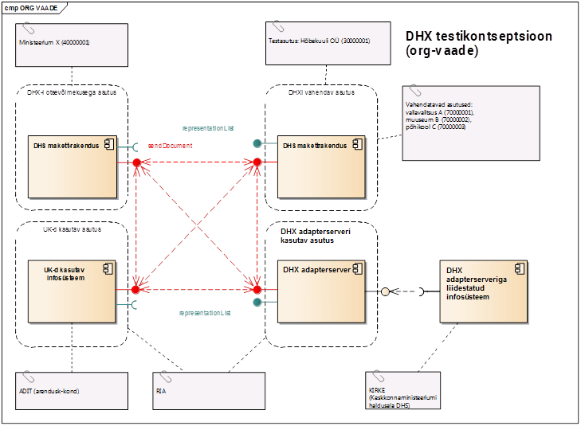

# Sisukord

- [Testimise strateegia](#test-strateegia)
- [Testilood](#tests)

  - [1. DHX protokolli teenuste testimine](#dhx-tests)

    - [1.1 Õige kapsli saatmine](#1.1)
    - [1.2. Õige kapsli saatmine alamsüsteemile](#1.2)
    - [1.3. Vale kapsli saatmine](#1.3)
    - [1.4. Faili saatmine (fail ei ole kapsel)](#1.4)
    - [1.5. Duplikaadi kontroll](#1.5)
    - [1.6. Valele adressaadile saatmine](#1.6)
    - [1.7. Vahendatavate nimekirja küsimine DVK-st](#1.7)
    - [1.8. Õige kapsli saatmine. Kapslis on määratud 'ARVED' kaust](#1.8)
    - [1.9. Õige kapsli saatmine vahendatavale](#1.9)
    - [1.10. Õige kapsli saatmine vahendatava alamsüsteemile](#1.10)

  - [2. DVK protokolli teenuste testimine.](#dvk-tests)

    - [2.1. Õige kapsli saatmine](#2.1)
    - [2.2. Vale kapsli saatmine](#2.2)
    - [2.3. Faili saatmine (fail ei ole kapsel)](#2.3)
    - [2.4. Vahendatavale saatmine](#2.4)
    - [2.5. Valele adressaadile saatmine](#2.5)
    - [2.6. DHX süsteemist tulnud dokumendi vastuvõtmine](#2.6)
    - [2.7. DHX süsteemist tulnud dokumendi vastuvõetuks märkimine](#2.7)
    - [2.8. DHX süsteemist tulnud dokumendi vastuvõtmine. Dokument on suunatud alamsüsteemile.](#2.8)
    - [2.9. DHX süsteemist tulnud dokumendi vastuvõetuks märkimine. Dokument on suunatud alamsüsteemile.](#2.9)
    - [2.10. DVK adressaatide nimekirja pärimine.](#2.10)
    - [2.11. DHX-i saadetud dokumendi staatuse pärimine(saatmine õnnestus)](#2.11)
    - [2.12. DHX-i saadetud dokumendi staatuse pärimine(saatmine ebaõnnestus, adressaat ei ole üleval)](#2.12)
    - [2.13. Õige kapsli saatmine DHX alamsüsteemile(DHX. prefiksiga X-tee alamsüsteemile)](#2.13)
    - [2.14. DHX süsteemist tulnud dokumendi vastuvõtmine 'ARVED' kaustast.](#2.14)
    - [2.15. DHX süsteemist tulnud dokumendi vastuvõetuks märkimine. Dokument on 'ARVED' kaustas.](#2.15)
    - [2.16. DHX süsteemist tulnud dokumendi vastuvõtmine. Dokument on suunatud vahendatavale.](#2.16)
    - [2.17. DHX süsteemist tulnud dokumendi vastuvõetuks märkimine. Dokument on suunatud vahendatavale.](#2.17)
    - [2.18. DHX süsteemist tulnud dokumendi vastuvõtmine. Dokument on suunatud vahendatava alamsüsteemile.](#2.18)
    - [2.19. DHX süsteemist tulnud dokumendi vastuvõetuks märkimine. Dokument on suunatud vahendatava alamsüsteemile.](#2.19)

  - [3. DHX makettrakenduse testid](#dhx-makett-tests)

    - [3.1. Õige kapsli saatmine](#3.1)
    - [3.2. Duplikaadi kontroll](#3.2)
    - [3.3. DVK süsteemist tulnud dokumendi vastuvõtmine](#3.3)

- [Testplaan](#testplaan)

<a name="test-strateegia"></a>
# Testimise strateegia

Käesolev dokument määratleb seoses DHX protokolli kasutuselevõtuga DHX adapterserveri testimise ulatuse, korralduse ja üksikasjad. DHX adapterserveri testimiseks tehakse otse SOAP päringud (nii vastavalt DHX protokollile kui ka vastavalt DVK protokollile, kuna DHX adapterserver pakub mõlemaid). SOAP päringute tegemiseks on soovitatav kasutada SOAP UI-d.

Iga punkti 1 ja punkti 2 testloo juures on olemas näidis-XML, mida võib kasutada testimiseks. Enne XML-i saatmist tuleb veenduda ja vajadusel muuta XML-i header-i _service_ ja _client_ elemente, täites neid vajalike andmetega (saatva süsteemi ja adressaadi andmetega). Juhul kui XML-i keha  vajab enne saatmist muutmist, siis vastav info on kajastatud testiloos. SOAP päringu saatmisel tuleb veenduda, et päring saadetakse õigele X-tee turvaserverile (saatva süsteemi turvaserverile). Lisaks juhul kui testiloo käigus saadetakse kapsel, siis tuleb veenduda, et kapsli adresssaat ja kapsli saatja on õiged (vastavad testiloos kirjeldatud saatja süsteemile ja kapsli adressadile).

DHX adapterserveri testikontseptsioon on esitatud joonisel:


<a name="tests"></a>
# Testilood

## **Tähistused:**

- Korrektselt kapseldatud fail - Vastavalt elektroonilise andmevahetuse metaandmete loendile 2.1  korrektselt kapseldatud fail.

DHX adapter serveri testimiseks on vajalikud järgmised X-tee liikmed:

DHS 1 – X-tee liige, kellel on olemas DHX alamsüsteem, aga ta ei paku DHX protokollile vastavaid teenuseid või teenusi pakkuv rakendus on maas.

DHS 2 – X-tee liige, kellel on olemas DHX alamsüsteem, kes on registreeritud DHX vahendajana ja pakub X-tee teenuseid representationList ja sendDocument vastavalt DHX protokollile. RepresentationList teenus peab tagastama vähemalt ühe vahendatava andmeid. Asutusel on registreeritud vähemalt üks DHX. prefiksiga(ntks DHX.subsystem) alamsüsteem, kuhu võib DHX protkolli järgi dokumente saata.

DHS 3 – Teenuste omanik(pakkuja), ehk see liige kellele dokumente saadetakse DHX-st ja kes pakub DVK teenuseid DHS-le. X-tee liige, kellel on olemas DHX alamsüsteem, kes on registreeritud DHX vahendajana ja pakub X-tee teenuseid representationList ja sendDocument vastavalt DHX protokollile.

Iga testiloo juures on kirjas, millised X-tee liikmed on vajalikud konkreetse testloo täitmiseks.

Iga SOAP sõnumi X-tee header ja  service element tuleb täita DHX adapterserveri andmetega, ehk iga SOAP sõnum tuleb saata DHX adapterserverisse.

<a name="dhx-tests"></a>
## 1. DHX protokolli teenuste testimine


<a name="1.1"></a>
### 1.1. Õige kapsli saatmine

```
Saatev süsteem : DHS 2
Kapsli adressaat : DHS 3
Saadetis : korrektselt kapseldatud fail
```

#### **Verifitseerija toimimine (samm-sammuline)**:

- Testija saadab päringu DHX teenusesse sendDocument

  - Testija asendab sendDocument päringu XML-i kehas consignmentId elemendi sisu unikaalse id-ga (näiteks suvalise tekstiga).
  - SOAP päringu manuseks tuleb lisada korrektselt kapseldatud fail. Manuse ContentId-na tuleb panna 'doc'.

#### **Oodatav tulemus** :

- sendDocument päringu saatmisel vigu ei tekkinud ja päringu vastuses on olemas receiptId

#### **Päringu näide:**

```xml
<soapenv:Envelope xmlns:soapenv="http://schemas.xmlsoap.org/soap/envelope/" xmlns:xro="http://x-road.eu/xsd/xroad.xsd" xmlns:iden="http://x-road.eu/xsd/identifiers" xmlns:prod="http://dhx.x-road.eu/producer">
   <soapenv:Header>
       <ns4:protocolVersion xmlns:ns2="http://dhx.x-road.eu/producer" xmlns:ns3="http://x-road.eu/xsd/identifiers" xmlns:ns4="http://x-road.eu/xsd/xroad.xsd" xmlns:ns5="http://www.riik.ee/schemas/deccontainer/vers_2_1/">4.0</ns4:protocolVersion>
    <ns4:id xmlns:ns2="http://dhx.x-road.eu/producer" xmlns:ns3="http://x-road.eu/xsd/identifiers" xmlns:ns4="http://x-road.eu/xsd/xroad.xsd" xmlns:ns5="http://www.riik.ee/schemas/deccontainer/vers_2_1/">64a3ddbd-1620-42c4-b2fe-60b854c2f32f
    </ns4:id>
    <ns4:client xmlns:ns2="http://dhx.x-road.eu/producer" xmlns:ns3="http://x-road.eu/xsd/identifiers" xmlns:ns4="http://x-road.eu/xsd/xroad.xsd" xmlns:ns5="http://www.riik.ee/schemas/deccontainer/vers_2_1/">
      <ns3:xRoadInstance>ee-dev</ns3:xRoadInstance>
      <ns3:memberClass>COM</ns3:memberClass>
      <ns3:memberCode>30000001</ns3:memberCode>
      <ns3:subsystemCode>DHX</ns3:subsystemCode>
    </ns4:client>
    <ns4:service ns3:objectType="SERVICE" xmlns:ns2="http://dhx.x-road.eu/producer" xmlns:ns3="http://x-road.eu/xsd/identifiers" xmlns:ns4="http://x-road.eu/xsd/xroad.xsd" xmlns:ns5="http://www.riik.ee/schemas/deccontainer/vers_2_1/">
      <ns3:xRoadInstance>ee-dev</ns3:xRoadInstance>
      <ns3:memberClass>GOV</ns3:memberClass>
      <ns3:memberCode>40000001</ns3:memberCode>
      <ns3:subsystemCode>DHX</ns3:subsystemCode>
      <ns3:serviceCode>sendDocument</ns3:serviceCode>
      <ns3:serviceVersion>v1</ns3:serviceVersion>
    </ns4:service>
   </soapenv:Header>
   <soapenv:Body>
      <prod:sendDocument>
         	<!--Optional:-->
          <prod:DHXVersion>1.0</prod:DHXVersion>
         	<prod:documentAttachment>cid:doc</prod:documentAttachment>
         	<prod:consignmentId>34a09efc-f842-45a1-ab9d-6eda0de85e63</prod:consignmentId>
      </prod:sendDocument>
   </soapenv:Body>
</soapenv:Envelope>
```

#### **Manus:**

```xml
<DecContainer xmlns="http://www.riik.ee/schemas/deccontainer/vers_2_1/">
  <Transport>
    <DecSender>
        <OrganisationCode>30000001</OrganisationCode>
        <PersonalIdCode>EE38806190294</PersonalIdCode>
    </DecSender>
    <DecRecipient>
        <OrganisationCode>40000001</OrganisationCode>
    </DecRecipient>
  </Transport>
  <RecordCreator>
    <Person>
      <Name>Lauri Tammemäe</Name>
      <GivenName>Lauri</GivenName>
      <Surname>Tammemäe</Surname>
      <PersonalIdCode>EE38806190294</PersonalIdCode>
      <Residency>EE</Residency>
    </Person>
    <ContactData>
      <Adit>true</Adit>
      <Phone>3726630276</Phone>
      <Email>lauri.tammemae@ria.ee</Email>
      <WebPage>www.hot.ee/lauri</WebPage>
      <MessagingAddress>skype: lauri.tammemae</MessagingAddress>
      <PostalAddress>
        <Country>Eesti</Country>
        <County>Harju maakond</County>
        <LocalGovernment>Tallinna linn</LocalGovernment>
        <AdministrativeUnit>Mustamäe linnaosa</AdministrativeUnit>
        <SmallPlace>Pääsukese KÜ</SmallPlace>
        <LandUnit></LandUnit>
        <Street>Mustamäe tee</Street>
        <HouseNumber>248</HouseNumber>
        <BuildingPartNumber>62</BuildingPartNumber>
        <PostalCode>11212</PostalCode>
      </PostalAddress>
    </ContactData>
  </RecordCreator>
  <RecordSenderToDec>
    <Person>
      <Name>Lauri Tammemäe</Name>
      <GivenName>Lauri</GivenName>
      <Surname>Tammemäe</Surname>
      <PersonalIdCode>EE38806190294</PersonalIdCode>
      <Residency>EE</Residency>
    </Person>
    <ContactData>
      <Adit>false</Adit>
      <Phone>3726630276</Phone>
      <Email>lauri.tammemae@ria.ee</Email>
      <WebPage>www.hot.ee/lauri</WebPage>
      <MessagingAddress>skype: lauri.tammemae</MessagingAddress>
      <PostalAddress>
        <Country>Eesti</Country>
        <County>Harju maakond</County>
        <LocalGovernment>Tallinna linn</LocalGovernment>
        <AdministrativeUnit>Mustamäe linnaosa</AdministrativeUnit>
        <SmallPlace>Pääsukese KÜ</SmallPlace>
        <LandUnit></LandUnit>
        <Street>Mustamäe tee</Street>
        <HouseNumber>248</HouseNumber>
        <BuildingPartNumber>62</BuildingPartNumber>
        <PostalCode>11212</PostalCode>
      </PostalAddress>
    </ContactData>
  </RecordSenderToDec>
  <Recipient>
    <Organisation>
      <Name>Riigi Infosüsteemi Amet</Name>
      <OrganisationCode>70006317</OrganisationCode>
      <Residency>EE</Residency>
    </Organisation>
  </Recipient>
  <RecordMetadata>
    <RecordGuid>25892e17-80f6-415f-9c65-7395632f0234</RecordGuid>
    <RecordType>Kiri</RecordType>
    <RecordOriginalIdentifier>213465</RecordOriginalIdentifier>
    <RecordDateRegistered>2012-11-11T19:18:03</RecordDateRegistered>
    <RecordTitle>Ettepanek</RecordTitle>
    <RecordLanguage>EE</RecordLanguage>
  </RecordMetadata>
  <Access>
    <AccessConditionsCode>Avalik</AccessConditionsCode>
  </Access>
  <File>
    <FileGuid>25892e17-80f6-415f-9c65-7395632f0001</FileGuid>
    <RecordMainComponent>0</RecordMainComponent>
    <FileName>Ettepanek.doc</FileName>
    <MimeType>application/msword</MimeType>
    <FileSize>211543</FileSize>
    <ZipBase64Content>H4sIACvlpU0AAwspqszMS1coyVcoTs1LUUjJT+YCALD0cp8TAAAA</ZipBase64Content>
  </File>
  <RecordTypeSpecificMetadata />
  <DecMetadata>
    <DecId>410125</DecId>
    <DecFolder>/</DecFolder>
    <DecReceiptDate>2012-11-11T19:20:42</DecReceiptDate>
  </DecMetadata>
</DecContainer>
```

<a name="1.2"></a>

### 1.2. Õige kapsli saatmine alamsüsteemile

```
Saatev süsteem : DHS 2
Kapsli adressaat : DHS 3-e registrikood
Saadetis : korrektselt kapseldatud fail
```

#### **Verifitseerija toimimine (samm-sammuline):**

- Testija saadab päringu DHX teenusesse sendDocument

  - Testija asendab sendDocument päringu XML-i kehas consignmentId elemendi sisu unikaalse id-ga (näiteks suvalise tekstiga). Märkus: Vajadusel (juhul kui testi tehakse mitte selle adressaadiga, kelle andmed on esitatud näites) tuleb muuta ka recipient ja recipientSystem (asutuse alamsüsteem) elemendid XML-i kehas.
  - SOAP päringu manuseks tuleb panna korrektselt kapseldatud fail. Manuse ContentId-na tuleb panna 'doc'.

#### **Oodatav tulemus** :

- sendDocument päringu saatmisel vigu ei tekkinud ja päringu vastuses on olemas receiptId

#### **Päringu näide:**

```xml
<soapenv:Envelope xmlns:soapenv="http://schemas.xmlsoap.org/soap/envelope/" xmlns:xro="http://x-road.eu/xsd/xroad.xsd" xmlns:iden="http://x-road.eu/xsd/identifiers" xmlns:prod="http://dhx.x-road.eu/producer">
   <soapenv:Header>
       <ns4:protocolVersion xmlns:ns2="http://dhx.x-road.eu/producer" xmlns:ns3="http://x-road.eu/xsd/identifiers" xmlns:ns4="http://x-road.eu/xsd/xroad.xsd" xmlns:ns5="http://www.riik.ee/schemas/deccontainer/vers_2_1/">4.0</ns4:protocolVersion>
    <ns4:id xmlns:ns2="http://dhx.x-road.eu/producer" xmlns:ns3="http://x-road.eu/xsd/identifiers" xmlns:ns4="http://x-road.eu/xsd/xroad.xsd" xmlns:ns5="http://www.riik.ee/schemas/deccontainer/vers_2_1/">64a3ddbd-1620-42c4-b2fe-60b854c2f32f
    </ns4:id>
    <ns4:client xmlns:ns2="http://dhx.x-road.eu/producer" xmlns:ns3="http://x-road.eu/xsd/identifiers" xmlns:ns4="http://x-road.eu/xsd/xroad.xsd" xmlns:ns5="http://www.riik.ee/schemas/deccontainer/vers_2_1/">
      <ns3:xRoadInstance>ee-dev</ns3:xRoadInstance>
      <ns3:memberClass>COM</ns3:memberClass>
      <ns3:memberCode>30000001</ns3:memberCode>
      <ns3:subsystemCode>DHX</ns3:subsystemCode>
    </ns4:client>
    <ns4:service ns3:objectType="SERVICE" xmlns:ns2="http://dhx.x-road.eu/producer" xmlns:ns3="http://x-road.eu/xsd/identifiers" xmlns:ns4="http://x-road.eu/xsd/xroad.xsd" xmlns:ns5="http://www.riik.ee/schemas/deccontainer/vers_2_1/">
      <ns3:xRoadInstance>ee-dev</ns3:xRoadInstance>
      <ns3:memberClass>GOV</ns3:memberClass>
      <ns3:memberCode>40000001</ns3:memberCode>
      <ns3:subsystemCode>DHX.subsystem</ns3:subsystemCode>
      <ns3:serviceCode>sendDocument</ns3:serviceCode>
      <ns3:serviceVersion>v1</ns3:serviceVersion>
    </ns4:service>
   </soapenv:Header>
   <soapenv:Body>
      <prod:sendDocument>
         	<!--Optional:-->
        	<prod:DHXVersion>1.0</prod:DHXVersion>
         	<prod:documentAttachment>cid:doc</prod:documentAttachment>
         	<prod:consignmentId>36562296-fb2d-4ffa-804e-0f0394ba204a</prod:consignmentId>
      </prod:sendDocument>
   </soapenv:Body>
</soapenv:Envelope>
```

#### **Manus:**

```xml
<DecContainer xmlns="http://www.riik.ee/schemas/deccontainer/vers_2_1/">
  <Transport>
    <DecSender>
        <OrganisationCode>30000001</OrganisationCode>
        <PersonalIdCode>EE38806190294</PersonalIdCode>
    </DecSender>
    <DecRecipient>
        <OrganisationCode>40000001</OrganisationCode>
    </DecRecipient>
  </Transport>
  <RecordCreator>
    <Person>
      <Name>Lauri Tammemäe</Name>
      <GivenName>Lauri</GivenName>
      <Surname>Tammemäe</Surname>
      <PersonalIdCode>EE38806190294</PersonalIdCode>
      <Residency>EE</Residency>
    </Person>
    <ContactData>
      <Adit>true</Adit>
      <Phone>3726630276</Phone>
      <Email>lauri.tammemae@ria.ee</Email>
      <WebPage>www.hot.ee/lauri</WebPage>
      <MessagingAddress>skype: lauri.tammemae</MessagingAddress>
      <PostalAddress>
        <Country>Eesti</Country>
        <County>Harju maakond</County>
        <LocalGovernment>Tallinna linn</LocalGovernment>
        <AdministrativeUnit>Mustamäe linnaosa</AdministrativeUnit>
        <SmallPlace>Pääsukese KÜ</SmallPlace>
        <LandUnit></LandUnit>
        <Street>Mustamäe tee</Street>
        <HouseNumber>248</HouseNumber>
        <BuildingPartNumber>62</BuildingPartNumber>
        <PostalCode>11212</PostalCode>
      </PostalAddress>
    </ContactData>
  </RecordCreator>
  <RecordSenderToDec>
    <Person>
      <Name>Lauri Tammemäe</Name>
      <GivenName>Lauri</GivenName>
      <Surname>Tammemäe</Surname>
      <PersonalIdCode>EE38806190294</PersonalIdCode>
      <Residency>EE</Residency>
    </Person>
    <ContactData>
      <Adit>false</Adit>
      <Phone>3726630276</Phone>
      <Email>lauri.tammemae@ria.ee</Email>
      <WebPage>www.hot.ee/lauri</WebPage>
      <MessagingAddress>skype: lauri.tammemae</MessagingAddress>
      <PostalAddress>
        <Country>Eesti</Country>
        <County>Harju maakond</County>
        <LocalGovernment>Tallinna linn</LocalGovernment>
        <AdministrativeUnit>Mustamäe linnaosa</AdministrativeUnit>
        <SmallPlace>Pääsukese KÜ</SmallPlace>
        <LandUnit></LandUnit>
        <Street>Mustamäe tee</Street>
        <HouseNumber>248</HouseNumber>
        <BuildingPartNumber>62</BuildingPartNumber>
        <PostalCode>11212</PostalCode>
      </PostalAddress>
    </ContactData>
  </RecordSenderToDec>
  <Recipient>
    <Organisation>
      <Name>Riigi Infosüsteemi Amet</Name>
      <OrganisationCode>70006317</OrganisationCode>
      <Residency>EE</Residency>
    </Organisation>
  </Recipient>
  <RecordMetadata>
    <RecordGuid>25892e17-80f6-415f-9c65-7395632f0234</RecordGuid>
    <RecordType>Kiri</RecordType>
    <RecordOriginalIdentifier>213465</RecordOriginalIdentifier>
    <RecordDateRegistered>2012-11-11T19:18:03</RecordDateRegistered>
    <RecordTitle>Ettepanek</RecordTitle>
    <RecordLanguage>EE</RecordLanguage>
  </RecordMetadata>
  <Access>
    <AccessConditionsCode>Avalik</AccessConditionsCode>
  </Access>
  <File>
    <FileGuid>25892e17-80f6-415f-9c65-7395632f0001</FileGuid>
    <RecordMainComponent>0</RecordMainComponent>
    <FileName>Ettepanek.doc</FileName>
    <MimeType>application/msword</MimeType>
    <FileSize>211543</FileSize>
    <ZipBase64Content>H4sIACvlpU0AAwspqszMS1coyVcoTs1LUUjJT+YCALD0cp8TAAAA</ZipBase64Content>
  </File>
  <RecordTypeSpecificMetadata />
  <DecMetadata>
    <DecId>410125</DecId>
    <DecFolder>/</DecFolder>
    <DecReceiptDate>2012-11-11T19:20:42</DecReceiptDate>
  </DecMetadata>
</DecContainer>
```

<a name="1.3"></a>

### 1.3. Vale kapsli saatmine

```
Saatev süsteem : DHS 2
Kapsli adressaat : DHS 3
Saadetis : kapsli fail, mis ei vasta Elektroonilise andmevahetuse metaandmete loendile 2.1 (nt puudu kohustuslik väli), aga on XML-vormingus fail õige XML-vorminguga.
```

#### **Verifitseerija toimimine (samm-sammuline):**

- Testija saadab päringu DHX teenusesse sendDocument

  - Testija asendab sendDocument päringu XML-i kehas consignmentId elemendi sisu unikaalse id-ga (näiteks suvalise tekstiga).
  - SOAP päringu manuseks tuleb lisada kapsli fail, mis ei vasta Elektroonilise andmevahetuse metaandmete loendile 2.1 (nt puudu kohustuslik väli), aga on XML-fail õige XML-vorminguga. Manuse ContentId-na tuleb panna 'doc'.

#### **Oodatav tulemus** :

- sendDocument päringu vastuses on DHX.Validation koodiga fault

#### **Päringu näide:**

```xml
<soapenv:Envelope xmlns:soapenv="http://schemas.xmlsoap.org/soap/envelope/" xmlns:xro="http://x-road.eu/xsd/xroad.xsd" xmlns:iden="http://x-road.eu/xsd/identifiers" xmlns:prod="http://dhx.x-road.eu/producer">
   <soapenv:Header>
       <ns4:protocolVersion xmlns:ns2="http://dhx.x-road.eu/producer" xmlns:ns3="http://x-road.eu/xsd/identifiers" xmlns:ns4="http://x-road.eu/xsd/xroad.xsd" xmlns:ns5="http://www.riik.ee/schemas/deccontainer/vers_2_1/">4.0</ns4:protocolVersion>
    <ns4:id xmlns:ns2="http://dhx.x-road.eu/producer" xmlns:ns3="http://x-road.eu/xsd/identifiers" xmlns:ns4="http://x-road.eu/xsd/xroad.xsd" xmlns:ns5="http://www.riik.ee/schemas/deccontainer/vers_2_1/">64a3ddbd-1620-42c4-b2fe-60b854c2f32f
    </ns4:id>
    <ns4:client xmlns:ns2="http://dhx.x-road.eu/producer" xmlns:ns3="http://x-road.eu/xsd/identifiers" xmlns:ns4="http://x-road.eu/xsd/xroad.xsd" xmlns:ns5="http://www.riik.ee/schemas/deccontainer/vers_2_1/">
      <ns3:xRoadInstance>ee-dev</ns3:xRoadInstance>
      <ns3:memberClass>COM</ns3:memberClass>
      <ns3:memberCode>30000001</ns3:memberCode>
      <ns3:subsystemCode>DHX</ns3:subsystemCode>
    </ns4:client>
    <ns4:service ns3:objectType="SERVICE" xmlns:ns2="http://dhx.x-road.eu/producer" xmlns:ns3="http://x-road.eu/xsd/identifiers" xmlns:ns4="http://x-road.eu/xsd/xroad.xsd" xmlns:ns5="http://www.riik.ee/schemas/deccontainer/vers_2_1/">
      <ns3:xRoadInstance>ee-dev</ns3:xRoadInstance>
      <ns3:memberClass>GOV</ns3:memberClass>
      <ns3:memberCode>40000001</ns3:memberCode>
      <ns3:subsystemCode>DHX</ns3:subsystemCode>
      <ns3:serviceCode>sendDocument</ns3:serviceCode>
      <ns3:serviceVersion>v1</ns3:serviceVersion>
    </ns4:service>
   </soapenv:Header>
   <soapenv:Body>
      <prod:sendDocument>
         	<!--Optional:-->
        	<prod:DHXVersion>1.0</prod:DHXVersion>
         	<prod:documentAttachment>cid:doc</prod:documentAttachment>
         	<prod:consignmentId>bd49d1c4-a4fb-4e2a-af0b-fabb78bbd96e</prod:consignmentId>
      </prod:sendDocument>
   </soapenv:Body>
</soapenv:Envelope>
```

#### **Manus:**

```xml
<DecContainer xmlns="http://www.riik.ee/schemas/deccontainer/vers_2_1/">
  <RecordCreator>
    <Person>
      <Name>Lauri Tammemäe</Name>
      <GivenName>Lauri</GivenName>
      <Surname>Tammemäe</Surname>
      <PersonalIdCode>EE38806190294</PersonalIdCode>
      <Residency>EE</Residency>
    </Person>
    <ContactData>
      <Adit>true</Adit>
      <Phone>3726630276</Phone>
      <Email>lauri.tammemae@ria.ee</Email>
      <WebPage>www.hot.ee/lauri</WebPage>
      <MessagingAddress>skype: lauri.tammemae</MessagingAddress>
      <PostalAddress>
        <Country>Eesti</Country>
        <County>Harju maakond</County>
        <LocalGovernment>Tallinna linn</LocalGovernment>
        <AdministrativeUnit>Mustamäe linnaosa</AdministrativeUnit>
        <SmallPlace>Pääsukese KÜ</SmallPlace>
        <LandUnit></LandUnit>
        <Street>Mustamäe tee</Street>
        <HouseNumber>248</HouseNumber>
        <BuildingPartNumber>62</BuildingPartNumber>
        <PostalCode>11212</PostalCode>
      </PostalAddress>
    </ContactData>
  </RecordCreator>
  <RecordSenderToDec>
    <Person>
      <Name>Lauri Tammemäe</Name>
      <GivenName>Lauri</GivenName>
      <Surname>Tammemäe</Surname>
      <PersonalIdCode>EE38806190294</PersonalIdCode>
      <Residency>EE</Residency>
    </Person>
    <ContactData>
      <Adit>false</Adit>
      <Phone>3726630276</Phone>
      <Email>lauri.tammemae@ria.ee</Email>
      <WebPage>www.hot.ee/lauri</WebPage>
      <MessagingAddress>skype: lauri.tammemae</MessagingAddress>
      <PostalAddress>
        <Country>Eesti</Country>
        <County>Harju maakond</County>
        <LocalGovernment>Tallinna linn</LocalGovernment>
        <AdministrativeUnit>Mustamäe linnaosa</AdministrativeUnit>
        <SmallPlace>Pääsukese KÜ</SmallPlace>
        <LandUnit></LandUnit>
        <Street>Mustamäe tee</Street>
        <HouseNumber>248</HouseNumber>
        <BuildingPartNumber>62</BuildingPartNumber>
        <PostalCode>11212</PostalCode>
      </PostalAddress>
    </ContactData>
  </RecordSenderToDec>
  <Recipient>
    <Organisation>
      <Name>Riigi Infosüsteemi Amet</Name>
      <OrganisationCode>70006317</OrganisationCode>
      <Residency>EE</Residency>
    </Organisation>
  </Recipient>
  <RecordMetadata>
    <RecordGuid>25892e17-80f6-415f-9c65-7395632f0234</RecordGuid>
    <RecordType>Kiri</RecordType>
    <RecordOriginalIdentifier>213465</RecordOriginalIdentifier>
    <RecordDateRegistered>2012-11-11T19:18:03</RecordDateRegistered>
    <RecordTitle>Ettepanek</RecordTitle>
    <RecordLanguage>EE</RecordLanguage>
  </RecordMetadata>
  <Access>
    <AccessConditionsCode>Avalik</AccessConditionsCode>
  </Access>
  <File>
    <FileGuid>25892e17-80f6-415f-9c65-7395632f0001</FileGuid>
    <RecordMainComponent>0</RecordMainComponent>
    <FileName>Ettepanek.doc</FileName>
    <MimeType>application/msword</MimeType>
    <FileSize>211543</FileSize>
    <ZipBase64Content>H4sIACvlpU0AAwspqszMS1coyVcoTs1LUUjJT+YCALD0cp8TAAAA</ZipBase64Content>
  </File>
  <RecordTypeSpecificMetadata />
  <DecMetadata>
    <DecId>410125</DecId>
    <DecFolder>/</DecFolder>
    <DecReceiptDate>2012-11-11T19:20:42</DecReceiptDate>
  </DecMetadata>
</DecContainer>
```

<a name="1.4"></a>
### 1.4. Faili saatmine (fail ei ole kapsel)

```
Saatev süsteem : DHS 2
Kapsli adressaat : DHS 3
Saadetis : fail, mis ei ole XML-vormingus  või  on  XML vale vorminguga.
```

#### **Verifitseerija toimimine (samm-sammuline):**

- Testija saadab päringu DHX teenusesse sendDocument

  - Testija asendab sendDocument päringu XML-i kehas consignmentId elemendi sisu unikaalse id-ga(näiteks suvalise tekstiga).
  - SOAP päringu manusena tuleb panna fail, mis ei ole XML-vormingus või on XML vale vorminguga. Manuse ContentId-na tuleb panna 'doc'.

#### **Oodatav tulemus** :

- sendDocument päringu vastuses on DHX.Validation koodiga fault

#### **Päringu näide:**

```xml
<soapenv:Envelope xmlns:soapenv="http://schemas.xmlsoap.org/soap/envelope/" xmlns:xro="http://x-road.eu/xsd/xroad.xsd" xmlns:iden="http://x-road.eu/xsd/identifiers" xmlns:prod="http://dhx.x-road.eu/producer">
   <soapenv:Header>
       <ns4:protocolVersion xmlns:ns2="http://dhx.x-road.eu/producer" xmlns:ns3="http://x-road.eu/xsd/identifiers" xmlns:ns4="http://x-road.eu/xsd/xroad.xsd" xmlns:ns5="http://www.riik.ee/schemas/deccontainer/vers_2_1/">4.0</ns4:protocolVersion>
    <ns4:id xmlns:ns2="http://dhx.x-road.eu/producer" xmlns:ns3="http://x-road.eu/xsd/identifiers" xmlns:ns4="http://x-road.eu/xsd/xroad.xsd" xmlns:ns5="http://www.riik.ee/schemas/deccontainer/vers_2_1/">64a3ddbd-1620-42c4-b2fe-60b854c2f32f
    </ns4:id>
    <ns4:client xmlns:ns2="http://dhx.x-road.eu/producer" xmlns:ns3="http://x-road.eu/xsd/identifiers" xmlns:ns4="http://x-road.eu/xsd/xroad.xsd" xmlns:ns5="http://www.riik.ee/schemas/deccontainer/vers_2_1/">
      <ns3:xRoadInstance>ee-dev</ns3:xRoadInstance>
      <ns3:memberClass>COM</ns3:memberClass>
      <ns3:memberCode>30000001</ns3:memberCode>
      <ns3:subsystemCode>DHX</ns3:subsystemCode>
    </ns4:client>
      <ns4:service ns3:objectType="SERVICE" xmlns:ns2="http://dhx.x-road.eu/producer" xmlns:ns3="http://x-road.eu/xsd/identifiers" xmlns:ns4="http://x-road.eu/xsd/xroad.xsd" xmlns:ns5="http://www.riik.ee/schemas/deccontainer/vers_2_1/">
      <ns3:xRoadInstance>ee-dev</ns3:xRoadInstance>
      <ns3:memberClass>GOV</ns3:memberClass>
      <ns3:memberCode>40000001</ns3:memberCode>
      <ns3:subsystemCode>DHX</ns3:subsystemCode>
      <ns3:serviceCode>sendDocument</ns3:serviceCode>
      <ns3:serviceVersion>v1</ns3:serviceVersion>
    </ns4:service>
   </soapenv:Header>
   <soapenv:Body>
        <prod:sendDocument>
            <!--Optional:-->
            <prod:DHXVersion>1.0</prod:DHXVersion>
            <prod:documentAttachment>cid:doc</prod:documentAttachment>
            <prod:consignmentId>dede4323-db07-4190-a187-7293c912e3e8</prod:consignmentId>
        </prod:sendDocument>
   </soapenv:Body>
</soapenv:Envelope>
```

#### **Manus:**

```xml
Test fail.
```

<a name="1.5"></a>
### 1.5. Duplikaadi kontroll

```
Saatev süsteem : DHS 2
Kapsli adressaat : DHS 3
Saadetis : korrektselt kapseldatud fail
```

#### **Verifitseerija toimimine (samm-sammuline):**

- Testija saadab päringu DHX teenusesse sendDocument

  - Testija asendab sendDocument päringu XML-i kehas consignmentId elemendi sisu väärtusega, millisega on eelnevalt dokument juba saadetud.
  - SOAP päringu manuseks tuleb lisada korrektselt kapseldatud fail. Manuse ContentId-na tuleb panna 'doc'.

#### **Oodatav tulemus** :

- sendDocument päringu vastuses on DHX.Duplicate koodiga fault

#### **Päringu näide:**

```xml
<soapenv:Envelope xmlns:soapenv="http://schemas.xmlsoap.org/soap/envelope/" xmlns:xro="http://x-road.eu/xsd/xroad.xsd" xmlns:iden="http://x-road.eu/xsd/identifiers" xmlns:prod="http://dhx.x-road.eu/producer">
   <soapenv:Header>
       <ns4:protocolVersion xmlns:ns2="http://dhx.x-road.eu/producer" xmlns:ns3="http://x-road.eu/xsd/identifiers" xmlns:ns4="http://x-road.eu/xsd/xroad.xsd" xmlns:ns5="http://www.riik.ee/schemas/deccontainer/vers_2_1/">4.0</ns4:protocolVersion>
    <ns4:id xmlns:ns2="http://dhx.x-road.eu/producer" xmlns:ns3="http://x-road.eu/xsd/identifiers" xmlns:ns4="http://x-road.eu/xsd/xroad.xsd" xmlns:ns5="http://www.riik.ee/schemas/deccontainer/vers_2_1/">64a3ddbd-1620-42c4-b2fe-60b854c2f32f
    </ns4:id>
    <ns4:client xmlns:ns2="http://dhx.x-road.eu/producer" xmlns:ns3="http://x-road.eu/xsd/identifiers" xmlns:ns4="http://x-road.eu/xsd/xroad.xsd" xmlns:ns5="http://www.riik.ee/schemas/deccontainer/vers_2_1/">
      <ns3:xRoadInstance>ee-dev</ns3:xRoadInstance>
      <ns3:memberClass>COM</ns3:memberClass>
      <ns3:memberCode>30000001</ns3:memberCode>
      <ns3:subsystemCode>DHX</ns3:subsystemCode>
    </ns4:client>
    <ns4:service ns3:objectType="SERVICE" xmlns:ns2="http://dhx.x-road.eu/producer" xmlns:ns3="http://x-road.eu/xsd/identifiers" xmlns:ns4="http://x-road.eu/xsd/xroad.xsd" xmlns:ns5="http://www.riik.ee/schemas/deccontainer/vers_2_1/">
      <ns3:xRoadInstance>ee-dev</ns3:xRoadInstance>
      <ns3:memberClass>GOV</ns3:memberClass>
      <ns3:memberCode>40000001</ns3:memberCode>
      <ns3:subsystemCode>DHX</ns3:subsystemCode>
      <ns3:serviceCode>sendDocument</ns3:serviceCode>
      <ns3:serviceVersion>v1</ns3:serviceVersion>
    </ns4:service>
   </soapenv:Header>
   <soapenv:Body>
      <prod:sendDocument>
         	<!--Optional:-->
          <prod:DHXVersion>1.0</prod:DHXVersion>
         	<prod:documentAttachment>cid:doc</prod:documentAttachment>
         	<prod:consignmentId>8a647277-6375-48d8-8cd2-ad4028f06b94</prod:consignmentId>
      </prod:sendDocument>
   </soapenv:Body>
</soapenv:Envelope>

```

#### **Manus:**

```xml
<DecContainer xmlns="http://www.riik.ee/schemas/deccontainer/vers_2_1/">
  <Transport>
    <DecSender>
        <OrganisationCode>30000001</OrganisationCode>
        <PersonalIdCode>EE38806190294</PersonalIdCode>
    </DecSender>
    <DecRecipient>
        <OrganisationCode>40000001</OrganisationCode>
    </DecRecipient>
  </Transport>
  <RecordCreator>
    <Person>
      <Name>Lauri Tammemäe</Name>
      <GivenName>Lauri</GivenName>
      <Surname>Tammemäe</Surname>
      <PersonalIdCode>EE38806190294</PersonalIdCode>
      <Residency>EE</Residency>
    </Person>
    <ContactData>
      <Adit>true</Adit>
      <Phone>3726630276</Phone>
      <Email>lauri.tammemae@ria.ee</Email>
      <WebPage>www.hot.ee/lauri</WebPage>
      <MessagingAddress>skype: lauri.tammemae</MessagingAddress>
      <PostalAddress>
        <Country>Eesti</Country>
        <County>Harju maakond</County>
        <LocalGovernment>Tallinna linn</LocalGovernment>
        <AdministrativeUnit>Mustamäe linnaosa</AdministrativeUnit>
        <SmallPlace>Pääsukese KÜ</SmallPlace>
        <LandUnit></LandUnit>
        <Street>Mustamäe tee</Street>
        <HouseNumber>248</HouseNumber>
        <BuildingPartNumber>62</BuildingPartNumber>
        <PostalCode>11212</PostalCode>
      </PostalAddress>
    </ContactData>
  </RecordCreator>
  <RecordSenderToDec>
    <Person>
      <Name>Lauri Tammemäe</Name>
      <GivenName>Lauri</GivenName>
      <Surname>Tammemäe</Surname>
      <PersonalIdCode>EE38806190294</PersonalIdCode>
      <Residency>EE</Residency>
    </Person>
    <ContactData>
      <Adit>false</Adit>
      <Phone>3726630276</Phone>
      <Email>lauri.tammemae@ria.ee</Email>
      <WebPage>www.hot.ee/lauri</WebPage>
      <MessagingAddress>skype: lauri.tammemae</MessagingAddress>
      <PostalAddress>
        <Country>Eesti</Country>
        <County>Harju maakond</County>
        <LocalGovernment>Tallinna linn</LocalGovernment>
        <AdministrativeUnit>Mustamäe linnaosa</AdministrativeUnit>
        <SmallPlace>Pääsukese KÜ</SmallPlace>
        <LandUnit></LandUnit>
        <Street>Mustamäe tee</Street>
        <HouseNumber>248</HouseNumber>
        <BuildingPartNumber>62</BuildingPartNumber>
        <PostalCode>11212</PostalCode>
      </PostalAddress>
    </ContactData>
  </RecordSenderToDec>
  <Recipient>
    <Organisation>
      <Name>Riigi Infosüsteemi Amet</Name>
      <OrganisationCode>70006317</OrganisationCode>
      <Residency>EE</Residency>
    </Organisation>
  </Recipient>
  <RecordMetadata>
    <RecordGuid>25892e17-80f6-415f-9c65-7395632f0234</RecordGuid>
    <RecordType>Kiri</RecordType>
    <RecordOriginalIdentifier>213465</RecordOriginalIdentifier>
    <RecordDateRegistered>2012-11-11T19:18:03</RecordDateRegistered>
    <RecordTitle>Ettepanek</RecordTitle>
    <RecordLanguage>EE</RecordLanguage>
  </RecordMetadata>
  <Access>
    <AccessConditionsCode>Avalik</AccessConditionsCode>
  </Access>
  <File>
    <FileGuid>25892e17-80f6-415f-9c65-7395632f0001</FileGuid>
    <RecordMainComponent>0</RecordMainComponent>
    <FileName>Ettepanek.doc</FileName>
    <MimeType>application/msword</MimeType>
    <FileSize>211543</FileSize>
    <ZipBase64Content>H4sIACvlpU0AAwspqszMS1coyVcoTs1LUUjJT+YCALD0cp8TAAAA</ZipBase64Content>
  </File>
  <RecordTypeSpecificMetadata />
  <DecMetadata>
    <DecId>410125</DecId>
    <DecFolder>/</DecFolder>
    <DecReceiptDate>2012-11-11T19:20:42</DecReceiptDate>
  </DecMetadata>
</DecContainer>
```

<a name="1.6"></a>
### 1.6. Valele adressaadile saatmine

```
Saatev süsteem : DHS 2
Kapsli adressaat : puudu olev adressaat
Saadetis : korrektselt kapseldatud fail
```

#### **Verifitseerija toimimine (samm-sammuline):**

- Testija saadab päringu DVK teenusesse sendDocument

  - Testija asendab sendDocument päringu XML-i kehas consignmentId elemendi sisu unikaalse id-ga(näiteks suvalise tekstiga).
  - SOAP päringu manusena tuleb lisada korrektselt kapseldatud fail. Manuse ContentId-na tuleb panna 'doc'.

#### **Oodatav tulemus** :

- sendDocument päringu vastuses on DHX.InvalidAddressee koodiga fault

#### **Päringu näide:**

```xml
<soapenv:Envelope xmlns:soapenv="http://schemas.xmlsoap.org/soap/envelope/" xmlns:xro="http://x-road.eu/xsd/xroad.xsd" xmlns:iden="http://x-road.eu/xsd/identifiers" xmlns:prod="http://dhx.x-road.eu/producer">
   <soapenv:Header>
       <ns4:protocolVersion xmlns:ns2="http://dhx.x-road.eu/producer" xmlns:ns3="http://x-road.eu/xsd/identifiers" xmlns:ns4="http://x-road.eu/xsd/xroad.xsd" xmlns:ns5="http://www.riik.ee/schemas/deccontainer/vers_2_1/">4.0</ns4:protocolVersion>
    <ns4:id xmlns:ns2="http://dhx.x-road.eu/producer" xmlns:ns3="http://x-road.eu/xsd/identifiers" xmlns:ns4="http://x-road.eu/xsd/xroad.xsd" xmlns:ns5="http://www.riik.ee/schemas/deccontainer/vers_2_1/">64a3ddbd-1620-42c4-b2fe-60b854c2f32f
    </ns4:id>
    <ns4:client xmlns:ns2="http://dhx.x-road.eu/producer" xmlns:ns3="http://x-road.eu/xsd/identifiers" xmlns:ns4="http://x-road.eu/xsd/xroad.xsd" xmlns:ns5="http://www.riik.ee/schemas/deccontainer/vers_2_1/">
      <ns3:xRoadInstance>ee-dev</ns3:xRoadInstance>
      <ns3:memberClass>COM</ns3:memberClass>
      <ns3:memberCode>30000001</ns3:memberCode>
      <ns3:subsystemCode>DHX</ns3:subsystemCode>
    </ns4:client>
    <ns4:service ns3:objectType="SERVICE" xmlns:ns2="http://dhx.x-road.eu/producer" xmlns:ns3="http://x-road.eu/xsd/identifiers" xmlns:ns4="http://x-road.eu/xsd/xroad.xsd" xmlns:ns5="http://www.riik.ee/schemas/deccontainer/vers_2_1/">
      <ns3:xRoadInstance>ee-dev</ns3:xRoadInstance>
      <ns3:memberClass>GOV</ns3:memberClass>
      <ns3:memberCode>30000001</ns3:memberCode>
      <ns3:subsystemCode>DHX</ns3:subsystemCode>
      <ns3:serviceCode>sendDocument</ns3:serviceCode>
      <ns3:serviceVersion>v1</ns3:serviceVersion>
    </ns4:service>
   </soapenv:Header>
   <soapenv:Body>
      <prod:sendDocument>
            <!--Optional:-->
            <prod:DHXVersion>1.0</prod:DHXVersion>
            <prod:documentAttachment>cid:doc</prod:documentAttachment>
            <prod:consignmentId>37021a1a-d443-4085-ae07-3a78b928559e</prod:consignmentId>
      </prod:sendDocument>
   </soapenv:Body>
</soapenv:Envelope>
```

#### **Manus:**

```xml
<DecContainer xmlns="http://www.riik.ee/schemas/deccontainer/vers_2_1/">
  <Transport>
    <DecSender>
        <OrganisationCode>30000001</OrganisationCode>
        <PersonalIdCode>EE38806190294</PersonalIdCode>
    </DecSender>
    <DecRecipient>
        <OrganisationCode></OrganisationCode>
    </DecRecipient>
  </Transport>
  <RecordCreator>
    <Person>
      <Name>Lauri Tammemäe</Name>
      <GivenName>Lauri</GivenName>
      <Surname>Tammemäe</Surname>
      <PersonalIdCode>EE38806190294</PersonalIdCode>
      <Residency>EE</Residency>
    </Person>
    <ContactData>
      <Adit>true</Adit>
      <Phone>3726630276</Phone>
      <Email>lauri.tammemae@ria.ee</Email>
      <WebPage>www.hot.ee/lauri</WebPage>
      <MessagingAddress>skype: lauri.tammemae</MessagingAddress>
      <PostalAddress>
        <Country>Eesti</Country>
        <County>Harju maakond</County>
        <LocalGovernment>Tallinna linn</LocalGovernment>
        <AdministrativeUnit>Mustamäe linnaosa</AdministrativeUnit>
        <SmallPlace>Pääsukese KÜ</SmallPlace>
        <LandUnit></LandUnit>
        <Street>Mustamäe tee</Street>
        <HouseNumber>248</HouseNumber>
        <BuildingPartNumber>62</BuildingPartNumber>
        <PostalCode>11212</PostalCode>
      </PostalAddress>
    </ContactData>
  </RecordCreator>
  <RecordSenderToDec>
    <Person>
      <Name>Lauri Tammemäe</Name>
      <GivenName>Lauri</GivenName>
      <Surname>Tammemäe</Surname>
      <PersonalIdCode>EE38806190294</PersonalIdCode>
      <Residency>EE</Residency>
    </Person>
    <ContactData>
      <Adit>false</Adit>
      <Phone>3726630276</Phone>
      <Email>lauri.tammemae@ria.ee</Email>
      <WebPage>www.hot.ee/lauri</WebPage>
      <MessagingAddress>skype: lauri.tammemae</MessagingAddress>
      <PostalAddress>
        <Country>Eesti</Country>
        <County>Harju maakond</County>
        <LocalGovernment>Tallinna linn</LocalGovernment>
        <AdministrativeUnit>Mustamäe linnaosa</AdministrativeUnit>
        <SmallPlace>Pääsukese KÜ</SmallPlace>
        <LandUnit></LandUnit>
        <Street>Mustamäe tee</Street>
        <HouseNumber>248</HouseNumber>
        <BuildingPartNumber>62</BuildingPartNumber>
        <PostalCode>11212</PostalCode>
      </PostalAddress>
    </ContactData>
  </RecordSenderToDec>
  <Recipient>
    <Organisation>
      <Name>Riigi Infosüsteemi Amet</Name>
      <OrganisationCode>70006317</OrganisationCode>
      <Residency>EE</Residency>
    </Organisation>
  </Recipient>
  <RecordMetadata>
    <RecordGuid>25892e17-80f6-415f-9c65-7395632f0234</RecordGuid>
    <RecordType>Kiri</RecordType>
    <RecordOriginalIdentifier>213465</RecordOriginalIdentifier>
    <RecordDateRegistered>2012-11-11T19:18:03</RecordDateRegistered>
    <RecordTitle>Ettepanek</RecordTitle>
    <RecordLanguage>EE</RecordLanguage>
  </RecordMetadata>
  <Access>
    <AccessConditionsCode>Avalik</AccessConditionsCode>
  </Access>
  <File>
    <FileGuid>25892e17-80f6-415f-9c65-7395632f0001</FileGuid>
    <RecordMainComponent>0</RecordMainComponent>
    <FileName>Ettepanek.doc</FileName>
    <MimeType>application/msword</MimeType>
    <FileSize>211543</FileSize>
    <ZipBase64Content>H4sIACvlpU0AAwspqszMS1coyVcoTs1LUUjJT+YCALD0cp8TAAAA</ZipBase64Content>
  </File>
  <RecordTypeSpecificMetadata />
  <DecMetadata>
    <DecId>410125</DecId>
    <DecFolder>/</DecFolder>
    <DecReceiptDate>2012-11-11T19:20:42</DecReceiptDate>
  </DecMetadata>
</DecContainer>
```

<a name="1.7"></a>
### 1.7. Vahendatavate nimekirja küsimine DVK-st.

```
Saatev süsteem : DHS 2
Kapsli adressaat :
Saadetis :
```

#### **Verifitseerija toimimine (samm-sammuline):**

- Testija saadab päringu DHX teenusesse representationList

#### **Oodatav tulemus** :

- representationList päringu saatmisel vigu ei tekkinud ja päringu vastuses on kõik asutuse poolt vahendatavad asutused olemas.

#### **Päringu näide:**

```xml
<soapenv:Envelope xmlns:soapenv="http://schemas.xmlsoap.org/soap/envelope/" xmlns:xro="http://x-road.eu/xsd/xroad.xsd" xmlns:iden="http://x-road.eu/xsd/identifiers" xmlns:prod="http://dhx.x-road.eu/producer">
   <soapenv:Header>
       <ns4:protocolVersion xmlns:ns2="http://dhx.x-road.eu/producer" xmlns:ns3="http://x-road.eu/xsd/identifiers" xmlns:ns4="http://x-road.eu/xsd/xroad.xsd" xmlns:ns5="http://www.riik.ee/schemas/deccontainer/vers_2_1/">4.0</ns4:protocolVersion>
    <ns4:id xmlns:ns2="http://dhx.x-road.eu/producer" xmlns:ns3="http://x-road.eu/xsd/identifiers" xmlns:ns4="http://x-road.eu/xsd/xroad.xsd" xmlns:ns5="http://www.riik.ee/schemas/deccontainer/vers_2_1/">64a3ddbd-1620-42c4-b2fe-60b854c2f32f
    </ns4:id>
  	<ns4:client xmlns:ns2="http://dhx.x-road.eu/producer" xmlns:ns3="http://x-road.eu/xsd/identifiers" xmlns:ns4="http://x-road.eu/xsd/xroad.xsd" xmlns:ns5="http://www.riik.ee/schemas/deccontainer/vers_2_1/">
      <ns3:xRoadInstance>ee-dev</ns3:xRoadInstance>
      <ns3:memberClass>COM</ns3:memberClass>
      <ns3:memberCode>30000001</ns3:memberCode>
      <ns3:subsystemCode>DHX</ns3:subsystemCode>
    </ns4:client>
    <ns4:service ns3:objectType="SERVICE" xmlns:ns2="http://dhx.x-road.eu/producer" xmlns:ns3="http://x-road.eu/xsd/identifiers" xmlns:ns4="http://x-road.eu/xsd/xroad.xsd" xmlns:ns5="http://www.riik.ee/schemas/deccontainer/vers_2_1/">
      <ns3:xRoadInstance>ee-dev</ns3:xRoadInstance>
      <ns3:memberClass>GOV</ns3:memberClass>
      <ns3:memberCode>40000001</ns3:memberCode>
      <ns3:subsystemCode>DHX</ns3:subsystemCode>
      <ns3:serviceCode>representationList</ns3:serviceCode>
      <ns3:serviceVersion>v1</ns3:serviceVersion>
    </ns4:service>
   <xro:userId/><xro:issue/></soapenv:Header>
   <soapenv:Body>
      <prod:representationList>
      </prod:representationList>
   </soapenv:Body>
</soapenv:Envelope>
```

<a name="1.8"></a>
### 1.8. Õige kapsli saatmine. Kapslis on määratud 'ARVED' kaust.

```
Saatev süsteem : DHS 2
Kapsli adressaat : DHS 3
Saadetis : korrektselt kapseldatud fail
```

#### **Verifitseerija toimimine (samm-sammuline):**

- Testija saadab päringu DVK teenusesse sendDocument

  - Testija asendab sendDocument päringu XML-i kehas consignmentId elemendi sisu unikaalse id-ga(näiteks suvalise tekstiga).
  - SOAP päringu manuseks tuleb lisada korrektselt kapseldatud fail. Manuse ContentId-na tuleb panna 'doc'.

#### **Oodatav tulemus** :

- sendDocument päringu saatmisel vigu ei tekkinud ja päringu vastuses on olemas receiptId

#### **Päringu näide:**

```xml
<soapenv:Envelope xmlns:soapenv="http://schemas.xmlsoap.org/soap/envelope/" xmlns:xro="http://x-road.eu/xsd/xroad.xsd" xmlns:iden="http://x-road.eu/xsd/identifiers" xmlns:prod="http://dhx.x-road.eu/producer">
   <soapenv:Header>
       <ns4:protocolVersion xmlns:ns2="http://dhx.x-road.eu/producer" xmlns:ns3="http://x-road.eu/xsd/identifiers" xmlns:ns4="http://x-road.eu/xsd/xroad.xsd" xmlns:ns5="http://www.riik.ee/schemas/deccontainer/vers_2_1/">4.0</ns4:protocolVersion>
    <ns4:id xmlns:ns2="http://dhx.x-road.eu/producer" xmlns:ns3="http://x-road.eu/xsd/identifiers" xmlns:ns4="http://x-road.eu/xsd/xroad.xsd" xmlns:ns5="http://www.riik.ee/schemas/deccontainer/vers_2_1/">64a3ddbd-1620-42c4-b2fe-60b854c2f32f
    </ns4:id>
    <ns4:client xmlns:ns2="http://dhx.x-road.eu/producer" xmlns:ns3="http://x-road.eu/xsd/identifiers" xmlns:ns4="http://x-road.eu/xsd/xroad.xsd" xmlns:ns5="http://www.riik.ee/schemas/deccontainer/vers_2_1/">
      <ns3:xRoadInstance>ee-dev</ns3:xRoadInstance>
      <ns3:memberClass>COM</ns3:memberClass>
      <ns3:memberCode>30000001</ns3:memberCode>
      <ns3:subsystemCode>DHX</ns3:subsystemCode>
    </ns4:client>
    <ns4:service ns3:objectType="SERVICE" xmlns:ns2="http://dhx.x-road.eu/producer" xmlns:ns3="http://x-road.eu/xsd/identifiers" xmlns:ns4="http://x-road.eu/xsd/xroad.xsd" xmlns:ns5="http://www.riik.ee/schemas/deccontainer/vers_2_1/">
      <ns3:xRoadInstance>ee-dev</ns3:xRoadInstance>
      <ns3:memberClass>GOV</ns3:memberClass>
      <ns3:memberCode>40000001</ns3:memberCode>
      <ns3:subsystemCode>DHX</ns3:subsystemCode>
      <ns3:serviceCode>sendDocument</ns3:serviceCode>
      <ns3:serviceVersion>v1</ns3:serviceVersion>
    </ns4:service>
   </soapenv:Header>
   <soapenv:Body>
      <prod:sendDocument>
            <!--Optional:-->
            <prod:DHXVersion>1.0</prod:DHXVersion>
            <prod:documentAttachment>cid:doc</prod:documentAttachment>
            <prod:consignmentId>169b8ad3-41ec-49ec-be2c-14015c103148</prod:consignmentId>
      </prod:sendDocument>
   </soapenv:Body>
</soapenv:Envelope>

```

#### **Manus:**

```xml
<DecContainer xmlns="http://www.riik.ee/schemas/deccontainer/vers_2_1/">
  <Transport>
    <DecSender>
        <OrganisationCode>30000001</OrganisationCode>
        <PersonalIdCode>EE38806190294</PersonalIdCode>
    </DecSender>
    <DecRecipient>
        <OrganisationCode>40000001</OrganisationCode>
    </DecRecipient>
  </Transport>
  <RecordCreator>
    <Person>
      <Name>Lauri Tammemäe</Name>
      <GivenName>Lauri</GivenName>
      <Surname>Tammemäe</Surname>
      <PersonalIdCode>EE38806190294</PersonalIdCode>
      <Residency>EE</Residency>
    </Person>
    <ContactData>
      <Adit>true</Adit>
      <Phone>3726630276</Phone>
      <Email>lauri.tammemae@ria.ee</Email>
      <WebPage>www.hot.ee/lauri</WebPage>
      <MessagingAddress>skype: lauri.tammemae</MessagingAddress>
      <PostalAddress>
        <Country>Eesti</Country>
        <County>Harju maakond</County>
        <LocalGovernment>Tallinna linn</LocalGovernment>
        <AdministrativeUnit>Mustamäe linnaosa</AdministrativeUnit>
        <SmallPlace>Pääsukese KÜ</SmallPlace>
        <LandUnit></LandUnit>
        <Street>Mustamäe tee</Street>
        <HouseNumber>248</HouseNumber>
        <BuildingPartNumber>62</BuildingPartNumber>
        <PostalCode>11212</PostalCode>
      </PostalAddress>
    </ContactData>
  </RecordCreator>
  <RecordSenderToDec>
    <Person>
      <Name>Lauri Tammemäe</Name>
      <GivenName>Lauri</GivenName>
      <Surname>Tammemäe</Surname>
      <PersonalIdCode>EE38806190294</PersonalIdCode>
      <Residency>EE</Residency>
    </Person>
    <ContactData>
      <Adit>false</Adit>
      <Phone>3726630276</Phone>
      <Email>lauri.tammemae@ria.ee</Email>
      <WebPage>www.hot.ee/lauri</WebPage>
      <MessagingAddress>skype: lauri.tammemae</MessagingAddress>
      <PostalAddress>
        <Country>Eesti</Country>
        <County>Harju maakond</County>
        <LocalGovernment>Tallinna linn</LocalGovernment>
        <AdministrativeUnit>Mustamäe linnaosa</AdministrativeUnit>
        <SmallPlace>Pääsukese KÜ</SmallPlace>
        <LandUnit></LandUnit>
        <Street>Mustamäe tee</Street>
        <HouseNumber>248</HouseNumber>
        <BuildingPartNumber>62</BuildingPartNumber>
        <PostalCode>11212</PostalCode>
      </PostalAddress>
    </ContactData>
  </RecordSenderToDec>
  <Recipient>
    <Organisation>
      <Name>Riigi Infosüsteemi Amet</Name>
      <OrganisationCode>70006317</OrganisationCode>
      <Residency>EE</Residency>
    </Organisation>
  </Recipient>
  <RecordMetadata>
    <RecordGuid>25892e17-80f6-415f-9c65-7395632f0234</RecordGuid>
    <RecordType>Kiri</RecordType>
    <RecordOriginalIdentifier>213465</RecordOriginalIdentifier>
    <RecordDateRegistered>2012-11-11T19:18:03</RecordDateRegistered>
    <RecordTitle>Ettepanek</RecordTitle>
    <RecordLanguage>EE</RecordLanguage>
  </RecordMetadata>
  <Access>
    <AccessConditionsCode>Avalik</AccessConditionsCode>
  </Access>
  <File>
    <FileGuid>25892e17-80f6-415f-9c65-7395632f0001</FileGuid>
    <RecordMainComponent>0</RecordMainComponent>
    <FileName>Ettepanek.doc</FileName>
    <MimeType>application/msword</MimeType>
    <FileSize>211543</FileSize>
    <ZipBase64Content>H4sIACvlpU0AAwspqszMS1coyVcoTs1LUUjJT+YCALD0cp8TAAAA</ZipBase64Content>
  </File>
  <RecordTypeSpecificMetadata />
  <DecMetadata>
    <DecId>410125</DecId>
    <DecFolder>ARVED</DecFolder>
    <DecReceiptDate>2012-11-11T19:20:42</DecReceiptDate>
  </DecMetadata>
</DecContainer>
```

<a name="1.9"></a>
### 1.9. Õige kapsli saatmine vahendatavale

```
Saatev süsteem : DHS 2
Kapsli adressaat : DHS 3 vahendatava registrikood
Saadetis : korrektselt kapseldatud fail
```

#### **Verifitseerija toimimine (samm-sammuline)**:

- Testija saadab päringu DHX teenusesse sendDocument

  - Testija asendab sendDocument päringu XML-i kehas consignmentId elemendi sisu unikaalse id-ga(näiteks suvalise tekstiga).
  - SOAP päringu manuseks tuleb lisada korrektselt kapseldatud fail. Manuse ContentId-na tuleb panna 'doc'.

#### **Oodatav tulemus** :

- sendDocument päringu saatmisel vigu ei tekkinud ja päringu vastuses on olemas receiptId

#### **Päringu näide:**

```xml
<soapenv:Envelope xmlns:soapenv="http://schemas.xmlsoap.org/soap/envelope/" xmlns:xro="http://x-road.eu/xsd/xroad.xsd" xmlns:iden="http://x-road.eu/xsd/identifiers" xmlns:prod="http://dhx.x-road.eu/producer">
   <soapenv:Header>
       <ns4:protocolVersion xmlns:ns2="http://dhx.x-road.eu/producer" xmlns:ns3="http://x-road.eu/xsd/identifiers" xmlns:ns4="http://x-road.eu/xsd/xroad.xsd" xmlns:ns5="http://www.riik.ee/schemas/deccontainer/vers_2_1/">4.0</ns4:protocolVersion>
    <ns4:id xmlns:ns2="http://dhx.x-road.eu/producer" xmlns:ns3="http://x-road.eu/xsd/identifiers" xmlns:ns4="http://x-road.eu/xsd/xroad.xsd" xmlns:ns5="http://www.riik.ee/schemas/deccontainer/vers_2_1/">64a3ddbd-1620-42c4-b2fe-60b854c2f32f
    </ns4:id>
    <ns4:client xmlns:ns2="http://dhx.x-road.eu/producer" xmlns:ns3="http://x-road.eu/xsd/identifiers" xmlns:ns4="http://x-road.eu/xsd/xroad.xsd" xmlns:ns5="http://www.riik.ee/schemas/deccontainer/vers_2_1/">
      <ns3:xRoadInstance>ee-dev</ns3:xRoadInstance>
      <ns3:memberClass>COM</ns3:memberClass>
      <ns3:memberCode>30000001</ns3:memberCode>
      <ns3:subsystemCode>DHX</ns3:subsystemCode>
    </ns4:client>
    <ns4:service ns3:objectType="SERVICE" xmlns:ns2="http://dhx.x-road.eu/producer" xmlns:ns3="http://x-road.eu/xsd/identifiers" xmlns:ns4="http://x-road.eu/xsd/xroad.xsd" xmlns:ns5="http://www.riik.ee/schemas/deccontainer/vers_2_1/">
      <ns3:xRoadInstance>ee-dev</ns3:xRoadInstance>
      <ns3:memberClass>GOV</ns3:memberClass>
      <ns3:memberCode>40000001</ns3:memberCode>
      <ns3:subsystemCode>DHX</ns3:subsystemCode>
      <ns3:serviceCode>sendDocument</ns3:serviceCode>
      <ns3:serviceVersion>v1</ns3:serviceVersion>
    </ns4:service>
   </soapenv:Header>
   <soapenv:Body>
      <prod:sendDocument>
         <!--Optional:-->
         <prod:recipient>vahendatav1</prod:recipient>
         <prod:DHXVersion>1.0</prod:DHXVersion>
         <prod:documentAttachment>cid:doc</prod:documentAttachment>
         <prod:consignmentId>a8fd74d4-9a8a-438f-abda-dca15a530d9a</prod:consignmentId>
      </prod:sendDocument>
   </soapenv:Body>
</soapenv:Envelope>
```

#### **Manus:**

```xml
<DecContainer xmlns="http://www.riik.ee/schemas/deccontainer/vers_2_1/">
  <Transport>
    <DecSender>
        <OrganisationCode>30000001</OrganisationCode>
        <PersonalIdCode>EE38806190294</PersonalIdCode>
    </DecSender>
    <DecRecipient>
        <OrganisationCode>vahendatav1</OrganisationCode>
    </DecRecipient>
  </Transport>
  <RecordCreator>
    <Person>
      <Name>Lauri Tammemäe</Name>
      <GivenName>Lauri</GivenName>
      <Surname>Tammemäe</Surname>
      <PersonalIdCode>EE38806190294</PersonalIdCode>
      <Residency>EE</Residency>
    </Person>
    <ContactData>
      <Adit>true</Adit>
      <Phone>3726630276</Phone>
      <Email>lauri.tammemae@ria.ee</Email>
      <WebPage>www.hot.ee/lauri</WebPage>
      <MessagingAddress>skype: lauri.tammemae</MessagingAddress>
      <PostalAddress>
        <Country>Eesti</Country>
        <County>Harju maakond</County>
        <LocalGovernment>Tallinna linn</LocalGovernment>
        <AdministrativeUnit>Mustamäe linnaosa</AdministrativeUnit>
        <SmallPlace>Pääsukese KÜ</SmallPlace>
        <LandUnit></LandUnit>
        <Street>Mustamäe tee</Street>
        <HouseNumber>248</HouseNumber>
        <BuildingPartNumber>62</BuildingPartNumber>
        <PostalCode>11212</PostalCode>
      </PostalAddress>
    </ContactData>
  </RecordCreator>
  <RecordSenderToDec>
    <Person>
      <Name>Lauri Tammemäe</Name>
      <GivenName>Lauri</GivenName>
      <Surname>Tammemäe</Surname>
      <PersonalIdCode>EE38806190294</PersonalIdCode>
      <Residency>EE</Residency>
    </Person>
    <ContactData>
      <Adit>false</Adit>
      <Phone>3726630276</Phone>
      <Email>lauri.tammemae@ria.ee</Email>
      <WebPage>www.hot.ee/lauri</WebPage>
      <MessagingAddress>skype: lauri.tammemae</MessagingAddress>
      <PostalAddress>
        <Country>Eesti</Country>
        <County>Harju maakond</County>
        <LocalGovernment>Tallinna linn</LocalGovernment>
        <AdministrativeUnit>Mustamäe linnaosa</AdministrativeUnit>
        <SmallPlace>Pääsukese KÜ</SmallPlace>
        <LandUnit></LandUnit>
        <Street>Mustamäe tee</Street>
        <HouseNumber>248</HouseNumber>
        <BuildingPartNumber>62</BuildingPartNumber>
        <PostalCode>11212</PostalCode>
      </PostalAddress>
    </ContactData>
  </RecordSenderToDec>
  <Recipient>
    <Organisation>
      <Name>Riigi Infosüsteemi Amet</Name>
      <OrganisationCode>70006317</OrganisationCode>
      <Residency>EE</Residency>
    </Organisation>
  </Recipient>
  <RecordMetadata>
    <RecordGuid>25892e17-80f6-415f-9c65-7395632f0234</RecordGuid>
    <RecordType>Kiri</RecordType>
    <RecordOriginalIdentifier>213465</RecordOriginalIdentifier>
    <RecordDateRegistered>2012-11-11T19:18:03</RecordDateRegistered>
    <RecordTitle>Ettepanek</RecordTitle>
    <RecordLanguage>EE</RecordLanguage>
  </RecordMetadata>
  <Access>
    <AccessConditionsCode>Avalik</AccessConditionsCode>
  </Access>
  <File>
    <FileGuid>25892e17-80f6-415f-9c65-7395632f0001</FileGuid>
    <RecordMainComponent>0</RecordMainComponent>
    <FileName>Ettepanek.doc</FileName>
    <MimeType>application/msword</MimeType>
    <FileSize>211543</FileSize>
    <ZipBase64Content>H4sIACvlpU0AAwspqszMS1coyVcoTs1LUUjJT+YCALD0cp8TAAAA</ZipBase64Content>
  </File>
  <RecordTypeSpecificMetadata />
  <DecMetadata>
    <DecId>410125</DecId>
    <DecFolder>/</DecFolder>
    <DecReceiptDate>2012-11-11T19:20:42</DecReceiptDate>
  </DecMetadata>
</DecContainer>
```

<a name="1.10"></a>
### 1.10. Õige kapsli saatmine vahendatava alamsüsteemile

```
Saatev süsteem : DHS 2
Kapsli adressaat : DHS 3 vahendatava registrikood
Saadetis : korrektselt kapseldatud fail
```

#### **Verifitseerija toimimine (samm-sammuline)**:

- Testija saadab päringu DHX teenusesse sendDocument

  - Testija asendab sendDocument päringu XML-i kehas consignmentId elemendi sisu unikaalse id-ga(näiteks suvalise tekstiga).
  - SOAP päringu manuseks tuleb lisada korrektselt kapseldatud fail. Manuse ContentId-na tuleb panna 'doc'.

#### **Oodatav tulemus** :

- sendDocument päringu saatmisel vigu ei tekkinud ja päringu vastuses on olemas receiptId

#### **Päringu näide:**

```xml
<soapenv:Envelope xmlns:soapenv="http://schemas.xmlsoap.org/soap/envelope/" xmlns:xro="http://x-road.eu/xsd/xroad.xsd" xmlns:iden="http://x-road.eu/xsd/identifiers" xmlns:prod="http://dhx.x-road.eu/producer">
   <soapenv:Header>
       <ns4:protocolVersion xmlns:ns2="http://dhx.x-road.eu/producer" xmlns:ns3="http://x-road.eu/xsd/identifiers" xmlns:ns4="http://x-road.eu/xsd/xroad.xsd" xmlns:ns5="http://www.riik.ee/schemas/deccontainer/vers_2_1/">4.0</ns4:protocolVersion>
    <ns4:id xmlns:ns2="http://dhx.x-road.eu/producer" xmlns:ns3="http://x-road.eu/xsd/identifiers" xmlns:ns4="http://x-road.eu/xsd/xroad.xsd" xmlns:ns5="http://www.riik.ee/schemas/deccontainer/vers_2_1/">64a3ddbd-1620-42c4-b2fe-60b854c2f32f
    </ns4:id>
    <ns4:client xmlns:ns2="http://dhx.x-road.eu/producer" xmlns:ns3="http://x-road.eu/xsd/identifiers" xmlns:ns4="http://x-road.eu/xsd/xroad.xsd" xmlns:ns5="http://www.riik.ee/schemas/deccontainer/vers_2_1/">
      <ns3:xRoadInstance>ee-dev</ns3:xRoadInstance>
      <ns3:memberClass>COM</ns3:memberClass>
      <ns3:memberCode>30000001</ns3:memberCode>
      <ns3:subsystemCode>DHX</ns3:subsystemCode>
    </ns4:client>
    <ns4:service ns3:objectType="SERVICE" xmlns:ns2="http://dhx.x-road.eu/producer" xmlns:ns3="http://x-road.eu/xsd/identifiers" xmlns:ns4="http://x-road.eu/xsd/xroad.xsd" xmlns:ns5="http://www.riik.ee/schemas/deccontainer/vers_2_1/">
      <ns3:xRoadInstance>ee-dev</ns3:xRoadInstance>
      <ns3:memberClass>GOV</ns3:memberClass>
      <ns3:memberCode>40000001</ns3:memberCode>
      <ns3:subsystemCode>DHX</ns3:subsystemCode>
      <ns3:serviceCode>sendDocument</ns3:serviceCode>
      <ns3:serviceVersion>v1</ns3:serviceVersion>
    </ns4:service>
   </soapenv:Header>
   <soapenv:Body>
      <prod:sendDocument>
         <!--Optional:-->
         <prod:recipient>vahendatav1</prod:recipient>
         <prod:recipientSystem>subsytem</prod:recipientSystem>
         <prod:DHXVersion>1.0</prod:DHXVersion>
         <prod:documentAttachment>cid:doc</prod:documentAttachment>
         <prod:consignmentId>dae77a07-accb-499f-991e-4246b5a64057</prod:consignmentId>
      </prod:sendDocument>
   </soapenv:Body>
</soapenv:Envelope>
```

#### **Manus:**

```xml
<DecContainer xmlns="http://www.riik.ee/schemas/deccontainer/vers_2_1/">
  <Transport>
    <DecSender>
        <OrganisationCode>30000001</OrganisationCode>
        <PersonalIdCode>EE38806190294</PersonalIdCode>
    </DecSender>
    <DecRecipient>
        <OrganisationCode>vahendatav1</OrganisationCode>
    </DecRecipient>
  </Transport>
  <RecordCreator>
    <Person>
      <Name>Lauri Tammemäe</Name>
      <GivenName>Lauri</GivenName>
      <Surname>Tammemäe</Surname>
      <PersonalIdCode>EE38806190294</PersonalIdCode>
      <Residency>EE</Residency>
    </Person>
    <ContactData>
      <Adit>true</Adit>
      <Phone>3726630276</Phone>
      <Email>lauri.tammemae@ria.ee</Email>
      <WebPage>www.hot.ee/lauri</WebPage>
      <MessagingAddress>skype: lauri.tammemae</MessagingAddress>
      <PostalAddress>
        <Country>Eesti</Country>
        <County>Harju maakond</County>
        <LocalGovernment>Tallinna linn</LocalGovernment>
        <AdministrativeUnit>Mustamäe linnaosa</AdministrativeUnit>
        <SmallPlace>Pääsukese KÜ</SmallPlace>
        <LandUnit></LandUnit>
        <Street>Mustamäe tee</Street>
        <HouseNumber>248</HouseNumber>
        <BuildingPartNumber>62</BuildingPartNumber>
        <PostalCode>11212</PostalCode>
      </PostalAddress>
    </ContactData>
  </RecordCreator>
  <RecordSenderToDec>
    <Person>
      <Name>Lauri Tammemäe</Name>
      <GivenName>Lauri</GivenName>
      <Surname>Tammemäe</Surname>
      <PersonalIdCode>EE38806190294</PersonalIdCode>
      <Residency>EE</Residency>
    </Person>
    <ContactData>
      <Adit>false</Adit>
      <Phone>3726630276</Phone>
      <Email>lauri.tammemae@ria.ee</Email>
      <WebPage>www.hot.ee/lauri</WebPage>
      <MessagingAddress>skype: lauri.tammemae</MessagingAddress>
      <PostalAddress>
        <Country>Eesti</Country>
        <County>Harju maakond</County>
        <LocalGovernment>Tallinna linn</LocalGovernment>
        <AdministrativeUnit>Mustamäe linnaosa</AdministrativeUnit>
        <SmallPlace>Pääsukese KÜ</SmallPlace>
        <LandUnit></LandUnit>
        <Street>Mustamäe tee</Street>
        <HouseNumber>248</HouseNumber>
        <BuildingPartNumber>62</BuildingPartNumber>
        <PostalCode>11212</PostalCode>
      </PostalAddress>
    </ContactData>
  </RecordSenderToDec>
  <Recipient>
    <Organisation>
      <Name>Riigi Infosüsteemi Amet</Name>
      <OrganisationCode>70006317</OrganisationCode>
      <Residency>EE</Residency>
    </Organisation>
  </Recipient>
  <RecordMetadata>
    <RecordGuid>25892e17-80f6-415f-9c65-7395632f0234</RecordGuid>
    <RecordType>Kiri</RecordType>
    <RecordOriginalIdentifier>213465</RecordOriginalIdentifier>
    <RecordDateRegistered>2012-11-11T19:18:03</RecordDateRegistered>
    <RecordTitle>Ettepanek</RecordTitle>
    <RecordLanguage>EE</RecordLanguage>
  </RecordMetadata>
  <Access>
    <AccessConditionsCode>Avalik</AccessConditionsCode>
  </Access>
  <File>
    <FileGuid>25892e17-80f6-415f-9c65-7395632f0001</FileGuid>
    <RecordMainComponent>0</RecordMainComponent>
    <FileName>Ettepanek.doc</FileName>
    <MimeType>application/msword</MimeType>
    <FileSize>211543</FileSize>
    <ZipBase64Content>H4sIACvlpU0AAwspqszMS1coyVcoTs1LUUjJT+YCALD0cp8TAAAA</ZipBase64Content>
  </File>
  <RecordTypeSpecificMetadata />
  <DecMetadata>
    <DecId>410125</DecId>
    <DecFolder>/</DecFolder>
    <DecReceiptDate>2012-11-11T19:20:42</DecReceiptDate>
  </DecMetadata>
</DecContainer>
```

<a name="dvk-tests"></a>
## 2. DVK protokolli teenuste testimine.

<a name="2.1"></a>

### 2.1. Õige kapsli saatmine

```
Saatev süsteem : DHS 3
Kapsli adressaat : DHS 2
Saadetis : korrektselt kapseldatud fail
```

#### **Verifitseerija toimimine (samm-sammuline):**

- Testija saadab päringu DHX adapter serveri teenusesse sendDocuments.v4

  - SOAP päringu manusena tuleb lisada korrektselt kapseldatud fail. Manuse ContentId-na tuleb panna 'doc'.

#### **Oodatav tulemus** :

- sendDocument päringu saatmisel vigu ei tekkinud ja päringu vastuses on olemas dhlId

#### **Päringu näide:**

```xml
<soapenv:Envelope xmlns:soapenv="http://schemas.xmlsoap.org/soap/envelope/" xmlns:xtee="http://x-tee.riik.ee/xsd/xtee.xsd" xmlns:dhl="http://producers.dhl.xrd.riik.ee/producer/dhl">
    <soapenv:Header>
       <ns4:protocolVersion xmlns:ns2="http://dhx.x-road.eu/producer" xmlns:ns3="http://x-road.eu/xsd/identifiers" xmlns:ns4="http://x-road.eu/xsd/xroad.xsd" xmlns:ns5="http://www.riik.ee/schemas/deccontainer/vers_2_1/">4.0</ns4:protocolVersion>
    <ns4:id xmlns:ns2="http://dhx.x-road.eu/producer" xmlns:ns3="http://x-road.eu/xsd/identifiers" xmlns:ns4="http://x-road.eu/xsd/xroad.xsd" xmlns:ns5="http://www.riik.ee/schemas/deccontainer/vers_2_1/">64a3ddbd-1620-42c4-b2fe-60b854c2f32f
    </ns4:id>
         <ns4:client xmlns:ns2="http://dhx.x-road.eu/producer" xmlns:ns3="http://x-road.eu/xsd/identifiers" xmlns:ns4="http://x-road.eu/xsd/xroad.xsd" xmlns:ns5="http://www.riik.ee/schemas/deccontainer/vers_2_1/">
      <ns3:xRoadInstance>ee-dev</ns3:xRoadInstance>
      <ns3:memberClass>GOV</ns3:memberClass>
      <ns3:memberCode>40000001</ns3:memberCode>
      <ns3:subsystemCode>DHX</ns3:subsystemCode>
    </ns4:client>
         <ns4:service ns3:objectType="SERVICE" xmlns:ns2="http://dhx.x-road.eu/producer" xmlns:ns3="http://x-road.eu/xsd/identifiers" xmlns:ns4="http://x-road.eu/xsd/xroad.xsd" xmlns:ns5="http://www.riik.ee/schemas/deccontainer/vers_2_1/">
      <ns3:xRoadInstance>ee-dev</ns3:xRoadInstance>
      <ns3:memberClass>GOV</ns3:memberClass>
      <ns3:memberCode>40000001</ns3:memberCode>
      <ns3:subsystemCode>DHX</ns3:subsystemCode>
      <ns3:serviceCode>sendDocuments</ns3:serviceCode>
      <ns3:serviceVersion>v4</ns3:serviceVersion>
    </ns4:service>
   </soapenv:Header>
   <soapenv:Body>
      <dhl:sendDocuments>
         <keha>
            <dokumendid href="cid:doc">
            <doc>cid:doc</doc>
            </dokumendid>
            <kaust>/</kaust>
         </keha>
      </dhl:sendDocuments>
   </soapenv:Body>
</soapenv:Envelope>
```

#### **Manus:**

```xml
<DecContainer xmlns="http://www.riik.ee/schemas/deccontainer/vers_2_1/">
    <Transport>
        <DecSender>
            <OrganisationCode>40000001</OrganisationCode>
            <PersonalIdCode>EE38806190294</PersonalIdCode>
        </DecSender>
        <DecRecipient>
            <OrganisationCode>30000001</OrganisationCode>
        </DecRecipient>
    </Transport>
    <RecordCreator>
        <Person>
            <Name>Lauri Tammemäe</Name>
            <GivenName>Lauri</GivenName>
            <Surname>Tammemäe</Surname>
            <PersonalIdCode>EE38806190294</PersonalIdCode>
            <Residency>EE</Residency>
        </Person>
        <ContactData>
            <Adit>true</Adit>
            <Phone>3726630276</Phone>
            <Email>lauri.tammemae@ria.ee</Email>
            <WebPage>www.hot.ee/lauri</WebPage>
            <MessagingAddress>skype: lauri.tammemae</MessagingAddress>
            <PostalAddress>
                <Country>Eesti</Country>
                <County>Harju maakond</County>
                <LocalGovernment>Tallinna linn</LocalGovernment>
                <AdministrativeUnit>Mustamäe linnaosa</AdministrativeUnit>
                <SmallPlace>Pääsukese KÜ</SmallPlace>
                <LandUnit></LandUnit>
                <Street>Mustamäe tee</Street>
                <HouseNumber>248</HouseNumber>
                <BuildingPartNumber>62</BuildingPartNumber>
                <PostalCode>11212</PostalCode>
            </PostalAddress>
        </ContactData>
    </RecordCreator>
    <RecordSenderToDec>
        <Person>
            <Name>Lauri Tammemäe</Name>
            <GivenName>Lauri</GivenName>
            <Surname>Tammemäe</Surname>
            <PersonalIdCode>EE38806190294</PersonalIdCode>
            <Residency>EE</Residency>
        </Person>
        <ContactData>
            <Adit>false</Adit>
            <Phone>3726630276</Phone>
            <Email>lauri.tammemae@ria.ee</Email>
            <WebPage>www.hot.ee/lauri</WebPage>
            <MessagingAddress>skype: lauri.tammemae</MessagingAddress>
            <PostalAddress>
                <Country>Eesti</Country>
                <County>Harju maakond</County>
                <LocalGovernment>Tallinna linn</LocalGovernment>
                <AdministrativeUnit>Mustamäe linnaosa</AdministrativeUnit>
                <SmallPlace>Pääsukese KÜ</SmallPlace>
                <LandUnit></LandUnit>
                <Street>Mustamäe tee</Street>
                <HouseNumber>248</HouseNumber>
                <BuildingPartNumber>62</BuildingPartNumber>
                <PostalCode>11212</PostalCode>
            </PostalAddress>
        </ContactData>
    </RecordSenderToDec>
    <Recipient>
        <Organisation>
            <Name>Riigi Infosüsteemi Amet</Name>
            <OrganisationCode>30000001</OrganisationCode>
            <Residency>EE</Residency>
        </Organisation>
    </Recipient>
    <RecordMetadata>
        <RecordGuid>25892e17-80f6-415f-9c65-7395632f0234</RecordGuid>
        <RecordType>Kiri</RecordType>
        <RecordOriginalIdentifier>213465</RecordOriginalIdentifier>
        <RecordDateRegistered>2012-11-11T19:18:03</RecordDateRegistered>
        <RecordTitle>Ettepanek</RecordTitle>
        <RecordLanguage>EE</RecordLanguage>
    </RecordMetadata>
    <Access>
        <AccessConditionsCode>Avalik</AccessConditionsCode>
    </Access>
    <File>
        <FileGuid>25892e17-80f6-415f-9c65-7395632f0001</FileGuid>
        <RecordMainComponent>0</RecordMainComponent>
        <FileName>Ettepanek.doc</FileName>
        <MimeType>application/msword</MimeType>
        <FileSize>211543</FileSize>
        <ZipBase64Content>H4sIACvlpU0AAwspqszMS1coyVcoTs1LUUjJT+YCALD0cp8TAAAA</ZipBase64Content>
    </File>
    <RecordTypeSpecificMetadata/>
    <DecMetadata>
        <DecId>410125</DecId>
        <DecFolder>/</DecFolder>
        <DecReceiptDate>2012-11-11T19:20:42</DecReceiptDate>
    </DecMetadata>
</DecContainer>
```

<a name="2.2"></a>
### 2.2. Vale kapsli saatmine

```
Saatev süsteem : DHS 3
Kapsli adressaat : DHS 2
Saadetis : kapsli fail, mis ei vasta Elektroonilise andmevahetuse metaandmete loendile 2.1 (nt puudu kohustuslik väli), aga on XML-vormingus fail õige XML-vorminguga
```

#### **Verifitseerija toimimine (samm-sammuline):**

- Testija saadab päringu DHX adapter serveri teenusesse sendDocuments.v4

  - SOAP päringu manusena tuleb lisada kapsli fail, mis ei vasta Elektroonilise andmevahetuse metaandmete loendile 2.1 (nt puudu kohustuslik väli), aga on XML-vormingus fail õige XML-vorminguga. Manuse ContentId-na tuleb panna 'doc'.

#### **Oodatav tulemus** :

- sendDocument päringu saatmisel tekkis viga.

#### **Päringu näide:**

```xml
<soapenv:Envelope xmlns:soapenv="http://schemas.xmlsoap.org/soap/envelope/" xmlns:xtee="http://x-tee.riik.ee/xsd/xtee.xsd" xmlns:dhl="http://producers.dhl.xrd.riik.ee/producer/dhl">
    <soapenv:Header>
       <ns4:protocolVersion xmlns:ns2="http://dhx.x-road.eu/producer"
      xmlns:ns3="http://x-road.eu/xsd/identifiers" xmlns:ns4="http://x-road.eu/xsd/xroad.xsd"
      xmlns:ns5="http://www.riik.ee/schemas/deccontainer/vers_2_1/">4.0</ns4:protocolVersion>
    <ns4:id xmlns:ns2="http://dhx.x-road.eu/producer" xmlns:ns3="http://x-road.eu/xsd/identifiers"
      xmlns:ns4="http://x-road.eu/xsd/xroad.xsd" xmlns:ns5="http://www.riik.ee/schemas/deccontainer/vers_2_1/">64a3ddbd-1620-42c4-b2fe-60b854c2f32f
    </ns4:id>
         <ns4:client xmlns:ns2="http://dhx.x-road.eu/producer"
      xmlns:ns3="http://x-road.eu/xsd/identifiers" xmlns:ns4="http://x-road.eu/xsd/xroad.xsd"
      xmlns:ns5="http://www.riik.ee/schemas/deccontainer/vers_2_1/">
      <ns3:xRoadInstance>ee-dev</ns3:xRoadInstance>
      <ns3:memberClass>GOV</ns3:memberClass>
      <ns3:memberCode>40000001</ns3:memberCode>
      <ns3:subsystemCode>DHX</ns3:subsystemCode>
    </ns4:client>
        <ns4:service xmlns:ns2="http://dhx.x-road.eu/producer"
      xmlns:ns3="http://x-road.eu/xsd/identifiers" xmlns:ns4="http://x-road.eu/xsd/xroad.xsd"
      xmlns:ns5="http://www.riik.ee/schemas/deccontainer/vers_2_1/"
      ns3:objectType="SERVICE">
      <ns3:xRoadInstance>ee-dev</ns3:xRoadInstance>
      <ns3:memberClass>GOV</ns3:memberClass>
      <ns3:memberCode>40000001</ns3:memberCode>
      <ns3:subsystemCode>DHX</ns3:subsystemCode>
      <ns3:serviceCode>sendDocuments</ns3:serviceCode>
      <ns3:serviceVersion>v4</ns3:serviceVersion>
    </ns4:service>
   </soapenv:Header>
   <soapenv:Body>
      <dhl:sendDocuments>
         <keha>
            <dokumendid href="cid:doc"></dokumendid>
         </keha>
      </dhl:sendDocuments>
   </soapenv:Body>
</soapenv:Envelope>
```

#### **Manus:**

```xml
<DecContainer xmlns="http://www.riik.ee/schemas/deccontainer/vers_2_1/">
  <RecordCreator>
    <Person>
      <Name>Lauri Tammemäe</Name>
      <GivenName>Lauri</GivenName>
      <Surname>Tammemäe</Surname>
      <PersonalIdCode>EE38806190294</PersonalIdCode>
      <Residency>EE</Residency>
    </Person>
    <ContactData>
      <Adit>1</Adit>
      <Phone>3726630276</Phone>
      <Email>lauri.tammemae@ria.ee</Email>
      <WebPage>www.hot.ee/lauri</WebPage>
      <MessagingAddress>skype: lauri.tammemae</MessagingAddress>
      <PostalAddress>
        <Country>Eesti</Country>
        <County>Harju maakond</County>
        <LocalGovernment>Tallinna linn</LocalGovernment>
        <AdministrativeUnit>Mustamäe linnaosa</AdministrativeUnit>
        <SmallPlace> Pääsukese KÜ </SmallPlace>
        <LandUnit></LandUnit>
        <Street>Mustamäe tee</Street>
        <HouseNumber>248</HouseNumber>
        <BuildingPartNumber>62</BuildingPartNumber>
        <PostalCode>11212</PostalCode>
      </PostalAddress>
    </ContactData>
  </RecordCreator>
  <RecordSenderToDec>
    <Person>
      <Name>Lauri Tammemäe</Name>
      <GivenName>Lauri</GivenName>
      <Surname>Tammemäe</Surname>
      <PersonalIdCode>EE38806190294</PersonalIdCode>
      <Residency>EE</Residency>
    </Person>
    <ContactData>
      <Adit>1</Adit>
      <Phone>3726630276</Phone>
      <Email>lauri.tammemae@ria.ee</Email>
      <WebPage>www.hot.ee/lauri</WebPage>
      <MessagingAddress>skype: lauri.tammemae</MessagingAddress>
      <PostalAddress>
        <Country>Eesti</Country>
        <County>Harju maakond</County>
        <LocalGovernment>Tallinna linn</LocalGovernment>
        <AdministrativeUnit>Mustamäe linnaosa</AdministrativeUnit>
        <SmallPlace> Pääsukese KÜ </SmallPlace>
        <LandUnit></LandUnit>
        <Street>MustamƤe tee</Street>
        <HouseNumber>248</HouseNumber>
        <BuildingPartNumber>62</BuildingPartNumber>
        <PostalCode>11212</PostalCode>
      </PostalAddress>
    </ContactData>
  </RecordSenderToDec>
  <Recipient>
    <Organisation>
      <Name>Riigi Infosüsteemi Amet</Name>
      <OrganisationCode>30000001</OrganisationCode>
      <Residency>EE</Residency>
    </Organisation>
  </Recipient>
  <RecordMetadata>
    <RecordGuid>25892e17-80f6-415f-9c65-7395632f0234</RecordGuid>
    <RecordType>Kiri</RecordType>
    <RecordOriginalIdentifier>213465</RecordOriginalIdentifier>
    <RecordDateRegistered>2012-11-11T19:18:03</RecordDateRegistered>
    <RecordTitle>Ettepanek</RecordTitle>
    <RecordLanguage>EE</RecordLanguage>
  </RecordMetadata>
  <Access>
    <AccessConditionsCode>Avalik</AccessConditionsCode>
  </Access>
  <File>
    <FileGuid>25892e17-80f6-415f-9c65-7395632f0001</FileGuid>
    <RecordMainComponent>1</RecordMainComponent>
    <FileName>Ettepanek.txt</FileName>
    <MimeType>text/plain</MimeType>
    <FileSize>78</FileSize>
    <ZipBase64Content>H4sIACvlpU0AAwspqszMS1coyVcoTs1LUUjJT+YCALD0cp8TAAAA</ZipBase64Content>
  </File>
  <RecordTypeSpecificMetadata />
  <DecMetadata>
    <DecId>410125</DecId>
    <DecFolder>test</DecFolder>
    <DecReceiptDate>2012-11-11T19:20:42</DecReceiptDate>
  </DecMetadata>
</DecContainer>
```

<a name="2.3"></a>
### 2.3. Faili saatmine (fail ei ole kapsel)

```
Saatev süsteem : DHS 3
Kapsli adressaat : DHS 2
Saadetis : fail mis ei ole XML-vormingus või on XML vale vorminguga.
```

#### **Verifitseerija toimimine (samm-sammuline):**

- Testija saadab päringu DHX adapter serveri teenusesse sendDocument

  - Testija asendab sendDocument päringu XML-i kehas consignmentId elemendi sisu unikaalse id-ga(näiteks suvalise tekstiga).
  - SOAP päringu manusena tuleb lisada fail, mis ei ole XML-vormingus või XML vale vorminguga. Manuse ContentId-na tuleb panna 'doc'.

#### **Oodatav tulemus** :

- sendDocument päringu saatmisel tekkis viga.

#### **Päringu näide:**

```xml
<soapenv:Envelope xmlns:soapenv="http://schemas.xmlsoap.org/soap/envelope/" xmlns:xtee="http://x-tee.riik.ee/xsd/xtee.xsd" xmlns:dhl="http://producers.dhl.xrd.riik.ee/producer/dhl">
    <soapenv:Header>
       <ns4:protocolVersion xmlns:ns2="http://dhx.x-road.eu/producer"
      xmlns:ns3="http://x-road.eu/xsd/identifiers" xmlns:ns4="http://x-road.eu/xsd/xroad.xsd"
      xmlns:ns5="http://www.riik.ee/schemas/deccontainer/vers_2_1/">4.0</ns4:protocolVersion>
    <ns4:id xmlns:ns2="http://dhx.x-road.eu/producer" xmlns:ns3="http://x-road.eu/xsd/identifiers"
      xmlns:ns4="http://x-road.eu/xsd/xroad.xsd" xmlns:ns5="http://www.riik.ee/schemas/deccontainer/vers_2_1/">64a3ddbd-1620-42c4-b2fe-60b854c2f32f
    </ns4:id>
         <ns4:client xmlns:ns2="http://dhx.x-road.eu/producer"
      xmlns:ns3="http://x-road.eu/xsd/identifiers" xmlns:ns4="http://x-road.eu/xsd/xroad.xsd"
      xmlns:ns5="http://www.riik.ee/schemas/deccontainer/vers_2_1/">
      <ns3:xRoadInstance>ee-dev</ns3:xRoadInstance>
      <ns3:memberClass>GOV</ns3:memberClass>
      <ns3:memberCode>40000001</ns3:memberCode>
       <ns3:subsystemCode>DHX</ns3:subsystemCode>
    </ns4:client>
        <ns4:service xmlns:ns2="http://dhx.x-road.eu/producer"
      xmlns:ns3="http://x-road.eu/xsd/identifiers" xmlns:ns4="http://x-road.eu/xsd/xroad.xsd"
      xmlns:ns5="http://www.riik.ee/schemas/deccontainer/vers_2_1/"
      ns3:objectType="SERVICE">
     <ns3:xRoadInstance>ee-dev</ns3:xRoadInstance>
      <ns3:memberClass>GOV</ns3:memberClass>
      <ns3:memberCode>40000001</ns3:memberCode>
      <ns3:subsystemCode>DHX</ns3:subsystemCode>
      <ns3:serviceCode>sendDocuments</ns3:serviceCode>
      <ns3:serviceVersion>v4</ns3:serviceVersion>
    </ns4:service>
   </soapenv:Header>
   <soapenv:Body>
      <dhl:sendDocuments>
         <keha>
            <dokumendid href="cid:doc"></dokumendid>
            <kaust>/test</kaust>
         </keha>
      </dhl:sendDocuments>
   </soapenv:Body>
</soapenv:Envelope>
```

#### **Manus:**

```xml
Test fail.
```

<a name="2.4"></a>
### 2.4. Vahendatavale saatmine

```
Saatev süsteem : DHS 3
Kapsli adressaat : Üks DHS 2 vahendatavatest
Saadetis : korrektselt kapseldatud fail
```

#### **Verifitseerija toimimine (samm-sammuline):**

- Testija saadab päringu DHX adapterserveri teenusesse sendDocuments.v4

  - SOAP päringu manusena tuleb lisada korrektselt kapseldatud fail. Manuse ContentId-na tuleb panna 'doc'.

#### **Oodatav tulemus** :

- sendDocument päringu saatmisel vigu ei tekkinud ja päringu vastuses on olemas dhlId

#### **Päringu näide:**

```xml
<soapenv:Envelope xmlns:soapenv="http://schemas.xmlsoap.org/soap/envelope/" xmlns:xtee="http://x-tee.riik.ee/xsd/xtee.xsd" xmlns:dhl="http://producers.dhl.xrd.riik.ee/producer/dhl">
    <soapenv:Header>
       <ns4:protocolVersion xmlns:ns2="http://dhx.x-road.eu/producer"
      xmlns:ns3="http://x-road.eu/xsd/identifiers" xmlns:ns4="http://x-road.eu/xsd/xroad.xsd"
      xmlns:ns5="http://www.riik.ee/schemas/deccontainer/vers_2_1/">4.0</ns4:protocolVersion>
    <ns4:id xmlns:ns2="http://dhx.x-road.eu/producer" xmlns:ns3="http://x-road.eu/xsd/identifiers"
      xmlns:ns4="http://x-road.eu/xsd/xroad.xsd" xmlns:ns5="http://www.riik.ee/schemas/deccontainer/vers_2_1/">64a3ddbd-1620-42c4-b2fe-60b854c2f32f
    </ns4:id>
         <ns4:client xmlns:ns2="http://dhx.x-road.eu/producer"
      xmlns:ns3="http://x-road.eu/xsd/identifiers" xmlns:ns4="http://x-road.eu/xsd/xroad.xsd"
      xmlns:ns5="http://www.riik.ee/schemas/deccontainer/vers_2_1/">
      <ns3:xRoadInstance>ee-dev</ns3:xRoadInstance>
      <ns3:memberClass>GOV</ns3:memberClass>
      <ns3:memberCode>40000001</ns3:memberCode>
      <ns3:subsystemCode>DHX</ns3:subsystemCode>
    </ns4:client>
        <ns4:service xmlns:ns2="http://dhx.x-road.eu/producer"
      xmlns:ns3="http://x-road.eu/xsd/identifiers" xmlns:ns4="http://x-road.eu/xsd/xroad.xsd"
      xmlns:ns5="http://www.riik.ee/schemas/deccontainer/vers_2_1/"
      ns3:objectType="SERVICE">
      <ns3:xRoadInstance>ee-dev</ns3:xRoadInstance>
      <ns3:memberClass>GOV</ns3:memberClass>
      <ns3:memberCode>40000001</ns3:memberCode>
      <ns3:subsystemCode>DHX</ns3:subsystemCode>
      <ns3:serviceCode>sendDocuments</ns3:serviceCode>
      <ns3:serviceVersion>v4</ns3:serviceVersion>
    </ns4:service>
   </soapenv:Header>
   <soapenv:Body>
      <dhl:sendDocuments>
         <keha>
            <dokumendid href="cid:doc"></dokumendid>
            <kaust>/test</kaust>
         </keha>
      </dhl:sendDocuments>
   </soapenv:Body>
</soapenv:Envelope>
```

#### **Manus:**

```xml
<DecContainer xmlns="http://www.riik.ee/schemas/deccontainer/vers_2_1/">
  <Transport>
    <DecSender>
        <OrganisationCode>40000001</OrganisationCode>
        <PersonalIdCode>EE38806190294</PersonalIdCode>
    </DecSender>
    <DecRecipient>
        <OrganisationCode>70000001</OrganisationCode>
    </DecRecipient>
  </Transport>
  <RecordCreator>
    <Person>
      <Name>Lauri Tammemäe</Name>
      <GivenName>Lauri</GivenName>
      <Surname>Tammemäe</Surname>
      <PersonalIdCode>EE38806190294</PersonalIdCode>
      <Residency>EE</Residency>
    </Person>
    <ContactData>
      <Adit>true</Adit>
      <Phone>3726630276</Phone>
      <Email>lauri.tammemae@ria.ee</Email>
      <WebPage>www.hot.ee/lauri</WebPage>
      <MessagingAddress>skype: lauri.tammemae</MessagingAddress>
      <PostalAddress>
        <Country>Eesti</Country>
        <County>Harju maakond</County>
        <LocalGovernment>Tallinna linn</LocalGovernment>
        <AdministrativeUnit>Mustamäe linnaosa</AdministrativeUnit>
        <SmallPlace>Pääsukese KÜ</SmallPlace>
        <LandUnit></LandUnit>
        <Street>Mustamäe tee</Street>
        <HouseNumber>248</HouseNumber>
        <BuildingPartNumber>62</BuildingPartNumber>
        <PostalCode>11212</PostalCode>
      </PostalAddress>
    </ContactData>
  </RecordCreator>
  <RecordSenderToDec>
    <Person>
      <Name>Lauri Tammemäe</Name>
      <GivenName>Lauri</GivenName>
      <Surname>Tammemäe</Surname>
      <PersonalIdCode>EE38806190294</PersonalIdCode>
      <Residency>EE</Residency>
    </Person>
    <ContactData>
      <Adit>false</Adit>
      <Phone>3726630276</Phone>
      <Email>lauri.tammemae@ria.ee</Email>
      <WebPage>www.hot.ee/lauri</WebPage>
      <MessagingAddress>skype: lauri.tammemae</MessagingAddress>
      <PostalAddress>
        <Country>Eesti</Country>
        <County>Harju maakond</County>
        <LocalGovernment>Tallinna linn</LocalGovernment>
        <AdministrativeUnit>Mustamäe linnaosa</AdministrativeUnit>
        <SmallPlace>Pääsukese KÜ</SmallPlace>
        <LandUnit></LandUnit>
        <Street>Mustamäe tee</Street>
        <HouseNumber>248</HouseNumber>
        <BuildingPartNumber>62</BuildingPartNumber>
        <PostalCode>11212</PostalCode>
      </PostalAddress>
    </ContactData>
  </RecordSenderToDec>
  <Recipient>
    <Organisation>
      <Name>Riigi Infosüsteemi Amet</Name>
      <OrganisationCode>70006317</OrganisationCode>
      <Residency>EE</Residency>
    </Organisation>
  </Recipient>
  <RecordMetadata>
    <RecordGuid>25892e17-80f6-415f-9c65-7395632f0234</RecordGuid>
    <RecordType>Kiri</RecordType>
    <RecordOriginalIdentifier>213465</RecordOriginalIdentifier>
    <RecordDateRegistered>2012-11-11T19:18:03</RecordDateRegistered>
    <RecordTitle>Ettepanek</RecordTitle>
    <RecordLanguage>EE</RecordLanguage>
  </RecordMetadata>
  <Access>
    <AccessConditionsCode>Avalik</AccessConditionsCode>
  </Access>
  <File>
    <FileGuid>25892e17-80f6-415f-9c65-7395632f0001</FileGuid>
    <RecordMainComponent>0</RecordMainComponent>
    <FileName>Ettepanek.doc</FileName>
    <MimeType>application/msword</MimeType>
    <FileSize>211543</FileSize>
    <ZipBase64Content>H4sIACvlpU0AAwspqszMS1coyVcoTs1LUUjJT+YCALD0cp8TAAAA</ZipBase64Content>
  </File>
  <RecordTypeSpecificMetadata />
  <DecMetadata>
    <DecId>410125</DecId>
    <DecFolder>/</DecFolder>
    <DecReceiptDate>2012-11-11T19:20:42</DecReceiptDate>
  </DecMetadata>
</DecContainer>
```

<a name="2.5"></a>
### 2.5. Valele adressaadile saatmine

```
Saatev süsteem : DHS 3
Kapsli adressaat : Puudu olev asutus
Saadetis : korrektselt kapseldatud fail
```

#### **Verifitseerija toimimine (samm-sammuline):**

- Testija saadab päringu DHX adapter serveri teenusesse sendDocuments.v4

  - SOAP päringu manusena tuleb panna korrektselt kapseldatud faili. Manuse ContentId-na tuleb panna 'doc'.

#### **Oodatav tulemus** :

- sendDocument päringu saatmisel tekkis viga.

#### **Päringu näide:**

```xml
<soapenv:Envelope xmlns:soapenv="http://schemas.xmlsoap.org/soap/envelope/" xmlns:xtee="http://x-tee.riik.ee/xsd/xtee.xsd" xmlns:dhl="http://producers.dhl.xrd.riik.ee/producer/dhl">
    <soapenv:Header>
       <ns4:protocolVersion xmlns:ns2="http://dhx.x-road.eu/producer"
      xmlns:ns3="http://x-road.eu/xsd/identifiers" xmlns:ns4="http://x-road.eu/xsd/xroad.xsd"
      xmlns:ns5="http://www.riik.ee/schemas/deccontainer/vers_2_1/">4.0</ns4:protocolVersion>
    <ns4:id xmlns:ns2="http://dhx.x-road.eu/producer" xmlns:ns3="http://x-road.eu/xsd/identifiers"
      xmlns:ns4="http://x-road.eu/xsd/xroad.xsd" xmlns:ns5="http://www.riik.ee/schemas/deccontainer/vers_2_1/">64a3ddbd-1620-42c4-b2fe-60b854c2f32f
    </ns4:id>
         <ns4:client xmlns:ns2="http://dhx.x-road.eu/producer"
      xmlns:ns3="http://x-road.eu/xsd/identifiers" xmlns:ns4="http://x-road.eu/xsd/xroad.xsd"
      xmlns:ns5="http://www.riik.ee/schemas/deccontainer/vers_2_1/">
      <ns3:xRoadInstance>ee-dev</ns3:xRoadInstance>
      <ns3:memberClass>GOV</ns3:memberClass>
      <ns3:memberCode>40000001</ns3:memberCode>
      <ns3:subsystemCode>DHX</ns3:subsystemCode>
    </ns4:client>
        <ns4:service xmlns:ns2="http://dhx.x-road.eu/producer"
      xmlns:ns3="http://x-road.eu/xsd/identifiers" xmlns:ns4="http://x-road.eu/xsd/xroad.xsd"
      xmlns:ns5="http://www.riik.ee/schemas/deccontainer/vers_2_1/"
      ns3:objectType="SERVICE">
      <ns3:xRoadInstance>ee-dev</ns3:xRoadInstance>
      <ns3:memberClass>GOV</ns3:memberClass>
      <ns3:memberCode>40000001</ns3:memberCode>
      <ns3:subsystemCode>dhl</ns3:subsystemCode>
      <ns3:serviceCode>sendDocuments</ns3:serviceCode>
      <ns3:serviceVersion>v4</ns3:serviceVersion>
    </ns4:service>
   </soapenv:Header>
   <soapenv:Body>
      <dhl:sendDocuments>
         <keha>
            <dokumendid href="cid:doc"></dokumendid>
            <kaust>/test</kaust>
         </keha>
      </dhl:sendDocuments>
   </soapenv:Body>
</soapenv:Envelope>
```

#### **Manus:**

```xml
<DecContainer xmlns="http://www.riik.ee/schemas/deccontainer/vers_2_1/">
  <Transport>
    <DecSender>
      <OrganisationCode>40000001</OrganisationCode>
      <PersonalIdCode>EE38806190294</PersonalIdCode>
    </DecSender>
    <DecRecipient>
      <OrganisationCode>wrong</OrganisationCode>
    </DecRecipient>
  </Transport>
  <RecordCreator>
    <Person>
      <Name>Lauri Tammemäe</Name>
      <GivenName>Lauri</GivenName>
      <Surname>Tammemäe</Surname>
      <PersonalIdCode>EE38806190294</PersonalIdCode>
      <Residency>EE</Residency>
    </Person>
    <ContactData>
      <Adit>true</Adit>
      <Phone>3726630276</Phone>
      <Email>lauri.tammemae@ria.ee</Email>
      <WebPage>www.hot.ee/lauri</WebPage>
      <MessagingAddress>skype: lauri.tammemae</MessagingAddress>
      <PostalAddress>
        <Country>Eesti</Country>
        <County>Harju maakond</County>
        <LocalGovernment>Tallinna linn</LocalGovernment>
        <AdministrativeUnit>Mustamäe linnaosa</AdministrativeUnit>
        <SmallPlace>Pääsukese KÜ</SmallPlace>
        <LandUnit></LandUnit>
        <Street>Mustamäe tee</Street>
        <HouseNumber>248</HouseNumber>
        <BuildingPartNumber>62</BuildingPartNumber>
        <PostalCode>11212</PostalCode>
      </PostalAddress>
    </ContactData>
  </RecordCreator>
  <RecordSenderToDec>
    <Person>
      <Name>Lauri Tammemäe</Name>
      <GivenName>Lauri</GivenName>
      <Surname>Tammemäe</Surname>
      <PersonalIdCode>EE38806190294</PersonalIdCode>
      <Residency>EE</Residency>
    </Person>
    <ContactData>
      <Adit>false</Adit>
      <Phone>3726630276</Phone>
      <Email>lauri.tammemae@ria.ee</Email>
      <WebPage>www.hot.ee/lauri</WebPage>
      <MessagingAddress>skype: lauri.tammemae</MessagingAddress>
      <PostalAddress>
        <Country>Eesti</Country>
        <County>Harju maakond</County>
        <LocalGovernment>Tallinna linn</LocalGovernment>
        <AdministrativeUnit>Mustamäe linnaosa</AdministrativeUnit>
        <SmallPlace>Pääsukese KÜ</SmallPlace>
        <LandUnit></LandUnit>
        <Street>Mustamäe tee</Street>
        <HouseNumber>248</HouseNumber>
        <BuildingPartNumber>62</BuildingPartNumber>
        <PostalCode>11212</PostalCode>
      </PostalAddress>
    </ContactData>
  </RecordSenderToDec>
  <Recipient>
    <Organisation>
      <Name>Riigi Infosüsteemi Amet</Name>
      <OrganisationCode>wrong</OrganisationCode>
      <Residency>EE</Residency>
    </Organisation>
  </Recipient>
  <RecordMetadata>
    <RecordGuid>25892e17-80f6-415f-9c65-7395632f0234</RecordGuid>
    <RecordType>Kiri</RecordType>
    <RecordOriginalIdentifier>213465</RecordOriginalIdentifier>
    <RecordDateRegistered>2012-11-11T19:18:03</RecordDateRegistered>
    <RecordTitle>Ettepanek</RecordTitle>
    <RecordLanguage>EE</RecordLanguage>
  </RecordMetadata>
  <Access>
    <AccessConditionsCode>Avalik</AccessConditionsCode>
  </Access>
  <File>
    <FileGuid>25892e17-80f6-415f-9c65-7395632f0001</FileGuid>
    <RecordMainComponent>0</RecordMainComponent>
    <FileName>Ettepanek.doc</FileName>
    <MimeType>application/msword</MimeType>
    <FileSize>211543</FileSize>
    <ZipBase64Content>YCALD0cp8TAAAA</ZipBase64Content>
  </File>
  <RecordTypeSpecificMetadata />
  <DecMetadata>
    <DecId>410125</DecId>
    <DecFolder>/</DecFolder>
    <DecReceiptDate>2012-11-11T19:20:42</DecReceiptDate>
  </DecMetadata>
</DecContainer>
```

<a name="2.6"></a>
### 2.6. DHX süsteemist tulnud dokumendi vastuvõtmine

```
Saatev süsteem : DHS 3
Kapsli adressaat :
Saadetis :
```

#### **Verifitseerija toimimine (samm-sammuline):**

- Testija täidab testi 1.1
- Testija saadab päringu DHX adapterserveri teenusesse receiveDocuments

#### **Oodatav tulemus** :

- receiveDocuments päringu saatmisel vigu ei tekkinud ja päringu vastuses on olemas keha element. Manuses oleva faili sees on olemas esimeses sammus saadetud dokument.

#### **Päringu näide:**

```xml
<soapenv:Envelope xmlns:xsi="http://www.w3.org/2001/XMLSchema-instance" xmlns:xsd="http://www.w3.org/2001/XMLSchema" xmlns:soapenv="http://schemas.xmlsoap.org/soap/envelope/" xmlns:dhl="http://producers.dhl.xrd.riik.ee/producer/dhl">
    <soapenv:Header>
       <ns4:protocolVersion xmlns:ns2="http://dhx.x-road.eu/producer" xmlns:ns3="http://x-road.eu/xsd/identifiers" xmlns:ns4="http://x-road.eu/xsd/xroad.xsd" xmlns:ns5="http://www.riik.ee/schemas/deccontainer/vers_2_1/">4.0</ns4:protocolVersion>
    <ns4:id xmlns:ns2="http://dhx.x-road.eu/producer" xmlns:ns3="http://x-road.eu/xsd/identifiers" xmlns:ns4="http://x-road.eu/xsd/xroad.xsd" xmlns:ns5="http://www.riik.ee/schemas/deccontainer/vers_2_1/">64a3ddbd-1620-42c4-b2fe-60b854c2f32f
    </ns4:id>
         <ns4:client xmlns:ns2="http://dhx.x-road.eu/producer" xmlns:ns3="http://x-road.eu/xsd/identifiers" xmlns:ns4="http://x-road.eu/xsd/xroad.xsd" xmlns:ns5="http://www.riik.ee/schemas/deccontainer/vers_2_1/">
      <ns3:xRoadInstance>ee-dev</ns3:xRoadInstance>
      <ns3:memberClass>GOV</ns3:memberClass>
      <ns3:memberCode>40000001</ns3:memberCode>
      <ns3:subsystemCode>DHX</ns3:subsystemCode>
    </ns4:client>
     <ns4:service ns3:objectType="SERVICE" xmlns:ns2="http://dhx.x-road.eu/producer" xmlns:ns3="http://x-road.eu/xsd/identifiers" xmlns:ns4="http://x-road.eu/xsd/xroad.xsd" xmlns:ns5="http://www.riik.ee/schemas/deccontainer/vers_2_1/">
      <ns3:xRoadInstance>ee-dev</ns3:xRoadInstance>
      <ns3:memberClass>GOV</ns3:memberClass>
      <ns3:memberCode>40000001</ns3:memberCode>
      <ns3:subsystemCode>DHX</ns3:subsystemCode>
      <ns3:serviceCode>receiveDocuments</ns3:serviceCode>
      <ns3:serviceVersion>v4</ns3:serviceVersion>
    </ns4:service>
   </soapenv:Header>
   <soapenv:Body>
      <dhl:receiveDocuments soapenv:encodingStyle="http://schemas.xmlsoap.org/soap/encoding/">
         <keha xsi:type="xsd:anyType">
            <arv>50</arv>
         </keha>
      </dhl:receiveDocuments>
   </soapenv:Body>
</soapenv:Envelope>
```

<a name="2.7"></a>
### 2.7. DHX süsteemist tulnud dokumendi vastuvõetuks märkimine

```
Saatev süsteem : DHS 3
Kapsli adressaat :
Saadetis :
```

#### **Verifitseerija toimimine (samm-sammuline):**

- Testija täidab testi 1.1
- Testija saadab päringu DHX adapterserveri teenusesse markDocumentReceived.v3

  - Testija asendab markDocumentReceived päringu XML-i kehas dhlId elemendi sisu dokumendi saatmisel (test 1.1) saadud ID-ga.

#### **Oodatav tulemus** :

- receiveDocuments päringu saatmisel vigu ei tekkinud ja päringu vastuses on olemas keha element 'OK' sisuga.

#### **Päringu näide:**

```xml
<soapenv:Envelope xmlns:SOAP-ENC="http://schemas.xmlsoap.org/soap/encoding/" xmlns:soapenv="http://schemas.xmlsoap.org/soap/envelope/" xmlns:dhl="http://producers.dhl.xrd.riik.ee/producer/dhl" xmlns:xsi="xsi">
    <soapenv:Header>
       <ns4:protocolVersion xmlns:ns2="http://dhx.x-road.eu/producer" xmlns:ns3="http://x-road.eu/xsd/identifiers" xmlns:ns4="http://x-road.eu/xsd/xroad.xsd" xmlns:ns5="http://www.riik.ee/schemas/deccontainer/vers_2_1/">4.0</ns4:protocolVersion>
    <ns4:id xmlns:ns2="http://dhx.x-road.eu/producer" xmlns:ns3="http://x-road.eu/xsd/identifiers" xmlns:ns4="http://x-road.eu/xsd/xroad.xsd" xmlns:ns5="http://www.riik.ee/schemas/deccontainer/vers_2_1/">64a3ddbd-1620-42c4-b2fe-60b854c2f32f
    </ns4:id>
         <ns4:client xmlns:ns2="http://dhx.x-road.eu/producer" xmlns:ns3="http://x-road.eu/xsd/identifiers" xmlns:ns4="http://x-road.eu/xsd/xroad.xsd" xmlns:ns5="http://www.riik.ee/schemas/deccontainer/vers_2_1/">
      <ns3:xRoadInstance>ee-dev</ns3:xRoadInstance>
      <ns3:memberClass>GOV</ns3:memberClass>
      <ns3:memberCode>40000001</ns3:memberCode>
       <ns3:subsystemCode>DHX</ns3:subsystemCode>
    </ns4:client>
        <ns4:service ns3:objectType="SERVICE" xmlns:ns2="http://dhx.x-road.eu/producer" xmlns:ns3="http://x-road.eu/xsd/identifiers" xmlns:ns4="http://x-road.eu/xsd/xroad.xsd" xmlns:ns5="http://www.riik.ee/schemas/deccontainer/vers_2_1/">
     <ns3:xRoadInstance>ee-dev</ns3:xRoadInstance>
      <ns3:memberClass>GOV</ns3:memberClass>
      <ns3:memberCode>40000001</ns3:memberCode>
      <ns3:subsystemCode>DHX</ns3:subsystemCode>
      <ns3:serviceCode>markDocumentsReceived</ns3:serviceCode>
      <ns3:serviceVersion>v3</ns3:serviceVersion>
    </ns4:service>
   </soapenv:Header>
   <soapenv:Body>
      <dhl:markDocumentsReceived>
         <keha>
            <dokumendid xsi:type="SOAP-ENC:Array" SOAP-ENC:arrayType="dhl:asutus[3]">
				        <item>
				          <dhl_id>1432</dhl_id>
				        </item>
			      </dokumendid>
         </keha>
      </dhl:markDocumentsReceived>
   </soapenv:Body>
</soapenv:Envelope>
```

<a name="2.8"></a>
### 2.8. DHX süsteemist tulnud dokumendi vastuvõtmine. Dokument on suunatud alamsüsteemile.

```
Saatev süsteem : DHS 3 alamsüsteem
Kapsli adressaat :
Saadetis :
```

#### **Verifitseerija toimimine (samm-sammuline):**

- Testija täidab testi 1.2
- Testija saadab päringu DHX adapter serveri teenusesse receiveDocuments

#### **Oodatav tulemus** :

- receiveDocuments päringu saatmisel vigu ei tekkinud ja päringu vastuses on olemas keha element. Manuses oleva faili sees on olemas esimeses sammus saadetud dokument.

#### **Päringu näide:**

```xml
<soapenv:Envelope xmlns:xsi="http://www.w3.org/2001/XMLSchema-instance" xmlns:xsd="http://www.w3.org/2001/XMLSchema" xmlns:soapenv="http://schemas.xmlsoap.org/soap/envelope/" xmlns:dhl="http://producers.dhl.xrd.riik.ee/producer/dhl">
    <soapenv:Header>
       <ns4:protocolVersion xmlns:ns2="http://dhx.x-road.eu/producer"
      xmlns:ns3="http://x-road.eu/xsd/identifiers" xmlns:ns4="http://x-road.eu/xsd/xroad.xsd"
      xmlns:ns5="http://www.riik.ee/schemas/deccontainer/vers_2_1/">4.0</ns4:protocolVersion>
    <ns4:id xmlns:ns2="http://dhx.x-road.eu/producer" xmlns:ns3="http://x-road.eu/xsd/identifiers"
      xmlns:ns4="http://x-road.eu/xsd/xroad.xsd" xmlns:ns5="http://www.riik.ee/schemas/deccontainer/vers_2_1/">64a3ddbd-1620-42c4-b2fe-60b854c2f32f
    </ns4:id>
    <ns4:client xmlns:ns2="http://dhx.x-road.eu/producer"
      xmlns:ns3="http://x-road.eu/xsd/identifiers" xmlns:ns4="http://x-road.eu/xsd/xroad.xsd"
      xmlns:ns5="http://www.riik.ee/schemas/deccontainer/vers_2_1/">
      <ns3:xRoadInstance>ee-dev</ns3:xRoadInstance>
      <ns3:memberClass>GOV</ns3:memberClass>
      <ns3:memberCode>40000001</ns3:memberCode>
      <ns3:subsystemCode>DHX.subsystem</ns3:subsystemCode>
    </ns4:client>
     <ns4:service xmlns:ns2="http://dhx.x-road.eu/producer"
      xmlns:ns3="http://x-road.eu/xsd/identifiers" xmlns:ns4="http://x-road.eu/xsd/xroad.xsd"
      xmlns:ns5="http://www.riik.ee/schemas/deccontainer/vers_2_1/"
      ns3:objectType="SERVICE">
      <ns3:xRoadInstance>ee-dev</ns3:xRoadInstance>
      <ns3:memberClass>GOV</ns3:memberClass>
      <ns3:memberCode>40000001</ns3:memberCode>
      <ns3:subsystemCode>DHX</ns3:subsystemCode>
      <ns3:serviceCode>receiveDocuments</ns3:serviceCode>
      <ns3:serviceVersion>v4</ns3:serviceVersion>
    </ns4:service>
   </soapenv:Header>
   <soapenv:Body>
      <dhl:receiveDocuments soapenv:encodingStyle="http://schemas.xmlsoap.org/soap/encoding/">
         <keha xsi:type="xsd:anyType">
         <arv>50</arv>
         </keha>
      </dhl:receiveDocuments>
   </soapenv:Body>
</soapenv:Envelope>
```

<a name="2.9"></a>
### 2.9. DHX süsteemist tulnud dokumendi vastuvõetuks märkimine. Dokument on suunatud alamsüsteemile.

```
Saatev süsteem : DHS 3 alamsüsteem
Kapsli adressaat :
Saadetis :
```

#### **Verifitseerija toimimine (samm-sammuline):**

- Testija täidab testi 1.2
- Testija saadab päringu DHX adapter serveri teenusesse markDocumentReceived.v3

  - Testija asendab markDocumentReceived päringu XML-i kehas dhlId elemendi sisu dokumendi saatmisel (test 1.2) saadud ID-ga.

#### **Oodatav tulemus** :

- receiveDocuments päringu saatmisel vigu ei tekkinud ja päringu vastuses on olemas keha element 'OK' sisuga.

#### **Päringu näide:**

```xml
<soapenv:Envelope xmlns:SOAP-ENC="http://schemas.xmlsoap.org/soap/encoding/" xmlns:soapenv="http://schemas.xmlsoap.org/soap/envelope/" xmlns:dhl="http://producers.dhl.xrd.riik.ee/producer/dhl" xmlns:xsi="xsi">
    <soapenv:Header>
       <ns4:protocolVersion xmlns:ns2="http://dhx.x-road.eu/producer" xmlns:ns3="http://x-road.eu/xsd/identifiers" xmlns:ns4="http://x-road.eu/xsd/xroad.xsd" xmlns:ns5="http://www.riik.ee/schemas/deccontainer/vers_2_1/">4.0</ns4:protocolVersion>
    <ns4:id xmlns:ns2="http://dhx.x-road.eu/producer" xmlns:ns3="http://x-road.eu/xsd/identifiers" xmlns:ns4="http://x-road.eu/xsd/xroad.xsd" xmlns:ns5="http://www.riik.ee/schemas/deccontainer/vers_2_1/">64a3ddbd-1620-42c4-b2fe-60b854c2f32f
    </ns4:id>
    <ns4:client xmlns:ns2="http://dhx.x-road.eu/producer" xmlns:ns3="http://x-road.eu/xsd/identifiers" xmlns:ns4="http://x-road.eu/xsd/xroad.xsd" xmlns:ns5="http://www.riik.ee/schemas/deccontainer/vers_2_1/">
      <ns3:xRoadInstance>ee-dev</ns3:xRoadInstance>
      <ns3:memberClass>GOV</ns3:memberClass>
      <ns3:memberCode>40000001</ns3:memberCode>
      <ns3:subsystemCode>DHX.subsystem</ns3:subsystemCode>
    </ns4:client>
    <ns4:service ns3:objectType="SERVICE" xmlns:ns2="http://dhx.x-road.eu/producer" xmlns:ns3="http://x-road.eu/xsd/identifiers" xmlns:ns4="http://x-road.eu/xsd/xroad.xsd" xmlns:ns5="http://www.riik.ee/schemas/deccontainer/vers_2_1/">
      <ns3:xRoadInstance>ee-dev</ns3:xRoadInstance>
      <ns3:memberClass>GOV</ns3:memberClass>
      <ns3:memberCode>40000001</ns3:memberCode>
      <ns3:subsystemCode>DHX</ns3:subsystemCode>
      <ns3:serviceCode>markDocumentsReceived</ns3:serviceCode>
      <ns3:serviceVersion>v3</ns3:serviceVersion>
    </ns4:service>
   </soapenv:Header>
   <soapenv:Body>
      <dhl:markDocumentsReceived>
         <keha>
            <dokumendid xsi:type="SOAP-ENC:Array" SOAP-ENC:arrayType="dhl:asutus[3]">
                <item>
                  <dhl_id>1443</dhl_id>
                </item>
            </dokumendid>
         </keha>
      </dhl:markDocumentsReceived>
   </soapenv:Body>
</soapenv:Envelope>
```

<a name="2.10"></a>
### 2.10. Aadressaatide nimekirja pärimine.

```
Saatev süsteem : DHS 3
Kapsli adressaat :
Saadetis :
```

#### **Verifitseerija toimimine (samm-sammuline):**

- Testija saadab päringu DHX adapter serveri teenusesse getSendingOptions.v2

#### **Oodatav tulemus** :

- getSendingOptions päringu saatmisel vigu ei tekkinud ja päringu vastuses on olemas nii otse DVK-t kasutavad asutused kui ka DHX-i kasutavad asutused.

#### **Päringu näide:**

```xml
<soapenv:Envelope xmlns:xsi="http://www.w3.org/2001/XMLSchema-instance" xmlns:xsd="http://www.w3.org/2001/XMLSchema" xmlns:soapenv="http://schemas.xmlsoap.org/soap/envelope/" xmlns:dhl="http://producers.dhl.xrd.riik.ee/producer/dhl">
    <soapenv:Header>
       <ns4:protocolVersion xmlns:ns2="http://dhx.x-road.eu/producer"
      xmlns:ns3="http://x-road.eu/xsd/identifiers" xmlns:ns4="http://x-road.eu/xsd/xroad.xsd"
      xmlns:ns5="http://www.riik.ee/schemas/deccontainer/vers_2_1/">4.0</ns4:protocolVersion>
    <ns4:id xmlns:ns2="http://dhx.x-road.eu/producer" xmlns:ns3="http://x-road.eu/xsd/identifiers"
      xmlns:ns4="http://x-road.eu/xsd/xroad.xsd" xmlns:ns5="http://www.riik.ee/schemas/deccontainer/vers_2_1/">64a3ddbd-1620-42c4-b2fe-60b854c2f32f
    </ns4:id>
    <ns4:client xmlns:ns2="http://dhx.x-road.eu/producer"
      xmlns:ns3="http://x-road.eu/xsd/identifiers" xmlns:ns4="http://x-road.eu/xsd/xroad.xsd"
      xmlns:ns5="http://www.riik.ee/schemas/deccontainer/vers_2_1/">
      <ns3:xRoadInstance>ee-dev</ns3:xRoadInstance>
      <ns3:memberClass>GOV</ns3:memberClass>
      <ns3:memberCode>40000001</ns3:memberCode>
      <ns3:subsystemCode>DHX</ns3:subsystemCode>
    </ns4:client>
    <ns4:service xmlns:ns2="http://dhx.x-road.eu/producer"
      xmlns:ns3="http://x-road.eu/xsd/identifiers" xmlns:ns4="http://x-road.eu/xsd/xroad.xsd"
      xmlns:ns5="http://www.riik.ee/schemas/deccontainer/vers_2_1/"
      ns3:objectType="SERVICE">
      <ns3:xRoadInstance>ee-dev</ns3:xRoadInstance>
      <ns3:memberClass>GOV</ns3:memberClass>
      <ns3:memberCode>40000001</ns3:memberCode>
      <ns3:subsystemCode>DHX</ns3:subsystemCode>
      <ns3:serviceCode>getSendingOptions</ns3:serviceCode>
      <ns3:serviceVersion>v2</ns3:serviceVersion>
    </ns4:service>
   </soapenv:Header>

   <soapenv:Body>
      <dhl:getSendingOptions soapenv:encodingStyle="http://schemas.xmlsoap.org/soap/encoding/">
         <keha xsi:type="xsd:anyType"></keha>
      </dhl:getSendingOptions>
   </soapenv:Body>
</soapenv:Envelope>
```

<a name="2.11"></a>
### 2.11. DHX-i saadetud dokumendi staatuse pärimine (saatmine õnnestus)

```
Saatev süsteem : DHS 3
Kapsli adressaat :
Saadetis :
```

#### **Verifitseerija toimimine (samm-sammuline):**

- Testija täidab testi 2.1
- Testija saadab päringu DHX adapter serveri teenusesse getSendStatus.v2

  - Märkus: manuses olev fail on kodeeritud kujul(base64 ja gZip). Manuse sisu näidises tuleb muuta dhl_id, kodeerida base64 kodeeringus ja siis lisada SOAP päringu manusena. Manuse ContentId-na tuleb panna 'doc'.

#### **Oodatav tulemus** :

- getSendStatus päringu saatmisel vigu ei tekkinud ja päringu vastuses on olemas manus. Manuse sisus on olemas õige dokumendi olek (vastuvõetud).

  - Märkus: manuses olev fail on kodeeritud kujul(base64 ja gZip). Sisu lugemiseks tuleb manus esmalt  dekodeerida.

#### **Päringu näide:**

```xml
<soapenv:Envelope xmlns:SOAP-ENC="http://schemas.xmlsoap.org/soap/encoding/" xmlns:soapenv="http://schemas.xmlsoap.org/soap/envelope/" xmlns:dhl="http://producers.dhl.xrd.riik.ee/producer/dhl" xmlns:xsi="xsi">
    <soapenv:Header>
       <ns4:protocolVersion xmlns:ns2="http://dhx.x-road.eu/producer" xmlns:ns3="http://x-road.eu/xsd/identifiers" xmlns:ns4="http://x-road.eu/xsd/xroad.xsd" xmlns:ns5="http://www.riik.ee/schemas/deccontainer/vers_2_1/">4.0</ns4:protocolVersion>
    <ns4:id xmlns:ns2="http://dhx.x-road.eu/producer" xmlns:ns3="http://x-road.eu/xsd/identifiers" xmlns:ns4="http://x-road.eu/xsd/xroad.xsd" xmlns:ns5="http://www.riik.ee/schemas/deccontainer/vers_2_1/">64a3ddbd-1620-42c4-b2fe-60b854c2f32f
    </ns4:id>
    <ns4:client xmlns:ns2="http://dhx.x-road.eu/producer" xmlns:ns3="http://x-road.eu/xsd/identifiers" xmlns:ns4="http://x-road.eu/xsd/xroad.xsd" xmlns:ns5="http://www.riik.ee/schemas/deccontainer/vers_2_1/">
      <ns3:xRoadInstance>ee-dev</ns3:xRoadInstance>
      <ns3:memberClass>COM</ns3:memberClass>
      <ns3:memberCode>40000001</ns3:memberCode>
      <ns3:subsystemCode>DHX</ns3:subsystemCode>
    </ns4:client>
    <ns4:service ns3:objectType="SERVICE" xmlns:ns2="http://dhx.x-road.eu/producer" xmlns:ns3="http://x-road.eu/xsd/identifiers" xmlns:ns4="http://x-road.eu/xsd/xroad.xsd" xmlns:ns5="http://www.riik.ee/schemas/deccontainer/vers_2_1/">
      <ns3:xRoadInstance>ee-dev</ns3:xRoadInstance>
      <ns3:memberClass>GOV</ns3:memberClass>
      <ns3:memberCode>40000001</ns3:memberCode>
      <ns3:subsystemCode>DHX</ns3:subsystemCode>
      <ns3:serviceCode>getSendStatus</ns3:serviceCode>
      <ns3:serviceVersion>v2</ns3:serviceVersion>
    </ns4:service>
   </soapenv:Header>
   <soapenv:Body>
      <dhl:getSendStatus>
        <keha>
          <dokumendid href="cid:doc"/>
          <staatuse_ajalugu>false</staatuse_ajalugu>
        </keha>
      </dhl:getSendStatus>
   </soapenv:Body>
</soapenv:Envelope>
```

#### **Manus:**

```xml
<item><dhl_id>14322</dhl_id></item>
```

<a name="2.12"></a>
### 2.12. DHX-i saadetud dokumendi staatuse pärimine (saatmine ebaõnnestus, adressaat ei ole kättesaadav)

```
Saatev süsteem : DHS 3
Kapsli adressaat : DHS 1
Saadetis : korrektselt kapseldatud fail
```

#### **Verifitseerija toimimine (samm-sammuline):**

- Testija saadab päringu DHX adapter serveri teenusesse sendDocuments.v4

  - SOAP päringu manusena tuleb lisada korrektselt kapseldatud fail. Manuse ContentId-na tuleb panna 'doc'.

- Testija saadab päringu DHX adapterserveri teenusesse getSendStatus.v2

  - Märkus: manuses olev fail on kodeeritud kujul(base64 ja gZip). Manuse sisu näidises tuleb muuta dhl_id, kodeerida base64 kodeeringus ja siis lisada SOAP päringu manusena. Manuse ContentId-na tuleb panna 'doc'.

#### **Oodatav tulemus** :

- getSendStatus päringu saatmisel vigu ei tekkinud ja päringu vastuses on olemas manus. Manuses sisus on olemas õige dokumendi olek (katkestatud).

  - Märkus: manuses olev fail on kodeeritud kujul(base64 ja gZip). Sisu lugemiseks tuleb manus esmalt dekodeerida.

#### **Päringu näide:**

```xml
<soapenv:Envelope xmlns:SOAP-ENC="http://schemas.xmlsoap.org/soap/encoding/" xmlns:soapenv="http://schemas.xmlsoap.org/soap/envelope/" xmlns:dhl="http://producers.dhl.xrd.riik.ee/producer/dhl" xmlns:xsi="xsi">
    <soapenv:Header>
       <ns4:protocolVersion xmlns:ns2="http://dhx.x-road.eu/producer" xmlns:ns3="http://x-road.eu/xsd/identifiers" xmlns:ns4="http://x-road.eu/xsd/xroad.xsd" xmlns:ns5="http://www.riik.ee/schemas/deccontainer/vers_2_1/">4.0</ns4:protocolVersion>
    <ns4:id xmlns:ns2="http://dhx.x-road.eu/producer" xmlns:ns3="http://x-road.eu/xsd/identifiers" xmlns:ns4="http://x-road.eu/xsd/xroad.xsd" xmlns:ns5="http://www.riik.ee/schemas/deccontainer/vers_2_1/">64a3ddbd-1620-42c4-b2fe-60b854c2f32f
    </ns4:id>
    <ns4:client xmlns:ns2="http://dhx.x-road.eu/producer"
      xmlns:ns3="http://x-road.eu/xsd/identifiers" xmlns:ns4="http://x-road.eu/xsd/xroad.xsd"
      xmlns:ns5="http://www.riik.ee/schemas/deccontainer/vers_2_1/">
      <ns3:xRoadInstance>ee-dev</ns3:xRoadInstance>
      <ns3:memberClass>GOV</ns3:memberClass>
      <ns3:memberCode>40000001</ns3:memberCode>
      <ns3:subsystemCode>DHX.subsystem</ns3:subsystemCode>
    </ns4:client>
    <ns4:service xmlns:ns2="http://dhx.x-road.eu/producer"
      xmlns:ns3="http://x-road.eu/xsd/identifiers" xmlns:ns4="http://x-road.eu/xsd/xroad.xsd"
      xmlns:ns5="http://www.riik.ee/schemas/deccontainer/vers_2_1/"
      ns3:objectType="SERVICE">
      <ns3:xRoadInstance>ee-dev</ns3:xRoadInstance>
      <ns3:memberClass>GOV</ns3:memberClass>
      <ns3:memberCode>40000001</ns3:memberCode>
      <ns3:subsystemCode>DHX</ns3:subsystemCode>
      <ns3:serviceCode>getSendStatus</ns3:serviceCode>
      <ns3:serviceVersion>v2</ns3:serviceVersion>
    </ns4:service>
   </soapenv:Header>
   <soapenv:Body>
  <dhl:getSendStatus>
    <keha>
      <dokumendid href="cid:doc"/>
      <staatuse_ajalugu>false</staatuse_ajalugu>
      </keha>
  </dhl:getSendStatus>
   </soapenv:Body>
</soapenv:Envelope>
```

#### **Manus:**

```xml
<item><dhl_id>14322</dhl_id></item>
```

<a name="2.13"></a>
### 2.13. Õige kapsli saatmine DHX alamsüsteemile(DHX. prefiksiga X-tee alamsüsteemile)

```
Saatev süsteem : DHS 3
Kapsli adressaat : DHS 2-e registreeritud alamsüsteem
Saadetis : korrektselt kapseldatud fail
```

#### **Verifitseerija toimimine (samm-sammuline):**

- Testija saadab päringu DHX adapterserveri teenusesse sendDocuments.v4

  - SOAP päringu manusena tuleb lisada korrektselt kapseldatud fail. Manuse ContentId-na tuleb panna 'doc'.

#### **Oodatav tulemus** :

- sendDocument päringu saatmisel vigu ei tekkinud ja päringu vastuses on olemas dhlId

#### **Päringu näide:**

```xml
<soapenv:Envelope xmlns:soapenv="http://schemas.xmlsoap.org/soap/envelope/" xmlns:xtee="http://x-tee.riik.ee/xsd/xtee.xsd" xmlns:dhl="http://producers.dhl.xrd.riik.ee/producer/dhl">
    <soapenv:Header>
       <ns4:protocolVersion xmlns:ns2="http://dhx.x-road.eu/producer"
      xmlns:ns3="http://x-road.eu/xsd/identifiers" xmlns:ns4="http://x-road.eu/xsd/xroad.xsd"
      xmlns:ns5="http://www.riik.ee/schemas/deccontainer/vers_2_1/">4.0</ns4:protocolVersion>
    <ns4:id xmlns:ns2="http://dhx.x-road.eu/producer" xmlns:ns3="http://x-road.eu/xsd/identifiers"
      xmlns:ns4="http://x-road.eu/xsd/xroad.xsd" xmlns:ns5="http://www.riik.ee/schemas/deccontainer/vers_2_1/">64a3ddbd-1620-42c4-b2fe-60b854c2f32f
    </ns4:id>
    <ns4:client xmlns:ns2="http://dhx.x-road.eu/producer"
      xmlns:ns3="http://x-road.eu/xsd/identifiers" xmlns:ns4="http://x-road.eu/xsd/xroad.xsd"
      xmlns:ns5="http://www.riik.ee/schemas/deccontainer/vers_2_1/">
      <ns3:xRoadInstance>ee-dev</ns3:xRoadInstance>
      <ns3:memberClass>GOV</ns3:memberClass>
      <ns3:memberCode>40000001</ns3:memberCode>
      <ns3:subsystemCode>DHX</ns3:subsystemCode>
    </ns4:client>
    <ns4:service xmlns:ns2="http://dhx.x-road.eu/producer"
      xmlns:ns3="http://x-road.eu/xsd/identifiers" xmlns:ns4="http://x-road.eu/xsd/xroad.xsd"
      xmlns:ns5="http://www.riik.ee/schemas/deccontainer/vers_2_1/"
      ns3:objectType="SERVICE">
      <ns3:xRoadInstance>ee-dev</ns3:xRoadInstance>
      <ns3:memberClass>GOV</ns3:memberClass>
      <ns3:memberCode>40000001</ns3:memberCode>
      <ns3:subsystemCode>DHX</ns3:subsystemCode>
      <ns3:serviceCode>sendDocuments</ns3:serviceCode>
      <ns3:serviceVersion>v4</ns3:serviceVersion>
    </ns4:service>
   </soapenv:Header>
   <soapenv:Body>
      <dhl:sendDocuments>
         <keha>
            <dokumendid href="cid:doc"></dokumendid>
            <kaust>/</kaust>
         </keha>
      </dhl:sendDocuments>
   </soapenv:Body>
</soapenv:Envelope>
```

#### **Manus:**

```xml
<DecContainer xmlns="http://www.riik.ee/schemas/deccontainer/vers_2_1/">
  <Transport>
    <DecSender>
      <OrganisationCode>40000001</OrganisationCode>
      <PersonalIdCode>EE38806190294</PersonalIdCode>
    </DecSender>
    <DecRecipient>
      <OrganisationCode>subsystem.40000001</OrganisationCode>
    </DecRecipient>
  </Transport>
  <RecordCreator>
    <Person>
      <Name>Lauri Tammemäe</Name>
      <GivenName>Lauri</GivenName>
      <Surname>Tammemäe</Surname>
      <PersonalIdCode>EE38806190294</PersonalIdCode>
      <Residency>EE</Residency>
    </Person>
    <ContactData>
      <Adit>true</Adit>
      <Phone>3726630276</Phone>
      <Email>lauri.tammemae@ria.ee</Email>
      <WebPage>www.hot.ee/lauri</WebPage>
      <MessagingAddress>skype: lauri.tammemae</MessagingAddress>
      <PostalAddress>
        <Country>Eesti</Country>
        <County>Harju maakond</County>
        <LocalGovernment>Tallinna linn</LocalGovernment>
        <AdministrativeUnit>Mustamäe linnaosa</AdministrativeUnit>
        <SmallPlace>Pääsukese KÜ</SmallPlace>
        <LandUnit></LandUnit>
        <Street>Mustamäe tee</Street>
        <HouseNumber>248</HouseNumber>
        <BuildingPartNumber>62</BuildingPartNumber>
        <PostalCode>11212</PostalCode>
      </PostalAddress>
    </ContactData>
  </RecordCreator>
  <RecordSenderToDec>
    <Person>
      <Name>Lauri Tammemäe</Name>
      <GivenName>Lauri</GivenName>
      <Surname>Tammemäe</Surname>
      <PersonalIdCode>EE38806190294</PersonalIdCode>
      <Residency>EE</Residency>
    </Person>
    <ContactData>
      <Adit>false</Adit>
      <Phone>3726630276</Phone>
      <Email>lauri.tammemae@ria.ee</Email>
      <WebPage>www.hot.ee/lauri</WebPage>
      <MessagingAddress>skype: lauri.tammemae</MessagingAddress>
      <PostalAddress>
        <Country>Eesti</Country>
        <County>Harju maakond</County>
        <LocalGovernment>Tallinna linn</LocalGovernment>
        <AdministrativeUnit>Mustamäe linnaosa</AdministrativeUnit>
        <SmallPlace>Pääsukese KÜ</SmallPlace>
        <LandUnit></LandUnit>
        <Street>Mustamäe tee</Street>
        <HouseNumber>248</HouseNumber>
        <BuildingPartNumber>62</BuildingPartNumber>
        <PostalCode>11212</PostalCode>
      </PostalAddress>
    </ContactData>
  </RecordSenderToDec>
  <Recipient>
    <Organisation>
      <Name>Riigi Infosüsteemi Amet</Name>
      <OrganisationCode>subsystem.40000001</OrganisationCode>
      <Residency>EE</Residency>
    </Organisation>
  </Recipient>
  <RecordMetadata>
    <RecordGuid>25892e17-80f6-415f-9c65-7395632f0234</RecordGuid>
    <RecordType>Kiri</RecordType>
    <RecordOriginalIdentifier>213465</RecordOriginalIdentifier>
    <RecordDateRegistered>2012-11-11T19:18:03</RecordDateRegistered>
    <RecordTitle>Ettepanek</RecordTitle>
    <RecordLanguage>EE</RecordLanguage>
  </RecordMetadata>
  <Access>
    <AccessConditionsCode>Avalik</AccessConditionsCode>
  </Access>
  <File>
    <FileGuid>25892e17-80f6-415f-9c65-7395632f0001</FileGuid>
    <RecordMainComponent>0</RecordMainComponent>
    <FileName>Ettepanek.doc</FileName>
    <MimeType>application/msword</MimeType>
    <FileSize>211543</FileSize>
    <ZipBase64Content>H4sIACvlpU0AAwspqszMS1coyVcoTs1LUUjJT+YCALD0cp8TAAAA</ZipBase64Content>
  </File>
  <RecordTypeSpecificMetadata />
  <DecMetadata>
    <DecId>410125</DecId>
    <DecFolder>/</DecFolder>
    <DecReceiptDate>2012-11-11T19:20:42</DecReceiptDate>
  </DecMetadata>
</DecContainer>
```

<a name="2.14"></a>
### 2.14. DHX süsteemist tulnud dokumendi vastuvõtmine 'ARVED' kaustast.

```
Saatev süsteem : DHS 3
Kapsli adressaat :
Saadetis :
```

#### **Verifitseerija toimimine (samm-sammuline):**

- Testija täidab testi 1.10
- Testija saadab päringu DHX adapterserveri teenusesse receiveDocuments.v4

#### **Oodatav tulemus** :

- receiveDocuments päringu saatmisel vigu ei tekkinud ja päringu vastuses on olemas keha element. Manuses oleva faili sees on olemas esimeses sammus saadetud dokument. Märkus: manuses olev fail on kodeeritud kujul(base64 ja gZip).

#### **Päringu näide:**

```xml
<soapenv:Envelope xmlns:xsi="http://www.w3.org/2001/XMLSchema-instance" xmlns:xsd="http://www.w3.org/2001/XMLSchema" xmlns:soapenv="http://schemas.xmlsoap.org/soap/envelope/" xmlns:dhl="http://producers.dhl.xrd.riik.ee/producer/dhl">
    <soapenv:Header>
       <ns4:protocolVersion xmlns:ns2="http://dhx.x-road.eu/producer" xmlns:ns3="http://x-road.eu/xsd/identifiers" xmlns:ns4="http://x-road.eu/xsd/xroad.xsd" xmlns:ns5="http://www.riik.ee/schemas/deccontainer/vers_2_1/">4.0</ns4:protocolVersion>
    <ns4:id xmlns:ns2="http://dhx.x-road.eu/producer" xmlns:ns3="http://x-road.eu/xsd/identifiers" xmlns:ns4="http://x-road.eu/xsd/xroad.xsd" xmlns:ns5="http://www.riik.ee/schemas/deccontainer/vers_2_1/">64a3ddbd-1620-42c4-b2fe-60b854c2f32f
    </ns4:id>
    <ns4:client xmlns:ns2="http://dhx.x-road.eu/producer" xmlns:ns3="http://x-road.eu/xsd/identifiers" xmlns:ns4="http://x-road.eu/xsd/xroad.xsd" xmlns:ns5="http://www.riik.ee/schemas/deccontainer/vers_2_1/">
      <ns3:xRoadInstance>ee-dev</ns3:xRoadInstance>
      <ns3:memberClass>GOV</ns3:memberClass>
      <ns3:memberCode>40000001</ns3:memberCode>
      <ns3:subsystemCode>DHX</ns3:subsystemCode>
    </ns4:client>
    <ns4:service ns3:objectType="SERVICE" xmlns:ns2="http://dhx.x-road.eu/producer" xmlns:ns3="http://x-road.eu/xsd/identifiers" xmlns:ns4="http://x-road.eu/xsd/xroad.xsd" xmlns:ns5="http://www.riik.ee/schemas/deccontainer/vers_2_1/">
      <ns3:xRoadInstance>ee-dev</ns3:xRoadInstance>
      <ns3:memberClass>GOV</ns3:memberClass>
      <ns3:memberCode>40000001</ns3:memberCode>
      <ns3:subsystemCode>DHX</ns3:subsystemCode>
      <ns3:serviceCode>receiveDocuments</ns3:serviceCode>
      <ns3:serviceVersion>v4</ns3:serviceVersion>
    </ns4:service>
   </soapenv:Header>
   <soapenv:Body>
      <dhl:receiveDocuments soapenv:encodingStyle="http://schemas.xmlsoap.org/soap/encoding/">
         <keha xsi:type="xsd:anyType">
         <kaust>ARVED</kaust>
         <arv>50</arv>
         </keha>
      </dhl:receiveDocuments>
   </soapenv:Body>
</soapenv:Envelope>
```

<a name="2.15"></a>
### 2.15. DHX süsteemist tulnud dokumendi vastuvõetuks märkimine. Dokument on 'ARVED' kaustas.

```
Saatev süsteem : DHS 3
Kapsli adressaat :
Saadetis :
```

#### **Verifitseerija toimimine (samm-sammuline):**

- Testija täidab testi 1.8
- Testija saadab päringu DHX adapter serveri teenusesse markDocumentReceived.v3

  - Testija asendab markDocumentReceived päringu XML-i kehas dhlId elemendi sisu dokumendi saatmisel (test 1.8) saadud ID-ga.

#### **Oodatav tulemus** :

- receiveDocuments päringu saatmisel vigu ei tekkinud ja päringu vastuses on olemas keha element 'OK' sisuga.

#### **Päringu näide:**

```xml
<soapenv:Envelope xmlns:SOAP-ENC="http://schemas.xmlsoap.org/soap/encoding/" xmlns:soapenv="http://schemas.xmlsoap.org/soap/envelope/" xmlns:dhl="http://producers.dhl.xrd.riik.ee/producer/dhl" xmlns:xsi="xsi">
    <soapenv:Header>
       <ns4:protocolVersion xmlns:ns2="http://dhx.x-road.eu/producer" xmlns:ns3="http://x-road.eu/xsd/identifiers" xmlns:ns4="http://x-road.eu/xsd/xroad.xsd" xmlns:ns5="http://www.riik.ee/schemas/deccontainer/vers_2_1/">4.0</ns4:protocolVersion>
    <ns4:id xmlns:ns2="http://dhx.x-road.eu/producer" xmlns:ns3="http://x-road.eu/xsd/identifiers" xmlns:ns4="http://x-road.eu/xsd/xroad.xsd" xmlns:ns5="http://www.riik.ee/schemas/deccontainer/vers_2_1/">64a3ddbd-1620-42c4-b2fe-60b854c2f32f
    </ns4:id>
    <ns4:client xmlns:ns2="http://dhx.x-road.eu/producer" xmlns:ns3="http://x-road.eu/xsd/identifiers" xmlns:ns4="http://x-road.eu/xsd/xroad.xsd" xmlns:ns5="http://www.riik.ee/schemas/deccontainer/vers_2_1/">
      <ns3:xRoadInstance>ee-dev</ns3:xRoadInstance>
      <ns3:memberClass>GOV</ns3:memberClass>
      <ns3:memberCode>40000001</ns3:memberCode>
       <ns3:subsystemCode>DHX</ns3:subsystemCode>
    </ns4:client>
    <ns4:service ns3:objectType="SERVICE" xmlns:ns2="http://dhx.x-road.eu/producer" xmlns:ns3="http://x-road.eu/xsd/identifiers" xmlns:ns4="http://x-road.eu/xsd/xroad.xsd" xmlns:ns5="http://www.riik.ee/schemas/deccontainer/vers_2_1/">
       <ns3:xRoadInstance>ee-dev</ns3:xRoadInstance>
      <ns3:memberClass>GOV</ns3:memberClass>
      <ns3:memberCode>40000001</ns3:memberCode>
      <ns3:subsystemCode>DHX</ns3:subsystemCode>
      <ns3:serviceCode>markDocumentsReceived</ns3:serviceCode>
      <ns3:serviceVersion>v3</ns3:serviceVersion>
    </ns4:service>
   </soapenv:Header>
   <soapenv:Body>
      <dhl:markDocumentsReceived>
         <keha>
            <dokumendid xsi:type="SOAP-ENC:Array" SOAP-ENC:arrayType="dhl:asutus[3]">
        <item>
          <dhl_id>37848</dhl_id>
        </item>
      </dokumendid>
         </keha>
      </dhl:markDocumentsReceived>
   </soapenv:Body>
</soapenv:Envelope>
```

<a name="2.16"></a>
### 2.16. DHX süsteemist tulnud dokumendi vastuvõtmine. Dokument on suunatud vahendatavale.

```
Saatev süsteem : DHS 3 vahendatav
Kapsli adressaat :
Saadetis :
```

#### **Verifitseerija toimimine (samm-sammuline):**

- Testija täidab testi 1.9
- Testija saadab päringu DHX adapterserveri teenusesse receiveDocuments

#### **Oodatav tulemus** :

- receiveDocuments päringu saatmisel vigu ei tekkinud ja päringu vastuses on olemas keha element. Manuses oleva faili sees on olemas esimeses sammus saadetud dokument.

#### **Päringu näide:**

```xml
<soapenv:Envelope xmlns:xsi="http://www.w3.org/2001/XMLSchema-instance" xmlns:xsd="http://www.w3.org/2001/XMLSchema" xmlns:soapenv="http://schemas.xmlsoap.org/soap/envelope/" xmlns:dhl="http://producers.dhl.xrd.riik.ee/producer/dhl">
    <soapenv:Header>
       <ns4:protocolVersion xmlns:ns2="http://dhx.x-road.eu/producer" xmlns:ns3="http://x-road.eu/xsd/identifiers" xmlns:ns4="http://x-road.eu/xsd/xroad.xsd" xmlns:ns5="http://www.riik.ee/schemas/deccontainer/vers_2_1/">4.0</ns4:protocolVersion>
    <ns4:id xmlns:ns2="http://dhx.x-road.eu/producer" xmlns:ns3="http://x-road.eu/xsd/identifiers" xmlns:ns4="http://x-road.eu/xsd/xroad.xsd" xmlns:ns5="http://www.riik.ee/schemas/deccontainer/vers_2_1/">64a3ddbd-1620-42c4-b2fe-60b854c2f32f
    </ns4:id>
    <ns4:client xmlns:ns2="http://dhx.x-road.eu/producer" xmlns:ns3="http://x-road.eu/xsd/identifiers" xmlns:ns4="http://x-road.eu/xsd/xroad.xsd" xmlns:ns5="http://www.riik.ee/schemas/deccontainer/vers_2_1/">
      <ns3:xRoadInstance>ee-dev</ns3:xRoadInstance>
      <ns3:memberClass>GOV</ns3:memberClass>
      <ns3:memberCode>vahendatav1</ns3:memberCode>
    </ns4:client>
    <ns4:service ns3:objectType="SERVICE" xmlns:ns2="http://dhx.x-road.eu/producer" xmlns:ns3="http://x-road.eu/xsd/identifiers" xmlns:ns4="http://x-road.eu/xsd/xroad.xsd" xmlns:ns5="http://www.riik.ee/schemas/deccontainer/vers_2_1/">
      <ns3:xRoadInstance>ee-dev</ns3:xRoadInstance>
      <ns3:memberClass>GOV</ns3:memberClass>
      <ns3:memberCode>40000001</ns3:memberCode>
      <ns3:subsystemCode>DHX</ns3:subsystemCode>
      <ns3:serviceCode>receiveDocuments</ns3:serviceCode>
      <ns3:serviceVersion>v4</ns3:serviceVersion>
    </ns4:service>
   </soapenv:Header>
   <soapenv:Body>
      <dhl:receiveDocuments soapenv:encodingStyle="http://schemas.xmlsoap.org/soap/encoding/">
         <keha xsi:type="xsd:anyType">
         <arv>50</arv>
         </keha>
      </dhl:receiveDocuments>
   </soapenv:Body>
</soapenv:Envelope>
```

<a name="2.17"></a>
### 2.17. DHX süsteemist tulnud dokumendi vastuvõetuks märkimine. Dokument on suunatud vahendatavale.

```
Saatev süsteem : DHS 3 vahendatav
Kapsli adressaat :
Saadetis :
```

#### **Verifitseerija toimimine (samm-sammuline):**

- Testija täidab testi 1.9
- Testija saadab päringu DHX adapter serveri teenusesse markDocumentReceived.v3

  - Testija asendab markDocumentReceived päringu XML-i kehas dhlId elemendi sisu dokumendi saatmisel (test 1.9) saadud ID-ga.

#### **Oodatav tulemus** :

- receiveDocuments päringu saatmisel vigu ei tekkinud ja päringu vastuses on olemas keha element 'OK' sisuga.

#### **Päringu näide:**

```xml
<soapenv:Envelope xmlns:SOAP-ENC="http://schemas.xmlsoap.org/soap/encoding/" xmlns:soapenv="http://schemas.xmlsoap.org/soap/envelope/" xmlns:dhl="http://producers.dhl.xrd.riik.ee/producer/dhl" xmlns:xsi="xsi">
    <soapenv:Header>
       <ns4:protocolVersion xmlns:ns2="http://dhx.x-road.eu/producer" xmlns:ns3="http://x-road.eu/xsd/identifiers" xmlns:ns4="http://x-road.eu/xsd/xroad.xsd" xmlns:ns5="http://www.riik.ee/schemas/deccontainer/vers_2_1/">4.0</ns4:protocolVersion>
    <ns4:id xmlns:ns2="http://dhx.x-road.eu/producer" xmlns:ns3="http://x-road.eu/xsd/identifiers" xmlns:ns4="http://x-road.eu/xsd/xroad.xsd" xmlns:ns5="http://www.riik.ee/schemas/deccontainer/vers_2_1/">64a3ddbd-1620-42c4-b2fe-60b854c2f32f
    </ns4:id>
    <ns4:client xmlns:ns2="http://dhx.x-road.eu/producer" xmlns:ns3="http://x-road.eu/xsd/identifiers" xmlns:ns4="http://x-road.eu/xsd/xroad.xsd" xmlns:ns5="http://www.riik.ee/schemas/deccontainer/vers_2_1/">
      <ns3:xRoadInstance>ee-dev</ns3:xRoadInstance>
      <ns3:memberClass>GOV</ns3:memberClass>
      <ns3:memberCode>vahendatav1</ns3:memberCode>
      <ns3:subsystemCode/>
    </ns4:client>
    <ns4:service ns3:objectType="SERVICE" xmlns:ns2="http://dhx.x-road.eu/producer" xmlns:ns3="http://x-road.eu/xsd/identifiers" xmlns:ns4="http://x-road.eu/xsd/xroad.xsd" xmlns:ns5="http://www.riik.ee/schemas/deccontainer/vers_2_1/">
      <ns3:xRoadInstance>ee-dev</ns3:xRoadInstance>
      <ns3:memberClass>GOV</ns3:memberClass>
      <ns3:memberCode>40000001</ns3:memberCode>
      <ns3:subsystemCode>DHX</ns3:subsystemCode>
      <ns3:serviceCode>markDocumentsReceived</ns3:serviceCode>
      <ns3:serviceVersion>v3</ns3:serviceVersion>
    </ns4:service>
   </soapenv:Header>
   <soapenv:Body>
      <dhl:markDocumentsReceived>
         <keha>
            <dokumendid xsi:type="SOAP-ENC:Array" SOAP-ENC:arrayType="dhl:asutus[3]">
                <item>
                  <dhl_id>37867</dhl_id>
                </item>
            </dokumendid>
         </keha>
      </dhl:markDocumentsReceived>
   </soapenv:Body>
</soapenv:Envelope>
```

<a name="2.18"></a>
### 2.18. DHX süsteemist tulnud dokumendi vastuvõtmine. Dokument on suunatud vahendatava alamsüsteemile.

```
Saatev süsteem : DHS 3 vahendatava alamsüsteem
Kapsli adressaat :
Saadetis :
```

#### **Verifitseerija toimimine (samm-sammuline):**

- Testija täidab testi 1.10
- Testija saadab päringu DHX adapterserveri teenusesse receiveDocuments

#### **Oodatav tulemus** :

- receiveDocuments päringu saatmisel vigu ei tekkinud ja päringu vastuses on olemas keha element. Manuses oleva faili sees on olemas esimeses sammus saadetud dokument.

#### **Päringu näide:**

```xml
<soapenv:Envelope xmlns:xsi="http://www.w3.org/2001/XMLSchema-instance" xmlns:xsd="http://www.w3.org/2001/XMLSchema" xmlns:soapenv="http://schemas.xmlsoap.org/soap/envelope/" xmlns:dhl="http://producers.dhl.xrd.riik.ee/producer/dhl">
    <soapenv:Header>
       <ns4:protocolVersion xmlns:ns2="http://dhx.x-road.eu/producer" xmlns:ns3="http://x-road.eu/xsd/identifiers" xmlns:ns4="http://x-road.eu/xsd/xroad.xsd" xmlns:ns5="http://www.riik.ee/schemas/deccontainer/vers_2_1/">4.0</ns4:protocolVersion>
    <ns4:id xmlns:ns2="http://dhx.x-road.eu/producer" xmlns:ns3="http://x-road.eu/xsd/identifiers" xmlns:ns4="http://x-road.eu/xsd/xroad.xsd" xmlns:ns5="http://www.riik.ee/schemas/deccontainer/vers_2_1/">64a3ddbd-1620-42c4-b2fe-60b854c2f32f
    </ns4:id>
    <ns4:client xmlns:ns2="http://dhx.x-road.eu/producer" xmlns:ns3="http://x-road.eu/xsd/identifiers" xmlns:ns4="http://x-road.eu/xsd/xroad.xsd" xmlns:ns5="http://www.riik.ee/schemas/deccontainer/vers_2_1/">
      <ns3:xRoadInstance>ee-dev</ns3:xRoadInstance>
      <ns3:memberClass>GOV</ns3:memberClass>
      <ns3:memberCode>vahendatav1</ns3:memberCode>
      <ns3:subsystemCode>subsytem</ns3:subsystemCode>
    </ns4:client>
    <ns4:service ns3:objectType="SERVICE" xmlns:ns2="http://dhx.x-road.eu/producer" xmlns:ns3="http://x-road.eu/xsd/identifiers" xmlns:ns4="http://x-road.eu/xsd/xroad.xsd" xmlns:ns5="http://www.riik.ee/schemas/deccontainer/vers_2_1/">
      <ns3:xRoadInstance>ee-dev</ns3:xRoadInstance>
      <ns3:memberClass>GOV</ns3:memberClass>
      <ns3:memberCode>40000001</ns3:memberCode>
      <ns3:subsystemCode>DHX</ns3:subsystemCode>
      <ns3:serviceCode>receiveDocuments</ns3:serviceCode>
      <ns3:serviceVersion>v4</ns3:serviceVersion>
    </ns4:service>
   </soapenv:Header>
   <soapenv:Body>
      <dhl:receiveDocuments soapenv:encodingStyle="http://schemas.xmlsoap.org/soap/encoding/">
         <keha xsi:type="xsd:anyType">
         <arv>50</arv>
         </keha>
      </dhl:receiveDocuments>
   </soapenv:Body>
</soapenv:Envelope>
```

<a name="2.19"></a>
### 2.19. DHX süsteemist tulnud dokumendi vastuvõetuks märkimine. Dokument on suunatud vahendatava alamsüsteemile.

```
Saatev süsteem : DHS 3 vahendatava alamsüsteem
Kapsli adressaat :
Saadetis :
```

#### **Verifitseerija toimimine (samm-sammuline):**

- Testija täidab testi 1.10
- Testija saadab päringu DHX adapterserveri teenusesse markDocumentReceived.v3

  - Testija asendab markDocumentReceived päringu XML-i kehas dhlId elemendi sisu dokumendi saatmisel (test 1.10) saadud ID-ga.

#### **Oodatav tulemus** :

- receiveDocuments päringu saatmisel vigu ei tekkinud ja päringu vastuses on olemas keha element 'OK' sisuga.

#### **Päringu näide:**

```xml
<soapenv:Envelope xmlns:SOAP-ENC="http://schemas.xmlsoap.org/soap/encoding/" xmlns:soapenv="http://schemas.xmlsoap.org/soap/envelope/" xmlns:dhl="http://producers.dhl.xrd.riik.ee/producer/dhl" xmlns:xsi="xsi">
    <soapenv:Header>
       <ns4:protocolVersion xmlns:ns2="http://dhx.x-road.eu/producer" xmlns:ns3="http://x-road.eu/xsd/identifiers" xmlns:ns4="http://x-road.eu/xsd/xroad.xsd" xmlns:ns5="http://www.riik.ee/schemas/deccontainer/vers_2_1/">4.0</ns4:protocolVersion>
    <ns4:id xmlns:ns2="http://dhx.x-road.eu/producer" xmlns:ns3="http://x-road.eu/xsd/identifiers" xmlns:ns4="http://x-road.eu/xsd/xroad.xsd" xmlns:ns5="http://www.riik.ee/schemas/deccontainer/vers_2_1/">64a3ddbd-1620-42c4-b2fe-60b854c2f32f
    </ns4:id>
    <ns4:client xmlns:ns2="http://dhx.x-road.eu/producer" xmlns:ns3="http://x-road.eu/xsd/identifiers" xmlns:ns4="http://x-road.eu/xsd/xroad.xsd" xmlns:ns5="http://www.riik.ee/schemas/deccontainer/vers_2_1/">
      <ns3:xRoadInstance>ee-dev</ns3:xRoadInstance>
      <ns3:memberClass>GOV</ns3:memberClass>
      <ns3:memberCode>vahendatav1</ns3:memberCode>
      <ns3:subsystemCode>subsytem</ns3:subsystemCode>
    </ns4:client>
    <ns4:service ns3:objectType="SERVICE" xmlns:ns2="http://dhx.x-road.eu/producer" xmlns:ns3="http://x-road.eu/xsd/identifiers" xmlns:ns4="http://x-road.eu/xsd/xroad.xsd" xmlns:ns5="http://www.riik.ee/schemas/deccontainer/vers_2_1/">
      <ns3:xRoadInstance>ee-dev</ns3:xRoadInstance>
      <ns3:memberClass>GOV</ns3:memberClass>
      <ns3:memberCode>40000001</ns3:memberCode>
      <ns3:subsystemCode>DHX</ns3:subsystemCode>
      <ns3:serviceCode>markDocumentsReceived</ns3:serviceCode>
      <ns3:serviceVersion>v3</ns3:serviceVersion>
    </ns4:service>
   </soapenv:Header>
   <soapenv:Body>
      <dhl:markDocumentsReceived>
         <keha>
            <dokumendid xsi:type="SOAP-ENC:Array" SOAP-ENC:arrayType="dhl:asutus[3]">
                <item>
                  <dhl_id>37878</dhl_id>
                </item>
            </dokumendid>
         </keha>
      </dhl:markDocumentsReceived>
   </soapenv:Body>
</soapenv:Envelope>
```

<a name="dhx-makett-tests"></a>
## 3. DHX makettrakenduse testid

<a name="3.1"></a>
### 3.1. Õige kapsli saatmine

```
Saatev süsteem : DHS makett
   Kapsli adressaat : DHS 3
   Saadetis : korrektselt kapseldatud fail
```

#### **Verifitseerija toimimine (samm-sammuline):**

- Inimene valib "Dokumendi saatmine" saki "Tegevused regioonis"
- Valib rippmenüüst "Vali dokument" väärtuse "korrektselt kapseldatud"
- Valib rippmenüüst "Vali adressaat" väärtuse, mis vastab DHS 3 süsteemile (vastava registrikoodiga asutus).
- Vajutab nupule "Saada dokument"

#### **Oodatav tulemus** :

- dokument on vastu võetud DHX adapteri poolt
- saatvale süsteemile on saadetud õige vastuskood
- saatmise sündmus on kajastatud nii saatva kui vastuvõtva süsteemi sündmuste logis


<a name="3.2"></a>
### 3.2. Duplikaadi kontroll

```
Saatev süsteem : DHS makett
   Kapsli adressaat : DHS 3
   Saadetis : korrektselt kapseldatud fail
```

#### **Verifitseerija toimimine (samm-sammuline):**

- Inimene valib "Dokumendi saatmine" saki "Tegevused regioonis"
- Eemaldab linnukese märkeruudust 'Genereeri saadetise ID automaatselt'
- Sisestab välja "Saadetise ID" väärtuse, millega on eelnevalt dokument juba saadetud (väärtuse saab sündmuste logist, sündmuse logist tuleb kopeerida õnnestunud saatmise internalConsignmentId. Sündmuse logi näide: Sending document to: addressee: 30000001, X-road member: ee-dev/COM/30000001/DHX, is representee: false internalConsignmentId:7e8d0dbc-8a04-48c6-a509-6ef25eb38c7b)
- Valib rippmenüüst "Vali dokument" väärtuse "korrektselt kapseldatud"
- Valib rippmenüüst Vali adressaat väärtuse, mis vastab DHS 3 süsteemile (vastava registrikoodiga asutus).
- Vajutab nupule "Saada dokument". DHS 3 tunneb ära, et on sama saadetise juba edukalt vastu võtnud ja tagastab vastava veateate.

#### **Oodatav tulemus** :

- dokument on tagasi lükatud
- vastuses on DHX.Duplicate koodiga fault
- sündmus on kajastatud sündmuste logis

<a name="3.3"></a>
### 3.3. DVK süsteemist tulnud dokumendi vastuvõtmine

```
Saatev süsteem : DHS makett
   Kapsli adressaat : DHS 3
   Saadetis : korrektselt kapseldatud fail
```

#### **Verifitseerija toimimine (samm-sammuline):**

- Testija täidab testi 2.1
- Testija veendub et eelmises sammus saadetud dokument jõudis DHS makettrakendusesse.

#### **Oodatav tulemus** :

- DVK-st tulnud dokumendi info olemas makettrakenduse süsnmuste logis
