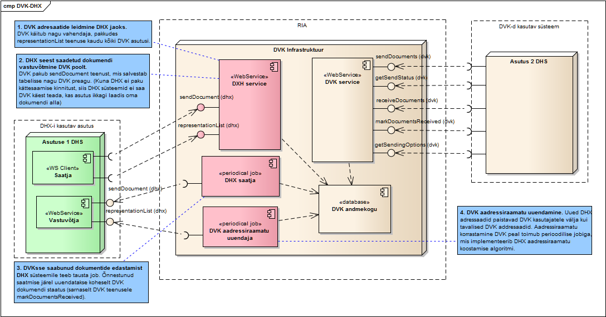
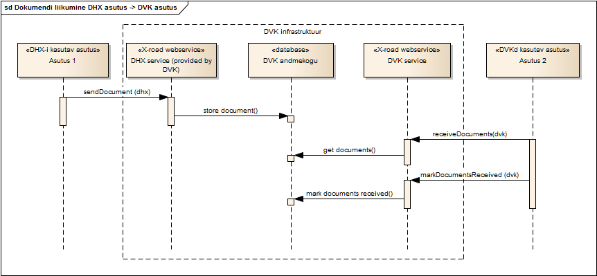
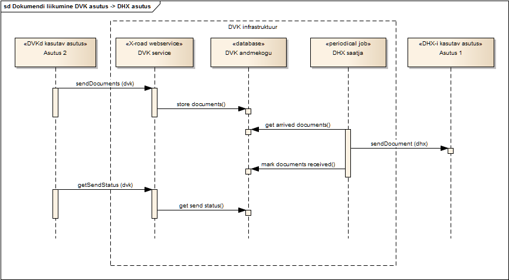

# DVK arhitektuur (DHX üleminekuperioodil)

  

## 1. Sissejuhatus

Antud dokument kirjeldab Dokumendivahetuskeskuse (DVK) uue arhitektuuri.
 
DVK arhitektuuri muudatuse tingib uue DHX dokumendivahetusprotokolli kasutusele võtmine. DHX protokollile üleminek toimub järkjärguliselt. Üleminekuperioodi jooksul on kasutusel nii DHX kui ka DVK dokumendivahetuse protokollid.

Uus arhitektuur kirjeldab kuidas toimib „lüüs“ dokumentide edastamiseks DHX-iga liitunud asutuselt DVK-ga liitunud asutusele ja vastupidi.

DHX protokolli ja ülemineku detailsemat kirjeldust vaata [siit](https://e-gov.github.io/DHX/).

Antud dokument ei muuda DVK protokolli spetsifikatsiooni, sest olemasolevad DVK X-tee teenused ja Kapsel jäävad üleminekuperioodil samaks.

[DVK Spetsifikatsioon](../DVKspek.md)

[DVK osad ja ülesehitus](https://www.ria.ee/ee/dvk-osad-ja-ulesehitus.html)

## 2. Süsteemi tehnilise arhitektuuri üldvaade

Uus arhitektuur on kujutatud järgmisel diagrammil. Punasega on märgitud DVK infrastruktuuri uued komponendid. Rohelisega uue DHX-i komponendid.



## 3. DVK adressaatide leidmine DHX jaoks

DVK käitub nagu DHX vahendaja, tagastades [representationList](https://github.com/e-gov/DHX/blob/master/files/representationList.md) DHX teenuse kaudu need asutused, kes kasutavad endiselt DKV-d (ei ole uuele DHX-ile üle läinud). Vaata arhitektuuri skeemil komponenti „DHX Service“.

## 4. Dokumendi liikumine DHX asutuselt DVK asutusele  (DHX->DVK)

Järgnevalt on kirjeldatud kuidas toimub DHX seest saadetud dokumendi vastuvõtmine DVK poolt.

DVK pakub [sendDocument](https://github.com/e-gov/DHX/blob/master/files/sendDocument.md) DHX teenust, mis salvestab dokumendi DVK andmekogu tabelisse (toimib sarnaselt olemasoleva [sendDocuments](../DVKspek.md#senddocumentsv4) DVK teenusega).Vaata arhitektuuri skeemil komponenti „DHX Service“.

Kuna DHX ei paku asünkroonset kättesaamise kinnitust, siis DHX-iga liitunud asutused ei saa DVK käest teada, kas DVK adressaat ikkagi laadis dokumendi alla või mitte. 

DHX kaudu saabunud dokumendi vastuvõtmiseks kasutab DVK asutus olemasolevaid DVK teenuseid [receiveDocuments](../DVKspek.md#receivedocuments) ja [markDocumentsReceived](../DVKspek.md#markdocumentsreceived). DVK-d kasutava asutuse ja DVK keskserveri vaheline X-tee liides jääb täpselt samaks. DVK-d kasutav asutus ei pea teadma, kas talle saabunud dokumendi saatmine algatati uue DHX-i või vana DVK kaudu.

Täpsem dokumendi liikumine DHX-i kasutavast asutusest DVK-d kasutavasse asutusse on kujutatud järgmisel diagrammil



## 5. Dokumendi liikumine DVK asutuselt DHX asutusele (DVK->DHX)

DVK asutus saadab dokumendi endist viisi DVK keskserverile kasutades DVK X-tee teenust [sendDocuments.v4](../DVKspek.md#senddocumentsv4). Dokument salvestatakse maha DVK andmekogu andmebaasi tabelisse. 

Saabunud dokumentide edastamist DHX süsteemile teeb perioodiline tausta protsess. Vaata arhitektuuri skeemil komponenti „DHX saatja“. DHX saatja leiab DVK andmekogust need saatmata dokumendid, mille adressaat on DHX süsteemiga liitunud. DHX saatja pöördub iga sellise dokumendi korral adressaadi DHX [sendDocument](https://github.com/e-gov/DHX/blob/master/files/sendDocument.md) teenuse poole.  Õnnestunud pöördumise järel uuendatakse koheselt DVK dokumendi staatus (sarnaselt DVK teenusele `markDocumentsReceived`). Ebaõnnestunud saatmisürituse järel korratakse saatmist mingi aja järel. Teatud arvu ebaõnnestunud saatmisürituste järel märgitakse DVK dokumendi staatuseks `katkestatud`.

DVK-d kasutav asutus ei pea saatmisel teadma, kas dokumendi adressaadi asutus on DHX-ga liitunud või vana DVK-d kasutav asutus.

Täpsem dokumendi liikumine DVK-d kasutavast asutusest DHX-i kasutavasse asutusse on kujutatud järgmisel diagrammil



## 6. DVK aadressiraamatu uuendamine

Uued DHX adressaadid paistavad DVK kasutajatele välja kui tavalised DVK adressaadid.

Aadressiraamatu korrastamine DVK peal toimub perioodilise taustaprotsessiga, mis realiseerib DHX aadressiraamatu koostamise algoritmi (X-tee globaalkonfiguratsiooni ja vahendajate `representationList` teenuste põhjal). 

Vaata arhitektuuri skeemil komponent „DVK aadressiraamatu uuendaja“.

DVK andmebaasi lisatakse iga asutuse juurde uus „Boolean“ tüüpi väli „dhx_asutus“.  

## 7. Adressaatide vahendamine DVK – DHX liidestuses

### 7.1. Probleemi kirjeldus DVK sees

DVK ja X-tee v5 lubasid adresseerimisel kasutada asutuse registrikoodi asemel mnemoonilist koodi. 

Näiteks kasutakse järgmisi adressaadi koode: 
* adit - Ametlike Dokumentide Infrastruktuuri Teenus
* eelnoud - Eelnõude Infosüsteem
* kovtp - Kohalike omavalitsuste teenusportaal
* louna.70000906 - Lõuna Ringkonnaprokuratuur
* laane.70000906 - Lääne Ringkonnaprokuratuur
* pohja.70000906 - Põhja Ringkonnaprokuratuur
* viru.70000906 - Viru Ringkonnaprokuratuur
* rt - Riigi Teataja
* sfos.70000272 – Struktuurfondid


Seoses X-tee V6 kasutuselevõtuga on X-tee tasemel on asutuse registrikood kohustuslik. 
DVKs lahendati see probleem niimoodi, et ASUTUS tabelisse lisati uus väli „registrikood2“, kuhu salvestati nende ülaltoodud mnemoonilisel kujul adressaatide tegelik asutuse registrikood. 

Seega DVK-s sees on need ASUTUS tabelis kujul:

Registrikood | registrikood2
------------ | -------------
adit | 70006317
eelnoud | 70000898
kovtp | 10264823
louna.70000906 | 70000906
laane.70000906 | 70000906
pohja.70000906 | 70000906
viru.70000906 | 70000906
rt | 70000898
sfos.70000272 | 70000272

DVK sees toimub adresseerimine järgmiselt:
* kõigepealt küsib DHS süsteem DVK käest [getSendingOptions](../DVKspek.md#getsendingoptionsv1) teenusega adressaatide nimekirja.

Päring `getSendingOptions` vastus tagastab ülaltoodud asutused kujul:
```xml
    <asutused>
        <asutus>
            <regnr>adit</regnr>
            <nimi>Ametlikud dokumendid</nimi>
             ….
        </asutus>
        <asutus>
            <regnr>eelnoud</regnr>
            <nimi>Eelnõude infosüsteem/nimi>
             ….
        </asutus>
        <asutus>
            <regnr>louna.70000906</regnr>
            <nimi>Lõuna politseiprefektuur</nimi>             ….
             ….
        </asutus>
    </asutused>
```

Päringu vastuses kasutatakse asutuse identifitseerimiseks kasutatakse välja `<regnr>` ja lisaks informatiivset välja `<nimi>`.

* Dokumendi saatmisel peab DHS märkima DVK `sendDocuments.v4` teenuse sisendis XML formaadis Kapsli sees `DecContainer/Transport/DecRecipient/OrganisationCode` parameetri väärtuseks eelnevast `getSendingOptions` taanusest tagastatud `<regnr>` parameetri väärtuse. Seega näiteks ADIT korral saadab DHS süsteem kapsli sisu:

```xml
<?xml version="1.0" encoding="utf-8"?>
<DecContainer xmlns="http://www.riik.ee/schemas/deccontainer/vers_2_1/">
  <Transport>
    ...
    <DecRecipient>
      <OrganisationCode>adit</OrganisationCode>
    </DecRecipient>
  </Transport>
  ...
</DecContainer>
```

Sfos korral saadetakse Kapsli sees:
```
<?xml version="1.0" encoding="utf-8"?>
<DecContainer xmlns="http://www.riik.ee/schemas/deccontainer/vers_2_1/">
  <Transport>
     ...
    <DecRecipient>
      <OrganisationCode>sfos.70000272</OrganisationCode>
    </DecRecipient>
  </Transport>
  ...
</DecContainer>
```

### 7.2. Probleemi kirjeldus DHX sees

DHX sees tuleb adresseerimiseks kindlasti kasutada esmaselt asutuse registrikoodi. 

Üldjuhul DHX adresseeritaksegi nimemustriga `EE/GOV/<registrikood>/DHX/sendDocument`

Juhuks kui asutusel on mitu alamsüsteemi (nagu ülaltoodud erandites) on DHX-is võimalik kasutada alamsüsteemi kaudu adresseerimist ([DHX* reserveeritud nimi](https://e-gov.github.io/DHX/#55-reserveeritud-nimi-dhx)).

Näiteks ülaltoodud süsteemide aadressid DHX süsteemid võiksid olla järgmised:
* EE/GOV/70006317/DHX.adit/sendDocument
* EE/GOV/70000906/DHX.louna/sendDocument
* EE/GOV/70000906/DHX.laane/sendDocument
* EE/GOV/70000272/DHX.sfos/sendDocument

### 7.3. Soovitud lahendus

DVK üleminekuperioodil peab DVK-DHX lüüs toimima selliselt, et DVK seest oleks võimalik saata kõikidele DHX adressaatidele ning DHX seest oleks võimalik saata kõikidele DVK adressaadile.

DVK vana liidese operatsioonid (getSendingOptions, sendDocuments, receiveDocments, getSendStatus ja markDocumentsReceived) peaksid tööle jääma samamoodi nagu varem.
 
Seega peab adressaadi `getSendingOptions` tagastama `adit`  adressaadi endiselt kujul `<regnr>adit</regnr>` ja `sendDocuments` teenuses Kapsli sees endiselt kujul:
```xml
  <DecRecipient>
    <OrganisationCode>adit</OrganisationCode>
  </DecRecipient>
```

Uued ja üle läinud DHX adressaadid peavad vanale DVK kasutajatele välja paistma `getSendingOptions` teenuse väljundis `<asutus>` kirjetena, kus `<regnr>` väli identifitseerib adressaadi üheselt.

DVK poolt pakutavas DHX vahendamise liideses peavad vanad DVK adressaadid paistma välja DHX `representationList` teenuse väljundis eraldi `<representee>` kirjetena.

```xml
<SOAP-ENV:Body>
        <ns3:representationListResponse>
            <ns3:representees>
                <ns3:representee>
                    <ns3:representeeCode>70006317</ns3:representeeCode >
                    <ns3:representeeSystem>adit</ns3:representeeSystem>
                    <ns3:representeeName>Ametlikud dokumendid</ns3:representeeName>
                    <ns3:startDate>2016-06-30T19:30:03.916+03:00</ns3:startDate>
                </ns3:representee>
                <ns3:representee>
                    <ns3:representeeCode>70000606</ns3:representeeCode >
                    <ns3:representeeSystem>louna</ns3:representeeSystem>
                    <ns3:representeeName>Lõuna politseiprefektuur</ns3:representeeName>
                    <ns3:startDate>2016-06-30T19:30:03.916+03:00</ns3:startDate>
                </ns3:representee>
                <ns3:representee>
                    <ns3:representeeCode>70000272</ns3:representeeCode >
                    <ns3:representeeSystem>sfos</ns3:representeeSystem>
                    <ns3:representeeName>Struktuurifondid</ns3:representeeName>
                    <ns3:startDate>2016-06-30T19:30:03.916+03:00</ns3:startDate>
                </ns3:representee>
```

Vaata ka [DHX Ettepanek 07](https://github.com/e-gov/DHX/blob/master/files/Ettepanek-07.md). 

### 7.3. Probleemi tehniline lahendus

#### 7.3.1. Tavalised DHX adressaadid

Tavalised DHX adressaadid (`EE/GOV/<registrikood>/DHX/sendDocument`), lisatakse ASUTUS tabelisse kujul `registrikood=<registrikood>`, `registrikood2=NULL`, `dhx_asutus=1`.


#### 7.3.2. DHX-i alamsüsteemidega adressaadid
 
 DHX-i alamsüsteemidega (kelle `subSystemCode` ei ole `DHX` vaid `DHX.alamsüsteem`) adressaadid registreeritakse DVK asutus tabelis kujul `registrikood=alamsüsteem.registrikood`, `registrikood2=registrikood`, `dhx_asutus=1`.

Registrikood | registrikood2 | DHX aadress tulevikus
------------ | ------------- | ------------- 
louna.70000906 | 70000906 | EE/GOV/70000906/DHX.louna/
laane.70000906 | 70000906 | EE/GOV/70000906/DHX.laane/
pohja.70000906 | 70000906 | EE/GOV/70000906/DHX.pohja/
viru.70000906 | 70000906 | EE/GOV/70000906/DHX.viru/
sfos.70000272 | 70000272 | EE/GOV/70000272/DHX.laane/
newsystem.300000001 | 30000001 | EE/GOV/30000001/DHX. newsystem/
30000002 | - | EE/GOV/30000002/DHX/

 
#### 7.3.3. Erandid olemasolevatele ilma registrikoodida süsteemidele (adit,kovtp,rt,eelnoud)

Teha erandid DVKs olemasolevate alamsüsteemide jaoks (adit,kovtp,rt,eelnoud). Juhul kui üks nendest süsteemidest läheb üle DHX peale, siis neid ei registreeri DVKs kujul `registrikood=alamsüsteem.registrikood`, `registrikood2=registrikood`,  vaid kujul `registirkood=alamsüsteem`, `registrikood2=registrikood`. 

Xtee v6 mõttes peab nendel asutustel olemas olema alamsüsteem nimega `DHX.alamsüsteem`. 

Lõpptulemusena need alamsüsteemid jäävad DVK saatjate jaoks samaks ka siis kui alamsüsteemid lähevad üle DHX peale. 


Registrikood | registrikood2 | DHX aadress tulevikus
------------ | ------------- | ------------- 
adit | 70006317 | EE/GOV/70006317/DHX.adit/
eelnoud | 70000898 | EE/GOV/70000898/DHX.eelnoud/
kovtp | 10264823 | EE/GOV/10264823/DHX. kovtp/
rt | 70000898 | EE/GOV/70000898/DHX.rt/


Näide: ADIT
> DVK asutused tabeli registrikood = adit
>
> DVK asutused tabeli  registrikood2 = 70006317
>
> **ADIT-sse saatmine DVK-st:**
> 
> kapsli adressaat: adit
> 
> **ADIT-sse saatmine DHX-st:**
> 
> kapsli adressaat: 70006317
>
> recipient: 70006317
>
> recipientSystem: adit
>
> **Xtee v6 DHX liige:**
>
> memberCode: 70006317
>
> subsystemCode: dhx.adit


#### 7.3.4. Erandid olemasolevatele registrikoodi ja alamsüsteemiga süsteemidele (sfos.70000272) 

Sellised süsteemid on DVK sees:
* louna.70000906 - Lõuna Ringkonnaprokuratuur
* laane.70000906 - Lääne Ringkonnaprokuratuur
* pohja.70000906 - Põhja Ringkonnaprokuratuur
* viru.70000906 - Viru Ringkonnaprokuratuur
* rt - Riigi Teataja
* sfos.70000272 – Struktuurfondid
 

Need asutused mis on DVKs juba hetkel registreeritud registrikoodiga kujul `registrikood=alamsüsteem.registrikood` jäävad nii nagu on ja DHX-le üle minnes neid registreeritakse tavalises korras (`registrikood=alamsüsteem.registrikood`). Xtee v6 mõttes peab nendel asutustel olemas olema alamsüsteem nimega `DHX.alamsüsteem_ilma_registrikoodita`.


Näide: sfos.70000272:
> DVK asutused tabeli registrikood = sfos.70000272
>
> DVK asutused tabeli  registrikood2 = 70000272
> 
> **Saatmine DVK-st:**
>  
> kapsli adressaat: sfos.70000272
> 
> **Saatmine DHX-st:**
>  
> kapsli adressaat: 70000272
>
> recipient: 70000272
>
> recipientSystem: sfos
>
> Xtee v6 DHX liige:
>
> memberCode: 70006317
>
> subsystemCode: sfos

#### 7.3.5. Adressaadi registrikoodi asendamine Kapsli sees
 
DVK-sse saatmisel ja DVK-st vastuvõtmisel pannakse kapsli adressaadina asutused tabeli registrikood välja väärtust (ehk alamsüsteemide puhul see ei ole asutuse registrikood).
DHX aga nõuab et kapslis olevad adressaadid oleksid asutuste registrikoodid.
Selle lahendamiseks tuleb DHX-st DVK-sse kapsli jõudmisel asendada kapsli adressaadi (asutuse reaalse registrikoodi) DVK asutuse tabeli registrikoodiga.
DVK-st DHX-i saatmisel tuleb asendada kapslis oleva adressaadi (asutus tabeli registrikoodi) asutuse reaalse registrikoodiga.


